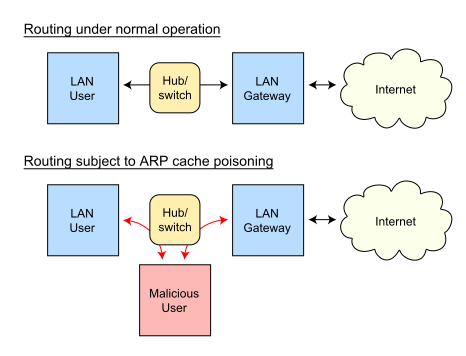

# ARP spoofing

In computer networking, ARP spoofing, ARP cache poisoning, or ARP poison routing, is a technique by which an attacker sends (spoofed) Address Resolution Protocol (ARP) messages onto a local area network. Generally, the aim is to associate the attacker's MAC address with the IP address of another host, such as the default gateway, causing any traffic meant for that IP address to be sent to the attacker instead.

ARP spoofing may allow an attacker to intercept data frames on a network, modify the traffic, or stop all traffic. Often the attack is used as an opening for other attacks, such as denial of service, man in the middle, or session hijacking attacks.[1]
The attack can only be used on networks that use the Address Resolution Protocol, and is limited to local network segments.[2]

### ARP vulnerabilities[edit]
The Address Resolution Protocol is a widely used communications protocol for resolving Internet layer addresses into link layer addresses.[note 1]
When an Internet Protocol (IP) datagram is sent from one host to another in a local area network, the destination IP address must be resolved to a MAC address for transmission via the data link layer.[2] When another host's IP address is known, and its MAC address is needed, a broadcast packet is sent out on the local network. This packet is known as an ARP request. The destination machine with the IP in the ARP request then responds with an ARP reply, which contains the MAC address for that IP.[2]
ARP is a stateless protocol. Network hosts will automatically cache any ARP replies they receive, regardless of whether Network hosts requested them. Even ARP entries which have not yet expired will be overwritten when a new ARP reply packet is received. There is no method in the ARP protocol by which a host can authenticate the peer from which the packet originated. This behavior is the vulnerability which allows ARP spoofing to occur.[1][2]

### Anatomy of an ARP spoofing attack[edit]
The basic principle behind ARP spoofing is to exploit the above-mentioned vulnerabilities in the ARP protocol by sending spoofed ARP messages onto the LAN. ARP spoofing attacks can be run from a compromised host on the LAN, or from an attacker's machine that is connected directly to the target LAN.
Generally, the goal of the attack is to associate the attacker's host MAC address with the IP address of a target host, so that any traffic meant for the target host will be sent to the attacker's host. The attacker may choose to inspect the packets (spying), while forwarding the traffic to the actual default gateway to avoid discovery, modify the data before forwarding it (man-in-the-middle attack), or launch a denial-of-service attack by causing some or all of the packets on the network to be dropped.

### Defenses[edit]
**Static ARP entries**[edit]
IP address-to-MAC address mappings in the local ARP cache may be statically entered so that hosts ignore all ARP reply packets.[3] While static entries provide some security against spoofing if the operating system handles them correctly, they result in maintenance efforts as address mappings of all systems in the network have to be distributed.
**ARP spoofing detection software**[edit]
Software that detects ARP spoofing generally relies on some form of certification or cross-checking of ARP responses. Uncertified ARP responses are then blocked. These techniques may be integrated with the DHCP server so that both dynamic and static IP addresses are certified. This capability may be implemented in individual hosts or may be integrated into Ethernet switches or other network equipment. The existence of multiple IP addresses associated with a single MAC address may indicate an ARP spoof attack, although there are legitimate uses of such a configuration. In a more passive approach a device listens for ARP replies on a network, and sends a notification via email when an ARP entry changes.[citation needed]

**OS security**[edit]
Operating systems react differently, e.g. Linux ignores unsolicited replies, but on the other hand uses seen requests from other machines to update its cache. Solaris accepts updates on entries only after a timeout. In Microsoft Windows, the behavior of the ARP cache can be configured through several registry entries under HKEY_LOCAL_MACHINE\SYSTEM\CurrentControlSet\Services\Tcpip\Parameters, ArpCacheLife, ArpCacheMinReferenceLife, ArpUseEtherSNAP, ArpTRSingleRoute, ArpAlwaysSourceRoute, ArpRetryCount.[4]
AntiARP[5] also provides Windows-based spoofing prevention at the kernel level. ArpStar is a Linux module for kernel 2.6 and Linksys routers that drops invalid packets that violate mapping, and contains an option to repoison/heal.
The simplest form of certification is the use of static, read-only entries for critical services in the ARP cache of a host. This prevents only simple attacks and does not scale on a large network, since the mapping has to be set for each pair of machines resulting in n2-n ARP entries that have to be configured when n machines are present: On every machine there must be an ARP entry for every other machine on the network, which are n ARP entries on every of the n machines.

**Legitimate usage**[edit]
See also: Proxy ARP
The techniques that are used in ARP spoofing can also be used to implement redundancy of network services. For example, some software allows a backup server to issue a gratuitous ARP request in order to take over for a defective server and transparently offer redundancy.[6] [7]
ARP spoofing is often used by developers to debug IP traffic between two hosts when a switch is in use: if host A and host B are communicating through an ethernet switch, their traffic would normally be invisible to a third monitoring host M. The developer configures A to have M's MAC address for B, and B to have M's MAC address for A; and also configures M to forward packets. M can now monitor the traffic, exactly as in a man-in-the-middle attack.