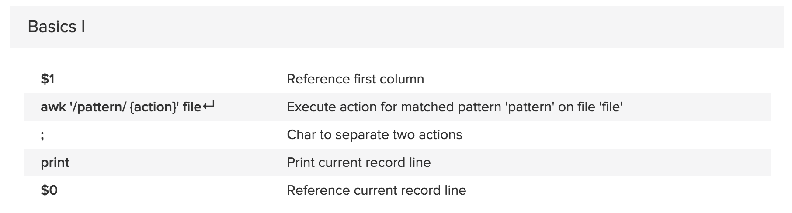
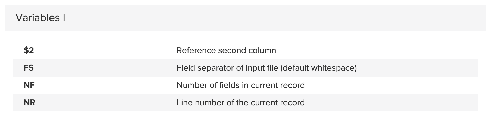
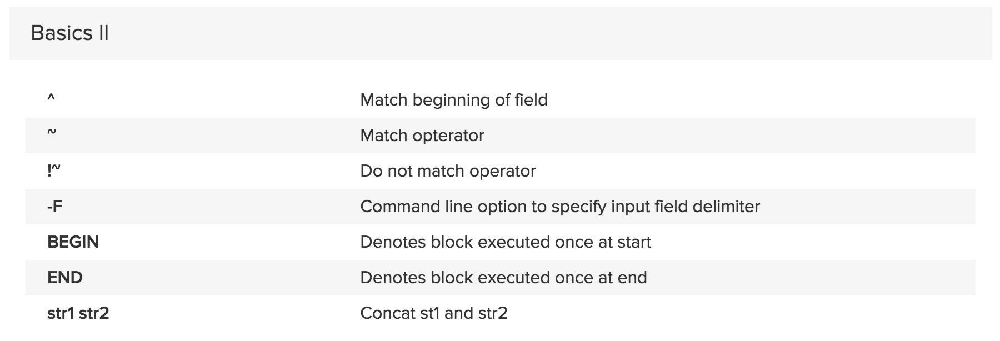
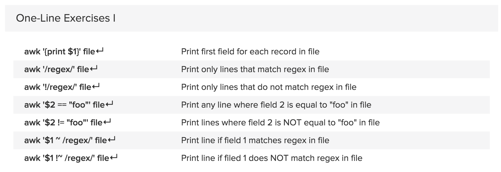
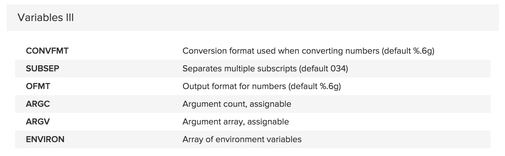
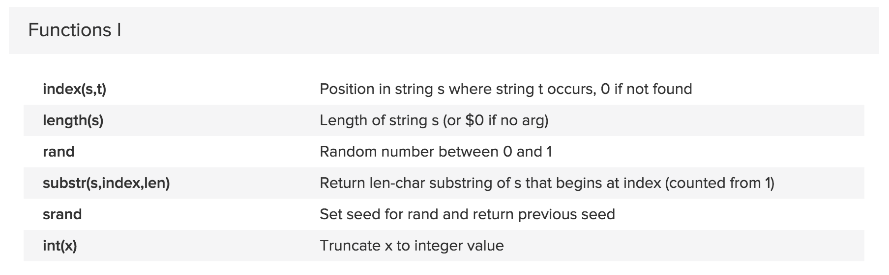
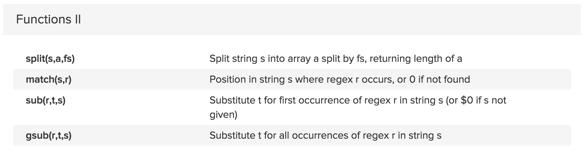
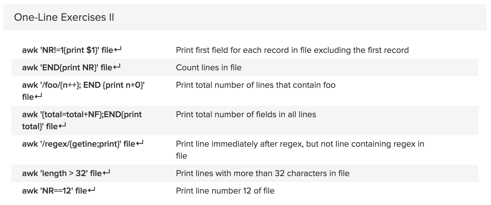

#AWK

Syntax:
```
awk '/search pattern1/ {Actions}
     /search pattern2/ {Actions}' file
```

In the above awk syntax:
* search pattern is a regular expression.
* Actions – statement(s) to be performed.
* several patterns and actions are possible in Awk.
* file – Input file.
* Single quotes around program is to avoid shell not to interpret any of its special characters.


Print only specific field
Awk has number of built in variables. For each record i.e line, it splits the record delimited by whitespace character by default and stores it in the $n variables. If the line has 4 words, it will be stored in $1, $2, $3 and $4. $0 represents whole line. NF is a built in variable which represents total number of fields in a record.
```
$ awk '/Thomas/
> /Nisha/' employee.txt
100  Thomas  Manager    Sales       $5,000
400  Nisha   Manager    Marketing   $9,500
$ awk '{print $2,$5;}' employee.txt
Thomas $5,000
Jason $5,500
Sanjay $7,000
Nisha $9,500
Randy $6,000
$ awk '{print $2,$NF;}' employee.txt
Thomas $5,000
Jason $5,500
Sanjay $7,000
Nisha $9,500
Randy $6,000
```

Find the employees who has employee id greater than 200
```
$ awk '$1 >200' employee.txt
300  Sanjay  Sysadmin   Technology  $7,000
400  Nisha   Manager    Marketing   $9,500
500  Randy   DBA        Technology  $6,000
```
In the above example, first field ($1) is employee id. So if $1 is greater than 200, then just do the default print action to print the whole line.

To print the previous, the pattern matching line and next line:
```
$ grep -C1 Solaris file
Linux
Solaris
AIX
```

-C is to print both lines above and below pattern.
```
$ awk '/Sola­ris­/{print x;prin­t;g­etl­ine­;pr­int­;ne­xt}­{x=­$0;}' file
Linux
Solaris
AIX
```

Remove duplicate lines using awk

```
$ awk '!($0 in array) { array[$0]; print }' temp
```

Print all lines from /etc/passwd that has the same uid and gid

```
$awk -F ':' '$3==$4' passwd.txt
```

Print only specific field from a file.

```
$ awk '{print $2,$5;}' employee.txt
```

**Awk If Else Example**: Generate Pass/Fail Report based on Student marks in each subject

```
$ awk '{
if ($3 >=35 && $4 >= 35 && $5 >= 35)
	print $0,"=>","Pass";
else
	print $0,"=>","Fail";
}' student-marks
Jones 2143 78 84 77 => Pass
Gondrol 2321 56 58 45 => Pass
RinRao 2122 38 37 => Fail
Edwin 2537 87 97 95 => Pass
Dayan 2415 30 47 => Fail
```

**Awk If Else If Example**: Find the average and grade for every student

```
$ cat grade.awk
{
total=$3+$4+$5;
avg=total/3;
if ( avg >= 90 ) grade="A";
else if ( avg >= 80) grade ="B";
else if (avg >= 70) grade ="C";
else grade="D";

print $0,"=>",grade;
}
$ awk -f grade.awk student-marks
Jones 2143 78 84 77 => C
Gondrol 2321 56 58 45 => D
RinRao 2122 38 37 => D
Edwin 2537 87 97 95 => A
Dayan 2415 30 47 => D
```

















