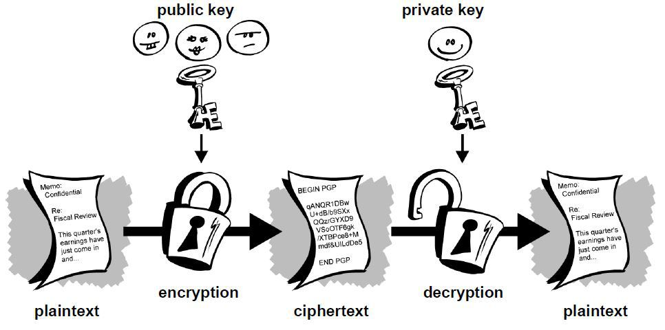
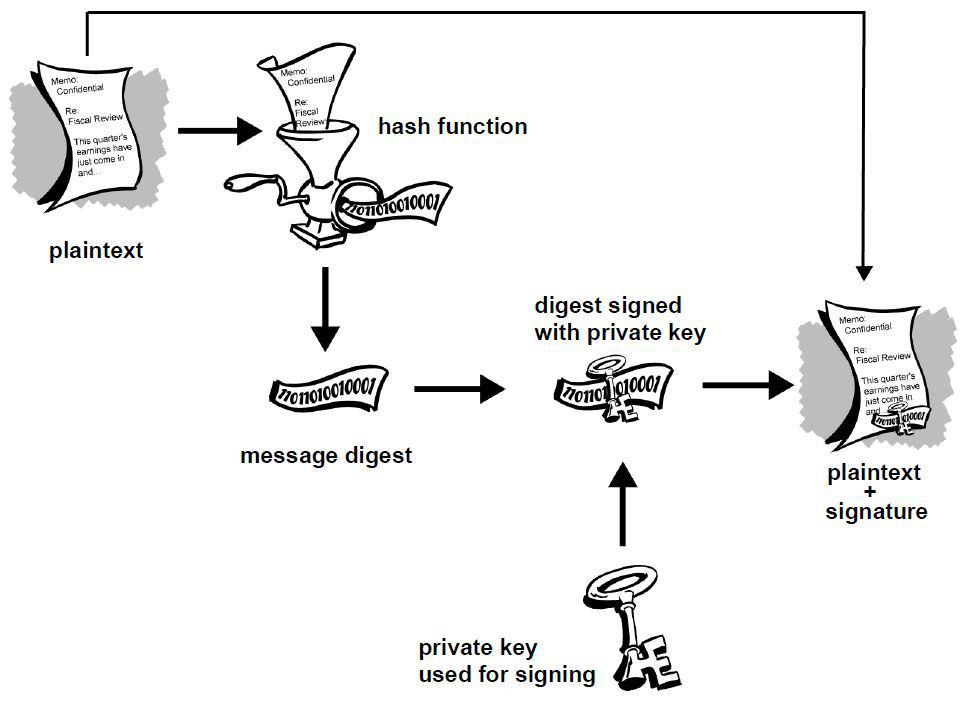
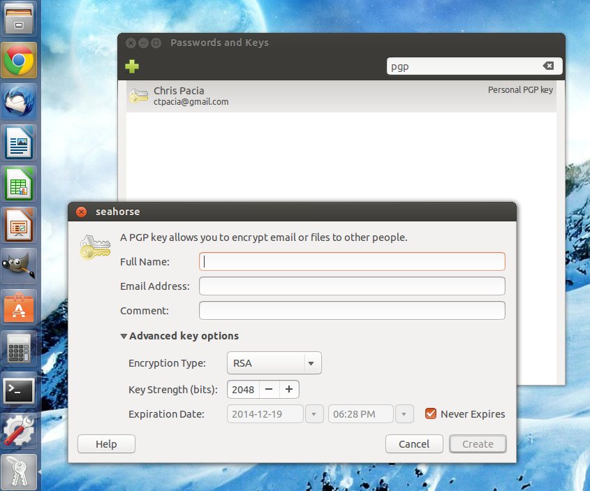
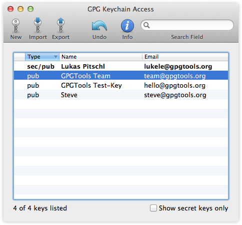
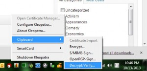
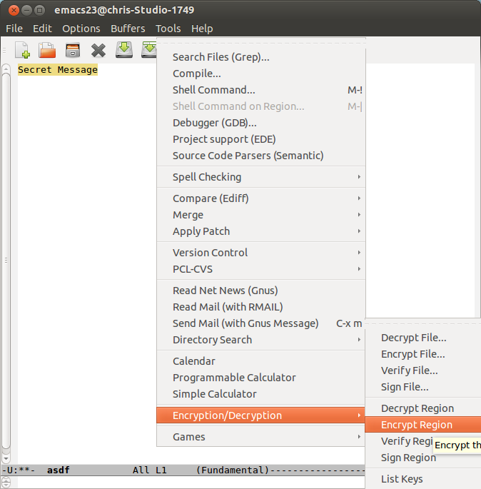
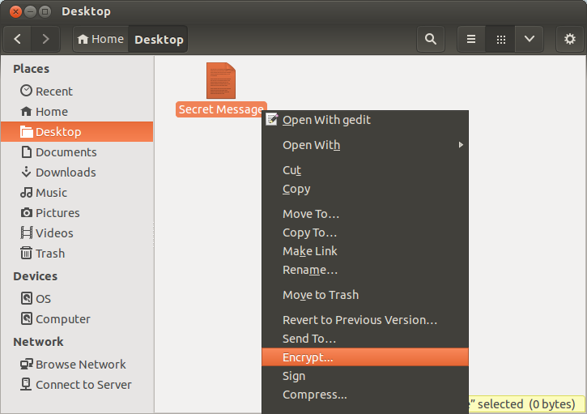
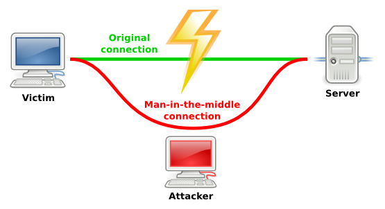

# Beginners’ Guide To PGP

If you are new to Bitcoin it’s likely you’ve heard some terms thrown around by Bitcoiners that you have no idea what they mean―PGP, Tor, VPN, OTR, etc. In most cases these are referring to various technologies that people use to protect their data and communications.

This is the first installment of what will likely be a series of articles aimed at introducing new Bitcoiners to these and other technologies that you can use to enhance your privacy and keep sensitive information away from the prying eyes of governments and data thieves.

We’re going to start off this series by introducing you to PGP, which is by far the most widely used encryption software available and a critical component to online privacy. Whether you’re purchasing drugs from Silk Road or just sending emails to friends and family, it’s something with which even casual internet users should familiarize themselves.

###What is PGP?

PGP stands for Pretty Good Privacy. At it’s core, it is an internet standard (called OpenPGP) used for data encryption and digital signatures. Software that employs this standard is available in both a free, open source version produced by the Free Software Foundation called the GNU Privacy Guard (or GPG for short) as well as a low-cost commercial version.

Let’s take a moment to understand some of the basics of how it works. In conventional encryption, a secret key is used to transform plaintext (the unencrypted data) into unreadable ciphertext. The same key is also used to decrypt the ciphertext and reveal the plaintext. While this process works well for encrypting data stored on your hard drive, it has its drawbacks for use in communication. For one, you need to somehow communicate the secret key to the other party. But how to do this securely? After all, the reason you are using encryption is because you don’t believe your communication channel is secure. You could meet in person and exchange the secret key offline, but that isn’t very convenient. Protocols have been developed to allow for secure exchange of keys across insecure communication channels, but they tend to work better for real-time chat than, say, sending encrypted emails.

PGP makes use of public-key encryption. One key (a public key) is used to encrypt the data and a separate key (the private key) is used to decrypt it.



As a new user, you will generate a new public-private key pair. Just like the names suggest, you’ll share your public key with others so that they can send you encrypted messages or files, while keeping your private key secret so that you can decrypt the data. The process by which the key pair is generated makes it impossible (given current technology and knowledge of mathematics) for an attacker to derive your private key from the public key.

###Use Cases

The most obvious use case for this type of encryption is email. Anyone who has your public key can send you encrypted emails which only you can view. Likewise, you can send encrypted emails to your contacts by first downloading their public keys. In a future post we’ll provide a more thorough tutorial demonstrating how to set up an email client to work with PGP. What you need to keep in mind, however, is only the body of the email will be encrypted. The subject and metadata (to, from, cc, and timestamp) will still be visible to anyone snooping on your emails.

You aren’t limited to just encrypting emails either. Buyers at anonymous marketplaces like Silk Road frequently download their merchant’s public key and use it to encrypt their shipping address so that only the merchant view it. Edward Snowden persuaded journalist Glenn Greenwald to set up PGP prior to leaking the top secret classified documents that revealed the depths of the NSA’s spying operation. You can encrypt whole folders and files with your own public key to protect them from attackers who may gain access to your hard drive. In other words, PGP can be used in just about every conceivable case where strong encryption is needed.

###Digital Signatures

Another feature of public-key cryptography is it allows for the creation of something called digital signatures. Much like your real life signature, a digital signature can be used to authenticate data but with the added benefit of being completely unforgeable (again given the current state of cryptography).

A digital signature is created by a mathematical algorithm which combines your private key with data you wish to “sign”. The validity of the signature can by verified by anyone simply by checking it with your public key.



In the above diagram you see that the plaintext is run through a hash function to produce a message digest which is then signed with your private key. What this process ensures is that a signed document cannot be altered without invalidating the signature, allowing people to not only check the document’s authenticity but also the integrity of the data. Just to give an example, suppose you sign a 10,000 word document. If someone were change even a single punctuation in that document, the signature would show as invalid. To see why digital signatures are useful let’s consider a few examples:

Returning to Edward Snowden, suppose the NSA had intercepted the classified documents before they reached Glenn Greenwald. The NSA could have removed the sensitive data, replaced it with disinformation, then forwarded it along to Greenwald. The reason this didn’t happen is because Snowden signed the data with his private key before sending it along. This allowed Greenwald to use Snowden’s public key to verify the files were unaltered. If the NSA tried to switch out some information, the signature would have shown as invalid.

Digital signatures are also extremely useful in verifying the integrity of software. A great example here would be Bitcoin wallets. Given the security implications, you want to be able to trust that the wallet you download is legitimate and wont leak information that would allow someone to steal your bitcoins. While all Bitcoin wallets are open source, unless you check and compile the source code yourself, you will most likely download a pre-compiled version that could contain malicious lines of code. Software developers will typically sign the software and provide a link to download the public key used for signing. With Bitcoin-Qt, lead developer Gavin Andresen signs new versions with his PGP key. Simply by checking the signature with his public key you can guarantee you’ve downloaded a legitimate copy.

###How Secure Is It?

If all of this is new to you, you’re likely wondering how secure is the encryption used in PGP. Can we really trust it to protect us from from the NSA and its $52.9 billion black budget? All I can really say is that the cryptographic algorithms used in PGP are all part of the public domain have been heavily vetted by the community of experts. At this point in time there are no feasible attacks known to the general public or academia. It’s certainly possible that the NSA has access to highly advanced math that isn’t publicly known, but even there the best attacks typically don’t reveal the plaintext, rather they just make the keys slightly easier to brute force. The fact that the NSA has pressured Google, Microsoft, Apple etc. into giving them backdoors into their systems seems to be prima facie evidence that they can’t break commercial cryptographic algorithms.

###Getting Started

The first thing you need to do to get started is download and install GPG. If you use the Ubuntu operating system you’re in luck, you already have it. It can be found in the apps menu as “Passwords and Keys”.

Windows users can download Gpg4win here.

And Mac users should download the GPG Suite for OS X from here.





In each of these operating systems you can access GPG as well as a number of advanced options from the command line, but as a new user, you’re better off learning to use the GUI for now.

###Generating A New Certificate

In PGP a “certificate” is essentially a public key with extra data attached to help others verify that the key really belongs to you. In practice this is usually your name, email address and one or more digital signatures from others (more on that later).

Depending on your operating system, you’ll generate a new certificate by clicking “New”, “New Certificate”, or “New PGP Key”.

At minimum you will have to enter your name, email address, and a strong password that you will use for decrypting and signing data. In the advanced options menu you can select your encryption algorithm (RSA, DSA/ElGamal), key size (in bits), and an expiration date if you want your certificate to expire. The defaults here should suffice for our purposes. The differences are technical and unlikely to affect your overall security (just don’t reduce to the key size).

Once this process is complete you will have generated a new certificate and private key. You can click on “export” to save your public key to a .asc file for distributing to others, or you can copy the text of the key block and share it with people that way. A typical public key block will look like this:

```
-----BEGIN PGP PUBLIC KEY BLOCK-----
Version: PGP Universal 2.9.1 (Build 347)

mQMuBFG3x4URCACZ/c7PjmPwOy2qIyKAYRftIT7YurxmZ/wQEwkyLJ4R+A2mFAvw
EfdVjghAKwnXxqeZO9WyAEofqIX5ewXD9J4H6THaWNlDeNwnIUhbVsSEgT6iwGEG
arXvkrMyy+U5KA0x2dcsYRKAPMM1db+4zSQkWTWzufLU7lcKi3gU3pNTxSA0DjCn
wfJQspiyWchSfgZ59+fKaGZJVSElrS2i2ok5mK3ywCXRWvnAC/VxA3N6T4jvkX/+
1gS/oUgdocP31TeV0L20JH9QgmFYC3jMbErAATo2x9Y8g4NofdvSnntbZk9Giycc
cgOWsa8aFtTjvcBp8hkCl3dK5xTZiY0gLSaDAQCXSHI7zw4LiNFfCV+PbO9BEqDA
i4JFV/qX7TgfBNX7nwf/fEFu18V16lVCsRzeuhMsHHzAQ7PZJfdfhyOubq0fnjkk
2RdcleosnP22zP5LoRs1fvIDdL3wnkg1ZUwfICP0HWRzRYcVBaIv9HcqSVBWriJj
uscni5QtX3fIU2wqSyP90wquWPkO7jObT0hWihhWPFXiFA6996i/rTZiJH+eFPSW
afxVlRAqH4kaUBen5fSMbBSsfc+GkuuQH7gIYQC2k88soPLuFZGsibDwBqvdUqFG
S39ifNf/2MUx8DrM8bbIPPwiuTelAFVPu7GGzyzAF3yhk/Cdd/YmWlwrwAd4Psev
WpXNSApzSgh/HhY3wVdj9skItQBISXJSVkMD4DLvhwgAh/Ur5JEgtx5dYGpU/nEr
LGEDUgPeBnewReA8wurAnYeOHGVSu84kXceO2tJvnbLn5y1L0dML/u3+S9pDXOfR
1TR9QxWd3QIBUY68lfa+DiXHSVcfrTPz3q+CHMLj7917hfATWwRTemccp6n8al68
tfGXih9t+lAwuq4KuRk0NkGEKrqeRU3sdGVLdIZ8IteikyYgWcZTYG7oxcj7qpif
ixl0DsI1HXfXQrFVnjOyQuiS8z06+ZuC/8dgi7UBpUkgQLZYosE0fUAdeiAVPGv0
LanXwHRQPDlmBiorge1c1jpbna2K9EyQ1Jbkyn6nkg8OaetO9brLBMk916mn6mQD
ebQfQ2hyaXMgUGFjaWEgPGN0cGFjaWFAZ21haWwuY29tPoh6BBMRCAAiBQJRt8eF
AhsDBgsJCAcDAgYVCAIJCgsEFgIDAQIeAQIXgAAKCRC4lW2/7nwQXJ/dAP42O7se
mHDqZnxl4Slrf8AxgCI0DowpBcNxWRM8hNHS2QD/TkbCvy4QNq2QNrP26m183eJM
y6PNCncuwsB5TdoLgYqJASIEEAECAAwFAlKqHEQFAwASdQAACgkQlxC4m8pXrXyE
oAf+JusFcRHVGXDYOlRLwQYUJt9q3czp4cinwdheR24VUZVoE9pibogJcc2Oh4aS
5cpMg3EbmuoyVeLunxp01qpFDfVnfGJ3ZpdPDPlFu6Wy1iM7rVafcSR7CxI+oGRH
DKH0fZLhKKffujevM0Y7lFA80wjItq5Ewqy2UBxI6Vtdzo/ouAJ+EPmJsDOjclwe
Ayx4d/0g1kzf7DIGjUs6loV74zMqruPSPHGC6zFSz6jdA4xkzrlSV5U44TAkTz+1
I65j6I+doTcCmkzv4V8NU9wQ5LblE/flfTVCpnHNH4z4jAN2N8MyGNjAnbd2q752
yG3t651VmyOxa+XPffZ+F06GMbkCDQRRt8eFEAgAg+tZGxFVO3eeEn7R3KBCNCzL
DH3AwxcQs52k6ZbPzfyS59HTbvz1vkNNE/aoSb6HKZ95t3jaSBqbYIs8G3cXqN7h
kc/WJpYGeyKEokELg6Fr5vdaPxQakf63q2Ly+hCFCAorsc2iR50xVFB1befMFPWn
sptPIsel1P47wpRd2HmEwE+vGA90HcYUfdAA7eGCxZeRl8wc0DHbgAb+iKa1bmAY
vMO8FDTBAV9aayLL5qHxCGhR3VHRQi0Pq8P2nYjwwA+eF4M7gTXrB3L8Cf/mTXKi
rEF36kAAKegMmlPBH8/bLsWg7loJcxbPll4qhuJM7ErFF+hpmWbvYUqksFMjrwAE
Cwf7B63AelE+pT1qOFITFQPV30kvbQbIMz70yAurUBDRTRQ4L45DnUvZurS0Uojr
nczueK6sHufdsKdI0DKxG2REOz9hZ64+NoZRzB+cYCt0g93M3Wtg3zt6x1q8MwEj
uFcaO0gTKlh1fKSg7cV+VYm0nMo7/kOgupVxtcy65te6EM6KAtRCugqBeY/FxKXN
G4tps+KbzwmDq5G5lAZOLH3kVmSJxOHdTr/jwPlHnq8J+AYlXANEJMmbG3s6Eaf2
/du8FAy4025UUPZdLsJBM3HKoIqR7lsl2T9cCB9Un4fXlF8axb7PojRO6Y68dfSU
to3UsZXERO4NtVI0IT0uhLXh+IhhBBgRCAAJBQJRt8eFAhsMAAoJELiVbb/ufBBc
QjgA/j1J7nN42zDMJxoAKQDvp+H3dErZVY7hJ8qHeGVbExWGAP97G/jWhl6FEg7M
2vOMWRC5GQUM8TU1YkCeAuhsxSj3ew==
=dgnf
-----END PGP PUBLIC KEY BLOCK-----
```

###Key Servers

You might want to consider uploading your public key to a key server such as the MIT Key Server or PGP Global Directory. These are searchable directories from which other people can download your public key without first asking you for it. This functionality comes in especially handy when using email. Some email clients can be configured to search the key servers for the PGP keys of your contacts or anyone who has sent you an encrypted email and import them automatically.

Just keep in mind that once you upload a key to a server, you typically can’t remove it. It’s probably a good idea to play around with PGP first, get used to it, then once you’ve created your permanent key, upload it. That way you don’t litter the key server with multiple keys bearing your name.

###Importing Keys

In order to encrypt files to send to others, you will first need to import their public key into PGP. You can do this by downloading the .asc file containing their public key (either directly from others or from a key server), clicking “Import” or “Import Certificate”, and selecting the file. In Linux you can import a key simply by double clicking the .asc file. In Windows you have the option to copy the public key block and import it directly from the clipboard.

The software will typically let you view, edit and sign the public keys on your keyring. More on signing other people’s keys later.

###Encrypting Data

You have two options for encrypting data in PGP ― you can encrypt a plain text message from the clipboard or encrypt whole files. Let’s start with encrypting plain text messages. The first thing you need to do is pull up your plain text editor (Notepad in Windows, GNU Emacs works well for this in Linux). You’ll have to forgive me for not being familiar with OS X, but I assume you can encrypt from the clipboard in that operating system (though I’m not positive).

Type whatever message you want and copy it to the clipboard. In Windows, you’ll need to right click on the Kleopatra tray icon and click Clipboard>>Encrypt. The software will prompt you do select a public key from your keyring with which to encrypt the message. The encrypted ciphertext will replace the unencrypted plaintext in your clipboard.



In Emacs you’ll need to highlight the text, click Options>>Encryption/Decryption>>Encrypt Region. Or you can simply save the file to disk and right click and click encrypt.





The resulting encrypted message will look like this:

```
-----BEGIN PGP MESSAGE-----
Version: GnuPG v1.4.14 (GNU/Linux)

jA0EAwMCNUyTD6Yu1QtgyemPt3ysidtpK5AXDobS2mB5+ym7/zNqMe4u/fli9pPV
PakBAwNtRCE45qIFUpCj3Pjh3jRoPVmiQOb8n5PuhipuIP4v6ANCboWnCUam7NGd
VHuU2OLX36QWOoPI5Ewl9xto+3iqjlclTaiRlHo0JHU8EOv75BpjahzKhDCV2lMQ
q9QOHBESsU9xhk/t7gnT2EfhxzPHTb2N7fkPRFqItMU949hSvaYtN3AA80qxjkic
jpEbftLI1brvEK2WpyMPDt+YPnIvJ2mHfsmB41VNlr14BS5zpfWTEDjkTJALRWVj
MRARwU8/iE/hh9FMkYb8mB2cmJh6TgqpYF45qtacdKOKVqQBToPwS0dFf5Pw25Qx
jaRKTzfoP9mhD1nkHuNP79zhj9+uTMwRp00d117CuopnTeaTMQTYJeHNpsX79Jx3
EF6QQjrw38UNz2IZGplKHFKT39laI7NywviI7LmfJYHMoIFhdz97Woad1MCMPq/G
qqlA/QRrheMz90NG9OQRtc6q2hNCsQUI7kRV7kTrgPCrzKepLwZ3EBcSea8vyQcH
f43blJP1VucaTf9jvGPX1qgisOFHBYcZKv1+1I4sRIFcSWpKr3VeCr76bq+vMk1D
7+rT8SaYs0efFkfF/Y6+yOoporP0HsxVxAIUZ7zPXIH2UxtGfcfcu/pWxNQ1WrM5
dwWFasQaXg==
=tfo5
-----END PGP MESSAGE-----
```

Some things to keep in mind, once you encrypt something with someone else’s public key, you can’t decrypt it. You can, however, encrypt a message using multiple public keys and the message can be decrypted with any of the corresponding private keys. So you could encrypt a message with someone else’s public key and your public key, then you can both decrypt it at a later date. Also, if you encrypt data using only your public key, it basically works like symmetric key encryption in that only you will be able to decrypt it.

To encrypt an entire file select “Sign/Encrypt File” from the menu and select the file you want to encrypt. Just like before, you’ll need to select a public key(s) from your keyring with which to encrypt the file.

###Decrypting Data

To decrypt either a message or a file, you need to do all of the above in reverse. Just this time use the decypt option from the menu. Here you will be prompted to enter your password for your private key that you created along with your key pair. This is what prevents an attacker from stealing your private key and decrypting messages intended for you.

Keep in mind, if you are decrypting data on your normal computer, you could be running the risk that malware could copy and upload the data after you’ve decrypted it. This might be an acceptable risk for everyday communications, but if you’re dealing with extremely sensitive data you should probably transfer the encrypted data to a secure viewing station prior to decryption.

Any air gapped computer (one permanently disconnected from the internet) would work for this purpose. Or you could boot into a Linux live system (such as Tails) from a USB stick to isolate your work environment from preexisting malware.

###Signing Data

Just like with encryption you can either sign a message from your clipboard or sign whole files. The process is just as straightforward as before except this time you will select “sign” rather than “encrypt”. Here you will again be prompted for your password. The resulting output will look like this:

```
-----BEGIN PGP SIGNED MESSAGE-----
Hash: SHA256

This is an example of a PGP signed message.
-----BEGIN PGP SIGNATURE-----
Version: GnuPG v1.4.14 (GNU/Linux)

iF4EAREIAAYFAlK5pacACgkQuJVtv+58EFxiXgD/QGwQVCZMAlE7fL6V1Kbv4Ogq
Sa9VTEw+s9mWwiBInp4A/3guc2PvZb8iIdrCyWGwIMJIOQS8OuhWfjtN3CBhOSA1
=S+B+
-----END PGP SIGNATURE-----
```

Notice that the message is at the top under the header, while the signature is at the bottom. If you chose to sign an entire file, the software will generate a separate .sig signature file that you will need to send along with the original file.

Also keep in mind that encrypting and signing are not mutually exclusive. You can opt to both encrypt and sign data to protect the message from eavesdroppers and allow the recipient to verify the message came from you.

###Verifying Signatures

To verify a signature on a signed message or file you will obviously have to first download and import the corresponding public key. Just like with decryption, you can either verify the signed message from your clipboard or by selecting the file. If you’re verifying a signed file, you’ll likely be prompted to select both the file and the detached signature (.sig) file.

If you’ve done it right you will see a response that looks something like this:

```
Good signature from B8956DBFEE7C105C Chris Pacia  (trust ultimate) created at 2013-11-16T12:05:37-0500 using DSA
```

When verifying the signature on software, the developer will typically provide a link to a .sig file for you to download. However, when releasing software on multiple platforms, it’s not uncommon for a developer to provide a single signed message containing the hashes of the files rather than a separate signature for each version. Consider the following release notes for Bitcoin-QT:

```
-----BEGIN PGP SIGNED MESSAGE-----
Hash: SHA256

73495de53d1a30676884961e39ff46c3851ff770eeaa767331d065ff0ce8dd0c  bitcoin-0.8.6-linux.tar.gz
ec85816e6cd034230ec5dc83c105334aa91bfa38fd959ba3d1d3bd5d4df3208b  bitcoin-0.8.6-macosx.dmg
baac30350a721472bd34e811f16bd68c4e4672cfb47df73aee12376b2adcae8d  bitcoin-0.8.6-win32-setup.exe
582fcb973a29e1a6e44ddc6602400e77fc85b53f6f54a1105d22d84d992e3c83  bitcoin-0.8.6-win32.zip
-----BEGIN PGP SIGNATURE-----
Version: GnuPG/MacGPG2 v2.0.20 (Darwin)

iQIcBAEBCAAGBQJSpjKpAAoJEBt7+0V79uISEvgP/2T2Pt1wO2WMaK3DL4D/uFq6
xcuhCjrV1FHt1UoYTdohl112dO3q6qsakguBxvaGMe80KCJS85JT7B2Sbs/goyYT
2WxkEv+ttQFVnB32MlFeGYrPt9I7xmNQqYoQMGsV+VeCfqSDElxVpPCLDYFbBLUk
lkHa4LTkXsGI351iIEjUB4jXSKeJvWQQ6HdxKOIUaxA6AZX8qGKuGbSYUMNy/pBi
lqZNOTWtFjRkPR+qhhjjpx9J9A9l4dFYvH6lJDS9mj2jOUCTtg3hKwYg3KvSOtjl
6Mkm6qkJtf0SxJpx3tQjH4rav7G1WY0Y546X2+uF9BuFKvhDVY74fe8pAh+ASF18
lq4pbpg6pElk94CESPEDxIIB1wgozKBidLSzCtKfqgTDPQtFDny1nA3Km+FGQX5Y
HATPB0EeuB5juJs7rHpO/OhweI1cORPPfhaTiA6Cf6Tioyl+FX/ZmVXclUUYEF1M
fXS8JsAIZxIdDgjeo6xTwI2llN5Gs3JmypGM0dggNslMUEeCX/O5uciyoZ6y+TUZ
TZLRVY4WsS0FpsA07UuYuasi1B1WzGm8BW4Akt3XO7awVwyHSUfePS02qGdUwfDS
sDzf5SoBphnBUcRiVoHL1lhn8bfW0henksL6YUJIfY4w5q5S9vM/5uk+vxghWGRk
K6o6VP8xT/1yRhWbR0Yp
=DYos
-----END PGP SIGNATURE-----
```

So what is going on here is that the installation files for Linux, OS X, and Windows (.exe and .zip) were run through the SHA-256 hash function and the outputs were then signed. To verify the integrity of the Bitcoin-QT for Windows (say), you would first verify the signature on this message then hash the bitcoin-0.8.6-win32-setup.exe file with SHA-256. The output should look like this:
```
baac30350a721472bd34e811f16bd68c4e4672cfb47df73aee12376b2adcae8d
```

Then just compare this output with the hash in the signed release notes. If the two match, you know you have a good file.

You may be asking, how in the world do I calculate a hash function? Some operating systems will let you do this from the terminal. For example in Linux you can just type:
```
user@users-desktop:~$ sha256sum [FILE]
```
```
user@users-desktop:~$ sha1sum [FILE]
```
```
user@users-desktop:~$ md5sum [FILE]
```

Otherwise, you could easily use an online hash calculator.

###Key Management

Finally, we should probably talk a little about key management. One of the downsides to PGP is susceptibility to something called a man-in-the-middle attack. This attack works like this: Let’s say you want to securely communicate with someone using PGP. The first thing you would do is download their public key. However, it may be possible for an attacker to intercept your internet communications before they reach the server containing the public key. The attacker could send you one of his own public keys and make you think it’s the public key of your communication partner. Not knowing any better, you would encrypt your messages with the attacker’s public key allowing him view all your communications. Even worse, the attacker could re-encrypt the message with the correct public key and forward it along it the destination. Neither you nor your communication partner would know the message was intercepted.



Obviously, a critical part of security in PGP is the ability to trust that the public key belongs to its purported owner. While complete trust is difficult to achieve, there are a few methods you can use to increase your level of trust.

1.  **Meet in person**. If someone physically hands you their public key, then obviously this eliminates the problem of trust. Of course, this is very inefficient.

2. **Verify the fingerprint**. Each PGP certificate has a unique fingerprint which is calculated as the hash of the certificate represented in hexadecimal. It looks like this:
```
0150 2502 DD3A 928D CE52 8CB9 B895 6DBF EE7C 105C
```
If you can get the key’s owner to verify the fingerprint, possibly by reading it over the phone, then you can be fairly confident in the validity of the certificate. Obviously, finding an appropriate communication channel to verify the fingerprint can be tricky.

3. **Download the key from multiple IP addresses/devices/servers** A MITM attack is difficult to pull off as it is. It becomes much harder if the attacker has to watch the communications of multiple IP addresses and servers. To this end you can increase the trust in the public key by downloading it from multiple locations (home, work, the library, Starbucks, over Tor, etc), from multiple devices, and from multiple servers. Gather up all the keys and check to make sure they are all they same. If so, you can be reasonably confident the key is valid. It would be extremely difficult to pull off a MITM attack after all that.

4. **Web of trust**. In PGP you have the ability to use your private key to sign the someone else’s public key. This creates the opportunity to introduce a sort of six degrees of separation trust model. Let’s say you’ve downloaded Charlie’s public key but don’t know if you can trust it. Charlie’s key is signed by Bob, who you also don’t trust, and Bob’s key is signed by Alice, who you do trust. Because you trust Alice, this gives you chain of trust that goes all the way to Charlie, allowing you to trust Charlie’s key. The only downside to web of trust is that it can be difficult to get started and make enough connections to link you to all the keys you wish to download.

So that’s it for now. While we could go much more in depth, what we covered should be enough to get you started using PGP. Just remember, given the revelations about U.S. government spying and depths to which it is sinking to destroy your online privacy, there is really no excuse for not familiarizing yourself with PGP and using it on a regular basis. In a future installment of the series we’ll talk about how to set up an email client to automatically encrypt and decrypt your emails. Until then, stay safe and feel free to email me with questions.