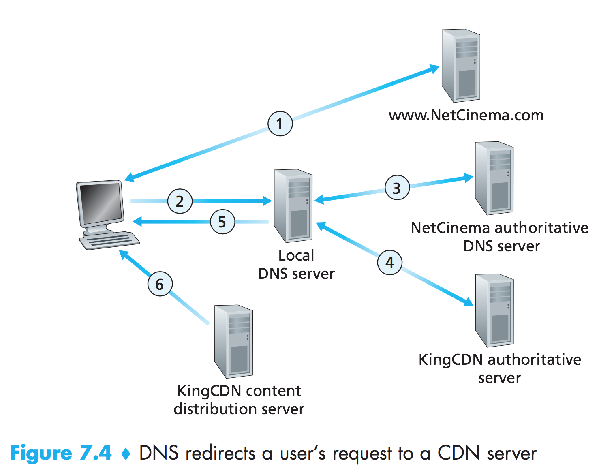

# CDN Operation

Having identified the two major approaches toward deploying a CDN, let’s now dive down into the nuts and bolts of how a CDN operates. When a browser in a user’s host is instructed to retrieve a specific video (identified by a URL), the CDN must intercept the request so that it can (1) determine a suitable CDN server cluster for that client at that time, and (2) redirect the client’s request to a server in that cluster. We’ll shortly discuss how a CDN can determine a suitable cluster. But first let’s examine the mechanics behind intercepting and redirecting a request.

Most CDNs take advantage of DNS to intercept and redirect requests; an inter- esting discussion of such a use of the DNS is [Vixie 2009]. Let’s consider a simple example to illustrate how DNS is typically involved. Suppose a content provider, NetCinema, employs the third-party CDN company, KingCDN, to distribute its videos to its customers. On the NetCinema Web pages, each of its videos is assigned a URL that includes the string “video” and a unique identifier for the video itself; for example, Transformers 7 might be assigned http://video.netcinema.com/6Y7B23V. Six steps then occur, as shown in Figure 7.4:

1. The user visits the Web page at NetCinema.
2. When the user clicks on the link http://video.netcinema.com/6Y7B23V, the
user’s host sends a DNS query for video.netcinema.com.
3. The user’s Local DNS Server (LDNS) relays the DNS query to an authorita- tive DNS server for NetCinema, which observes the string “video” in the hostname video.netcinema.com. To “hand over” the DNS query to KingCDN, instead of returning an IP address, the NetCinema authoritative DNS server returns to the LDNS a hostname in the KingCDN’s domain, for example, a1105.kingcdn.com.
4. From this point on, the DNS query enters into KingCDN’s private DNS infrastructure. The user’s LDNS then sends a second query, now for a1105.kingcdn.com, and KingCDN’s DNS system eventually returns the IP addresses of a KingCDN content server to the LDNS. It is thus here, within the KingCDN’s DNS system, that the CDN server from which the client will receive its content is specified.
5. The LDNS forwards the IP address of the content-serving CDN node to the user’s host.
6. Once the client receives the IP address for a KingCDN content server, it establishes a direct TCP connection with the server at that IP address and issues an HTTP GET request for the video. If DASH is used, the server will first send to the client a manifest file with a list of URLs, one for each version of the video, and the client will dynamically select chunks from the different versions.

