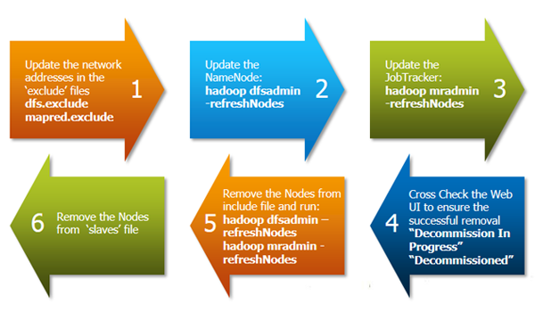
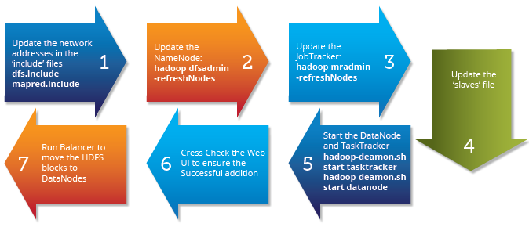

# Commissioning and Decommissioning Nodes in a Hadoop Cluster

One of the most attractive features of Hadoop framework is its utilization of commodity hardware. However, this leads to frequent DataNode crashes in a Hadoop cluster. Another striking feature of Hadoop Framework is the ease of scale in accordance to the rapid growth in data volume. Because of these two reasons, one of the most common task of a Hadoop administrator is to commission (Add) and decommission (Remove) Data Nodes in a Hadoop Cluster.


## Commissioning and Decommissioning Nodes in a Hadoop Cluster:





Above diagram shows a step by step process to decommission a DataNode in the cluster.

The first task is to update the ‘exclude‘ files for both HDFS (hdfs-site.xml) and MapReduce (mapred-site.xml).

The ‘exclude’ file:

* for jobtracker contains the list of hosts that should be excluded by the jobtracker. If the value is empty, no hosts are excluded.
* for Namenode contains a list of hosts that are not permitted to connect to the Namenode.
Here is the sample configuration for the exclude file in hdfs-site.xml and mapred-site.xml:


**hdfs-site.xml**
```bash
<property>
<name>dfs.hosts.exclude</name>
<value>/home/hadoop/excludes</value>
<final>true</final>
</property>
```

**mapred-site.xml**
```bash
<property>
<name>mapred.hosts.exclude</name>
<value>/home/hadoop/excludes</value>
<final>true</final>
</property>
```
Note: The full pathname of the files must be specified.


## Similarly, we have the ‘include’ files:


* for jobtracker containing the list of nodes that may connect to the JobTracker. If the value is empty, all hosts are permitted.
* for Namenode containing a list of hosts that are permitted to connect to the Namenode. If the value is empty, all hosts are permitted.
The ‘dfsadmin’ and ‘mradmin’ commands refresh the configuration with the changes to make them aware of the new node.

The ‘slaves’ file on master server contains the list of all data nodes. This must also be updated to ensure any issues in future hadoop daemon start/stop.



The important step in data node commission process is to run the Cluster Balancer.
```bash
>hdfs balancer -threshold 40
```

Balancer attempts to provide a balance to a certain threshold among data nodes by copying block data from older nodes to newly commissioned nodes.

You can adjust the network bandwidth used by the balancer, by running the dfsadmin -setBalanacerBandwidth command before you run the balancer; for example:
```bash
hdfs dfsadmin -setBalanacerBandwidth newbandwidth
```
where newbandwidth is the maximum amount of network bandwidth, in bytes per second, that each DataNode can use during the balancing operation. For more information about the bandwidth command, see this page.

The balancer can take a long time to run, especially if you are running it for the first time, or do not run it regularly.

So, this is how you can do – Commissioning and Decommissioning Nodes in a Hadoop Cluster.

Got a question for us? Please mention it in the comments section and we will get back to you.