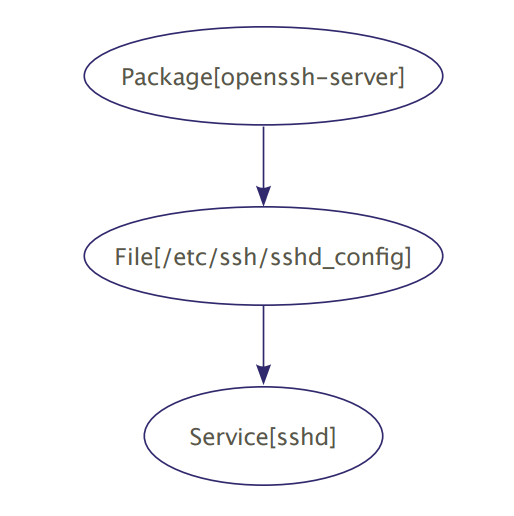

# Core Types Cheat Sheet

###THE TRIFECTA
Package/file/service: Learn it, live it, love it. If you can
only do this, you can still do a lot.

```
package { 'openssh-server':
    ensure => installed,
}
file { '/etc/ssh/sshd_config':
    source => 'puppet:///modules/sshd/
sshd_config',
    owner => 'root',
    group => 'root',
    mode => '640',
    notify => Service['sshd'], # sshd
              will restart whenever you
              edit this file.
    require => Package['openssh-server'],
}
service { 'sshd':
    ensure => running,
    enable => true,
    hasstatus => true,
    hasrestart => true,
}
```



###file
Manages local files

**ATTRIBUTES**
* ensure — Whether the file should exist, and what it
should be.
* present
* absent
* file
* directory
* link
* path — The fully qualified path to the file; defaults
to title.
* source — Where to download the file. A puppet:///
URL to a file on the master, or a path to a local file on
the agent.
* content — A string with the file’s desired contents.
Most useful when paired with templates, but you can
also use the output of the file function.
* target — The symlink target. (When ensure => link.)
* recurse — Whether to recursively manage the
directory. (When ensure => directory.)
 * true or false
* purge — Whether to keep unmanaged files out of the
directory. (When recurse => true.)
 * true or false
* owner — By name or UID.
* group — By name or GID.
* mode — Must be specified exactly. Does the right thing
for directories.
* See also: backup, checksum, force, ignore,
links, provider, recurselimit, replace,
selrange, selrole, seltype, seluser,
sourceselect, type.

###package
Manages software packages. Some platforms have better
package tools than others, so you’ll have to do some
research on yours; check the type reference for more info.

**ATTRIBUTES**
* ensure — The state for this package.
 * present
 * latest
 * {any version string}
 * absent
 * purged (Potentially dangerous. Ensures absent, then
   zaps configuration files and dependencies, including
   those that other packages depend on. Providerdependent.)
* name — The name of the package, as known to your
packaging system; defaults to title.
* source — Where to obtain the package, if your
system’s packaging tools don’t use a repository.
* See also: adminfile, allowcdrom, category,
configfiles, description, flavor, instance,
platform, provider, responsefile, root,
status, type, vendor.

###service
Manages services running on the node. Like with
packages, some platforms have better tools than others,
so read up. To restart a service whenever a file changes,
subscribe to the file or have the file notify the service.
(subscribe => File['sshd _ config'] or notify
=> Service['sshd'])

**ATTRIBUTES**
* ensure — The desired status of the service.
 * running (or true)
 * stopped (or false)
* enable — Whether the service should start on boot.
Doesn’t work everywhere.
 * true or false
* name — The name of the service to run; defaults
to title.
* status, start, stop, and restart — Manually
specified commands for working around bad init
scripts.
* hasrestart — Whether to use the init script’s restart
command instead of stop+start. Defaults to false.
 * true or false
* hasstatus — Whether to use the init script’s status
command instead of grepping the process table.
Defaults to false.
 * true or false
* pattern — A regular expression to use when
grepping the process table. Defaults to the name of
the service.
* See also: binary, control, manifest, path,
provider.

###HELLO WORLD
###notify
Sends an arbitrary message to the agent run-time log.

```
notify { "This message is getting logged
on the agent node.": }
notify { "Mac warning":
message => $operatingsystem ? {
 'Darwin' => "This seems to be a
Mac.",
 default => "And I’m a PC.",
},
}
```

**ATTRIBUTES**
* message — Defaults to title.
* See also: withpath

###GRAB BAG
###exec

Executes an arbitrary command on the agent node. When
using execs, make sure the command can be safely run
multiple times or specify that it should only run under
certain conditions.

**ATTRIBUTES**
* command — The command to run; defaults to title. If
this isn’t a fully-qualified path, use the path attribute.
* path — A search path for executables; colonseparated
list or an array. This is most useful as a
resource default, e.g.:

```
Exec {
path => [
 '/usr/local/bin',
 '/opt/local/bin',
 '/usr/bin',
 '/usr/sbin',
 '/bin',
 '/sbin'],
logoutput => true,
}
exec {'pwd':}
exec {'whoami':}
```

* creates — A file created by this command; if the file
exists, the command won’t run.
* refreshonly — If true, the exec will only run if a
resource it subscribes to (or a resource which notifies
it) has changed.
 * true or false
* onlyif — A command or array of commands; if any
have a non-zero return value, the command won’t run.
* unless — The opposite of onlyif.
* environment — An array of environment
variables to set (e.g. ['MYVAR=somevalue',
'OTHERVAR=othervalue']).
* See also: cwd, group, logoutput, returns,
timeout, tries, try _ sleep, user.

###cron
Manages cron jobs. Largely self-explanatory