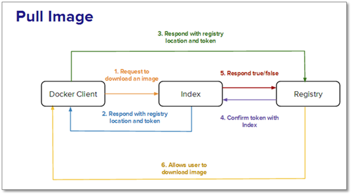
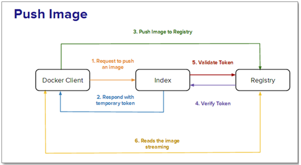
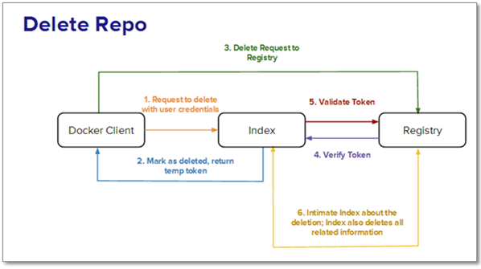

# Docker Registry & Workflows

In the previous #Docker Tutorial Series post, we discussed the importance of DockerFile and provided a list of DockerFile commands that makes the automation of image creation easier. In this post, let’s talk about about a significant #Docker component: #Docker Registry. This is the central registry for all repositories, public and private, and their workflows. But, before we dive into #Docker Registry, let’s go over some common terms and concepts related to repositories.

1. Repositories can be “liked” using stars or by being bookmarked.

2. Interact with the community by using the comment service to leave “comments” on the repositories.

3. Private repositories are similar to public ones, except that the former does not show up on search results and give access rights to it. A user, set as a collaborator, only has access to the private repositories.

4. Configure webhooks after a successful push has been made.

### Docker Registry has three roles to play: the index, registry and registry client.

stock_insert_index_markerRole #1 -- Index: The index is responsible for and maintains information about user accounts, checksums of the images, and public namespaces. It maintains such information using the following components:

* Web UI

* Meta-data store

* Authentication service

* Tokenization

It also resolves longer URLs for easier use and authenticates owners to repositories.

**Role #2 -- Registry:** The registry houses the images and graphs for the repositories. However, it does not have a local database and provides no user authentication. Database support is provided by S3, cloud files and local FS. Furthermore, the authentication is taken care of by the Index Auth service using tokens. Registries can be of different types. Let’s analyze a few of them:

1. **Sponsor Registry:** A third-party registry for use by its customers and the #Docker community.

2. **Mirror Registry:** A third-party registry for use by only its customers.

3. **Vendor Registry:** A registry provided by a vendor who distributes #Docker images.

4. **Private Registry:** A registry operated by a private entity with a firewall and additional layers of security.

**clientRole #3** -- Registry Client: #Docker acts as the registry client that maintains push and pull, as well as client authorizations.

Docker Registry in Action

Now, let’s discuss five scenarios to better comprehend the working of #Docker Registry. Scenario A: A user wants to pull or download an image. The steps that are involved are as follows:

Step 1: The user places a request to the index to download the image.

Step 2: The index, in response, returns three pertinent pieces of information:

1. The registry in which the image is located

2. Checksums for the image, including all layers

3. Token for authorization purposes

Note: Tokens are only sent when the request has the X-Docker-Token in the header. While private repositories need basic authentication, it’s not mandatory for public repositories.

Step 3: The user now contacts the registry with the token that was returned in the response. The registry is wholly responsible for the images. It stores the base image and the inherited layers.

Step 4: The registry now confirms with the Index that the token is authorized.

Step 5: The index now sends a “true” or “false” to the registry, thereby allowing the user to download the needed image

Scenario B: The user wants to push an image to the registry. The steps involved are as follows:

Step 1: The user contacts the index with credentials requesting allocation of the repository name.

Step 2: On successful authentication and namespace availability, the repository name is allocated. A temporary token is returned in response.

Step 3: The image, along with the token, is pushed to the registry.

Step 4: The registry confirms the token with the index, then starts reading the pushed stream after validation by the index.

Step 5: The index is then updated with the image checksums by #Docker.

Scenario C: The user wants to delete an image from the index or registry.

Step 1: The index receives a signal from #Docker to delete the repository.

Step 2: If the index validates the repository, it deletes the repository and returns a temporary token.

Step 3: The registry now receives the delete signal, along with the token.

Step 4: The token is verified with the index, and the registry deletes the repository and all related information.

Step 5: #Docker now intimates the index about the deletion, and the index removes all records of the repository.

Scenario D: The user wishes to use the registry in standalone mode without the index. Use of the registry, without the index, which is under the full control of #Docker, is best suited for storing images on private networks. The registry spins up in a special mode which restricts communication with the #Docker index. All security and authentication needs to be taken care of by the user.

Scenario E: The user wishes to use the registry in standalone mode with the index. In this scenario, a custom index is created to store and access images in a private network. However, the overhead is to inform #Docker about the custom index. #Docker provides an interesting concept of chaining registries, which in turn, enables load balancing and allocation of a specific registry for specific requests. In the next Docker Tutorial Series post, we will discuss how to use the #Docker Registry API for each of the above-mentioned scenarios, as well as delve into Docker Security.

