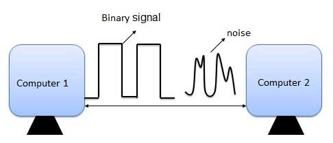

# Error Detection & Correction

###What is Error?

Error is a condition when the output information does not match with the input information. During transmission, digital signals suffer from noise that can introduce errors in the binary bits travelling from one system to other. That means a 0 bit may change to 1 or a 1 bit may change to 0.

###Error-Detecting codes

Whenever a message is transmitted, it may get scrambled by noise or data may get corrupted. To avoid this, we use error-detecting codes which are additional data added to a given digital message to help us detect if an error occurred during transmission of the message. A simple example of error-detecting code is **parity check**.

###Error-Correcting codes

Along with error-detecting code, we can also pass some data to figure out the original message from the corrupt message that we received. This type of code is called an error-correcting code. Error-correcting codes also deploy the same strategy as error-detecting codes but additionally, such codes also detect the exact location of the corrupt bit.

In error-correcting codes, parity check has a simple way to detect errors along with a sophisticated mechanism to determine the corrupt bit location. Once the corrupt bit is located, its value is reverted (from 0 to 1 or 1 to 0) to get the original message.