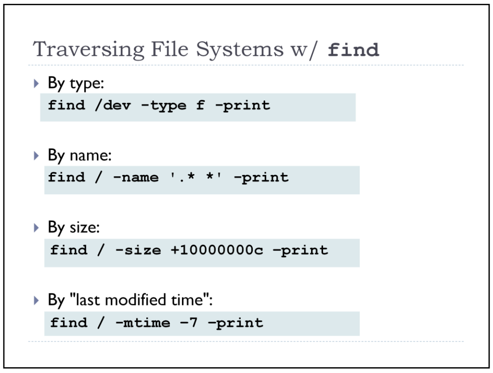

# FIND

（the "+" means "greater than", "-" means "less than"）

```
find . -type f -print -delete
```

Find files using file-name ( case in-sensitve find)

```
# find -iname "MyCProgram.c"
```

Execute commands on files found by the find command

```
$ find -iname "MyCProgram.c" -exec md5sum {} \;
```

Find all empty files in home directory

```
# find ~ -empty
```

