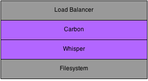
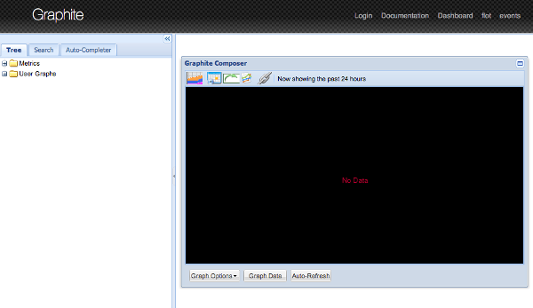

# Graphite

In this article, I'll provide a guide to help through all of the steps involved in setting up a monitoring system using a Graphite stack.

###What We Will Cover

We will cover the following topics to set up our Graphite monitoring system:

1. Introduction to Carbon & Whisper
2. Whisper Storage Schemas & Aggregations
3. Graphite Webapp

###Prerequisites

First and foremost we need hardware on which to run the Graphite stack. For simplicity, I will be using Amazon Web Services EC2 hosts. However, feel free to use any type of computer that you might have laying around in your office or at home.

Specifications:

* Operating System: Red Hat Enterprise Linux (RHEL) 6.5
* Instance Type: m3.xlarge
* Elastic Block Store (EBS) Volume: 250 GB
* Python Version: 2.6.6

###Introduction to Carbon & Whisper

Graphite is composed of multiple back-end and front-end components. The back-end components are used to store numeric time-series data. The front-end components are used to retrieve the metric data and optionally render graphs. In this article, I'll focus first on the back-end components: Carbon and Whisper.



Metrics can be published to a load balancer or directly to a Carbon process. The Carbon process interacts with the Whisper database library to store the time-series data to the filesystem.

**Install Carbon**

Carbon refers to a series of daemons that make up the storage backend of a Graphite installation. The daemons listen for time-series data using an event-driven networking engine called Twisted. The Twisted framework permits Carbon daemons to handle a large number of clients and a large amount of traffic with a low amount of overhead.

To install Carbon, run the following commands (assuming RHEL operating system):

```
# sudo yum groupinstall "Development Tools"
# sudo yum install python-devel
# sudo yum install git
# sudo easy_install pip
# sudo pip install twisted
# cd /tmp
# git clone https://github.com/graphite-project/carbon.git
# cd /tmp/carbon
# sudo python setup.py install
```

The /opt/graphite directory should now have the carbon libraries and configuration files:

```
# ls -l /opt/graphite
drwxr-xr-x. 2 root root 4096 May 18 23:56 bin
drwxr-xr-x. 2 root root 4096 May 18 23:56 conf
drwxr-xr-x. 4 root root 4096 May 18 23:56 lib
drwxr-xr-x. 6 root root 4096 May 18 23:56 storage
```

Inside the bin folder, you’ll find the three different types of Carbon daemons.

* **Cache**: accepts metrics over various protocols and writes them to disk as efficiently as possible; caches metric values in RAM as they are received, and flushes them to disk on a specified interval using the underlying Whisper library.
* **Relay**: serves two distinct purposes: replication and sharding of incoming metrics.
* **Aggregator**: runs in front of a cache to buffer metrics over time before reporting them into Whisper.

###Install Whisper

Whisper is a database library for storing time-series data that is then retrieved and manipulated by applications using the create, update, and fetch operations.

To install Whisper, run the following commands:

```
# cd /tmp
# git clone https://github.com/graphite-project/whisper.git
# cd /tmp/whisper
# sudo python setup.py install
```

The Whisper scripts should now be in place:

```
# ls -l /usr/bin/whisper*
-rwxr-xr-x. 1 root root 1711 May 19 00:00 /usr/bin/whisper-create.py
-rwxr-xr-x. 1 root root 2902 May 19 00:00 /usr/bin/whisper-dump.py
-rwxr-xr-x. 1 root root 1779 May 19 00:00 /usr/bin/whisper-fetch.py
-rwxr-xr-x. 1 root root 1121 May 19 00:00 /usr/bin/whisper-info.py
-rwxr-xr-x. 1 root root  674 May 19 00:00 /usr/bin/whisper-merge.py
-rwxr-xr-x. 1 root root 5982 May 19 00:00 /usr/bin/whisper-resize.py
-rwxr-xr-x. 1 root root 1060 May 19 00:00 /usr/bin/whisper-set-aggregation-method.py
-rwxr-xr-x. 1 root root  969 May 19 00:00 /usr/bin/whisper-update.py
```

###Start a Carbon Cache Process

The Carbon installation comes with sensible defaults for port numbers and many other configuration parameters. Copy the existing example configuration files:
```
# cd /opt/graphite/conf
# cp aggregation-rules.conf.example aggregation-rules.conf
# cp blacklist.conf.example blacklist.conf
# cp carbon.conf.example carbon.conf
# cp carbon.amqp.conf.example carbon.amqp.conf
# cp relay-rules.conf.example relay-rules.conf
# cp rewrite-rules.conf.example rewrite-rules.conf
# cp storage-schemas.conf.example storage-schemas.conf
# cp storage-aggregation.conf.example storage-aggregation.conf
# cp whitelist.conf.example whitelist.conf
# vi carbon.conf
```

Under the cache section, the line receiver port has a default value and it is used to accept incoming metrics through the plaintext protocol (see below):
```
[cache]
LINE_RECEIVER_INTERFACE = 0.0.0.0
LINE_RECEIVER_PORT = 2003
```

Start a carbon-cache process by running the following command:

```
# cd /opt/graphite/bin
# ./carbon-cache.py start
Starting carbon-cache (instance a)
```

The process should now be listening on port 2003:
```
# ps -efla | grep carbon-cache
1 S root      2674     1  0  80   0 - 75916 ep_pol 00:18 ?        00:00:03 /usr/bin/python ./carbon-cache.py start

# netstat -nap | grep 2003
tcp        0      0 0.0.0.0:2003                0.0.0.0:*                   LISTEN      2674/python 
```

###Publish Metrics

A metric is any measurable quantity that can vary over time, for example:

* number of requests per second
* request processing time
* CPU usage

A datapoint is a tuple containing:

* a metric name
* a measured value
* at a specific point in time (usually a timestamp)

Client applications publish metrics by sending data points to a Carbon process. The application establishes a TCP connection on the Carbon process' port and sends data points in a simple plaintext format. In our example, the port is 2003. The TCP connection may remain open and reused as many times as necessary. The Carbon process listens for incoming data but does not send any response back to the client.

The datapoint format is defined as:

* a single line of text per data point
* a dotted metric name at position 0
* a value at position 1
* a Unix Epoch timestamp at position 2
* spaces for the position separators

For example, here are some valid datapoints:

* The number of metrics received by the carbon-cache process every minute
    * carbon.agents.graphite-tutorial.metricsReceived 28198 1400509108
* The number of metrics created by the carbon-cache process every minute
    * carbon.agents.graphite-tutorial.creates 8 1400509110
* The p95 response times for a sample server endpoint over a minute
    * PRODUCTION.host.graphite-tutorial.responseTime.p95 0.10 1400509112

Client applications have multiple ways to publish metrics:

* using the plaintext protocol with tools such as the netcat (nc) command
* using the pickle protocol
* using the Advanced Message Queueing Protocol (AMQP)
* using libraries such as the Dropwizard Metrics library

For simplicity, in this tutorial I'll be using the plaintext protocol through the netcat command. To publish the example datapoints listed above, run the following commands:

```
sudo yum install nc
echo "carbon.agents.graphite-tutorial.metricsReceived 28198 `date +%s`" | nc localhost 2003
echo "carbon.agents.graphite-tutorial.creates 8 `date +%s`" | nc localhost 2003
echo "PRODUCTION.host.graphite-tutorial.responseTime.p95 0.10 `date +%s`" | nc localhost 2003
```

The carbon-cache log files will contain information about the new metrics received and where the information was stored:
```
# tail -f /opt/graphite/storage/log/carbon-cache/carbon-cache-a/creates.log
19/05/2014 10:42:44 :: creating database file /opt/graphite/storage/whisper/carbon/agents/graphite-tutorial/metricsReceived.wsp (archive=[(60, 129600)] xff=0.5 agg=average)
19/05/2014 10:42:53 :: creating database file /opt/graphite/storage/whisper/carbon/agents/graphite-tutorial/creates.wsp (archive=[(60, 129600)] xff=0.5 agg=average)
19/05/2014 10:42:57 :: creating database file /opt/graphite/storage/whisper/PRODUCTION/host/graphite-tutorial/responseTime/p95.wsp (archive=[(60, 1440)] xff=0.5 agg=average)
```

Carbon interacts with Whisper to store the time-series data to the filesystem. Navigate the filesystem to make sure the data files have been created:
```
# ls -l /opt/graphite/storage/whisper/carbon/agents/graphite-tutorial/
total 3040
-rw-r--r--. 1 root root 1555228 May 19 10:42 creates.wsp
-rw-r--r--. 1 root root 1555228 May 19 10:42 metricsReceived.wsp
# ls -l /opt/graphite/storage/whisper/PRODUCTION/host/graphite-tutorial/responseTime/
total 20
-rw-r--r--. 1 root root 17308 May 19 10:42 p95.wsp
```

Finally, you can retrieve metadata information about the Whisper file that was created for the metric using the whisper-info script:
```
# whisper-info.py /opt/graphite/storage/whisper/PRODUCTION/host/graphite-tutorial/responseTime/p95.wsp 
maxRetention: 86400
xFilesFactor: 0.5
aggregationMethod: average
fileSize: 17308

Archive 0
retention: 86400
secondsPerPoint: 60
points: 1440
size: 17280
offset: 28
```

The whisper-dump script is a more complete script that outputs the original data for all storage retention periods along with the metadata information about the Whisper file:
```
# whisper-dump.py /opt/graphite/storage/whisper/PRODUCTION/host/graphite-tutorial/responseTime/p95.wsp 
Meta data:
  aggregation method: average
  max retention: 86400
  xFilesFactor: 0.5

Archive 0 info:
  offset: 28
  seconds per point: 60
  points: 1440
  retention: 86400
  size: 17280

Archive 0 data:
0: 1400609220, 0.1000000000000000055511151231257827
1: 0,          0
2: 0,          0
3: 0,          0
4: 0,          0
5: 0,          0
...
1437: 0,          0
1438: 0,          0
1439: 0,          0
```

Aggregation method, max retention, xFilesFactor, and all of the other attributes of the Whisper file are important to understand. Don't worry if you're lost at this point, I'll be covering these in more detail in the next section.

###Whisper Storage Schemas & Aggregations
There might be some confusion when you or your fellow developers and system administrators start publishing data points and get unexpected results:

* Why are my data points getting averaged?
* I've been publishing data points intermittently, why are there no data points?
* I've been publishing data points for many days, why am I only getting data for one day?

###How does Whisper store data?

We first need to understand how data is stored in the Whisper files. When a Whisper file is created, it has a fixed size that will never change. Within the Whisper file there are potentially multiple "buckets", that you need to define in the configuration files, for data points at different resolutions. For example:

* Bucket A: data points with 10-second resolution
* Bucket B: data points with 60-second resolution
* Bucket C: data points with 10-minute resolution

Each bucket also has a retention attribute indicating the length of time data points in the bucket should be retained for. For example:

* Bucket A: data points with 10-second resolution retained for 6 hours
* Bucket B: data points with 60-second resolution retained for 1 day
* Bucket C: data points with 10-minute resolution retained for 7 days

Given these two pieces of information, Whisper performs some simple math to figure out how many points it will actually need to keep in each bucket:

* Bucket A: 6 hours x 60 mins/hour x 6 data points/min = 2160 points
* Bucket B: 1 day x 24 hours/day x 60 mins/hour x 1 data point/min = 1440 points
* Bucket C: 7 days x 24 hours/day x 6 data points/hour = 1008 points

If a Whisper file is created with this storage schema configuration, it will have a size of 56 KB. If you run it through the whisper-dump.py script, the following will be the output. Note that an archive corresponds to a bucket and the seconds per point and points attributes match our computations above.

Meta data:

```
aggregation method: average
  max retention: 604800
  xFilesFactor: 0.5

Archive 0 info:
  offset: 52
  seconds per point: 10
  points: 2160
  retention: 21600
  size: 25920

Archive 1 info:
  offset: 25972
  seconds per point: 60
  points: 1440
  retention: 86400
  size: 17280

Archive 2 info:
  offset: 43252
  seconds per point: 600
  points: 1008
  retention: 604800
  size: 12096
```

###What about aggregations?

Aggregations come into play when data from a high precision bucket is moved to a lower precision bucket. Let's use Bucket A and B from our previous example.

* Bucket A: 10-second resolution retained for 6 hours (higher precision)
* Bucket B: 60-second resolution retained for 1 day (lower precision)

We might have an application publishing data points every 10 seconds. Any data points published less than 6 hours ago will be found in Bucket A. However, if I start to query for data points published more than 6 hours ago, they will be found in Bucket B.

###How are data points moved to Bucket B?
The lower precision value is divided by the higher precision value to determine the number of data points that will need to be aggregated.

l 60 seconds (Bucket B) / 10 seconds (Bucket A) = 6 data points to aggregate

NOTE: Whisper needs the lower precision value to be cleanly divisible by the higher precision value (i.e. the division must result in a whole number). Otherwise the aggregation might not be accurate.

To aggregate the data, Whisper reads 6 10-second data points from Bucket A and applies a function to them to come up with the single 60-second data point that will be stored in Bucket B. There are five options for the aggregation function: average, sum, max, min and last. The choice of aggregation function depends on the data points you're dealing with. 95th percentile values, for example, should probably be aggregated with the max function. For counters, on the other hand, the sum function would be more appropriate.

Whisper also handles the concept of an xFilesFactor when aggregating data points. It represents the ratio of data points a bucket must contain to be aggregated accurately. In our previous example, Whisper determined that it needed to aggregate 6 10-second data points. It could be possible that only 4 data points have data and the other 2 are null - due to networking issues, application restarts, etc.

If our Whisper file has an xFilesFactor of 0.5, it means that it will aggregate the data only if at least 50% of the data points are present. If more than 50% of the data points are null, Whisper will create a null aggregation. In our case, we have 4 out of 6 data points - 66%. The aggregation function will be applied on the non-null data points to create the aggregated value.

You may set the xFilesFactor to any value between 0 and 1. A value of 0 indicates that the aggregation should be computed even if there is only one data point available. A value of 1 indicates that the aggregation should be computed only if all data points are present.

In the previous section, we made copies of all the example configuration files in the /opt/graphite/conf directory. The configuration files that control how Whisper files are created are:

* /opt/graphite/conf/storage-schemas.conf
* /opt/graphite/conf/storage-aggregation.conf

###Default Storage Schemas

The storage-schemas configuration file is composed of multiple entries containing a pattern against which to match metric names and a retention definition. By default there are two entries: carbon and everything else.

The carbon entry matches metric names that start with the "carbon" string. Carbon daemons emit their own internal metrics every 60 seconds - by default, but it can be changed. For example, a carbon-cache process will emit a metric for the number of metric files it creates every minute. The retention definition indicates that data points reported every 60 seconds will be retained for 90 days.

```
[carbon]
pattern = ^carbon\.
retentions = 60s:90d
```

The everything else entry captures any other metric that is not carbon-related by specifying a pattern with an asterisk. The retention definition indicates that data points reported every 60 seconds will be retained for 1 day.
```
[default_1min_for_1day]
pattern = .*
retentions = 60s:1d
```

###Default Storage Aggregation

The storage-aggregation configuration file is also composed of multiple entries containing:

* a pattern against which to match metric names
* an xFilesFactor value
* an aggregation function

By default there are four entries:

* l Metrics ending in .min
    * Use the min aggregation function
    * At least 10% of data points should be present to aggregate
* l Metrics ending in .max
    * Use the max aggregation function
    * At least 10% of data points should be present to aggregate
* l Metrics ending in .count
    * Use the sum aggregation function
    * Aggregate if there is at least one data point
* l Any other metrics
    * Use the average aggregation function
    * At least 50% of data points should be present to aggregate

```
[min]
pattern = \.min$
xFilesFactor = 0.1
aggregationMethod = min

[max]
pattern = \.max$
xFilesFactor = 0.1
aggregationMethod = max

[sum]
pattern = \.count$
xFilesFactor = 0
aggregationMethod = sum

[default_average]
pattern = .*
xFilesFactor = 0.5
aggregationMethod = average
```

The default storage schemas and storage aggregations work well for testing, but for real production metrics you might want to modify the configuration files.

###Modify Storage Schemas

First off, I'll modify the carbon entry. I'd like to keep the metrics reported by Carbon every 60 seconds for 180 days (6 months). After 180 days, I'd like to rollup the metrics to a precision of 10 minutes and keep those for another 180 days.
```
[carbon]
pattern = ^carbon\.
retentions = 1min:180d,10min:180d
```

At Squarespace we use the Dropwizard framework to build RESTful web services. We have many of these services running in staging and production environments and they all use the Dropwizard Metrics library to publish application and business metrics every 10 seconds. I'd like to keep 10-second data for 3 days. After 3 days, the data should be aggregated to 1-minute data and kept for 180 days (6 months). Finally, after 6 months, the data should be aggregated to 10-minute data and kept for 180 days.

NOTE: If my metrics library published data points at a different rate, my retention definition would need to change to match it.
```
[production_staging]
pattern = ^(PRODUCTION|STAGING).*
retentions = 10s:3d,1min:180d,10min:180d
```

Metrics that are not carbon, production, or staging metrics are probably just test metrics. I'll keep those around only for one day and assume that they will be published every minute.
```
[default_1min_for_1day]
pattern = .*
retentions = 60s:1d
```

###Modify Storage Aggregations

I'm going to keep the default storage aggregation entries, but will add a couple more for metrics ending in ratio, m1_rate and p95.

NOTE: Any new entries should be added before the default entry.
```
[ratio]
pattern = \.ratio$
xFilesFactor = 0.1
aggregationMethod = average

[m1_rate]
pattern = \.m1_rate$
xFilesFactor = 0.1
aggregationMethod = sum

[p95]
pattern = \.p95$
xFilesFactor = 0.1
aggregationMethod = max
```
At this point you have configured your Graphite backend to match the data point publishing rates of your application and fully understand how the data points are stored in the filesystem. In the next section, we'll attempt to visualize the data using graphite-webapp.

###Graphite Webapp

Now that we have the back-end components up and running and storing numeric time-series data in the formats that we have specified, it's time to take a look at the front-end components of Graphite. Specifically, we need a way to query and visualize the information that is stored.

The Graphite web application is a Django application that runs under Apache/mod_wsgi, according to the Github readme file. In general, it provides the following:

l a URL-based API endpoint to retrieve raw data and generate graphs

l a user interface to navigate metrics and build and save dashboards

Posted by Franklin Angulo on Jan 23, 2015 | 2  Discuss Share|  Read laterMy Reading List
 

In this article, I'll provide a guide to help through all of the steps involved in setting up a monitoring system using a Graphite stack.

What We Will Cover

We will cover the following topics to set up our Graphite monitoring system:

Introduction to Carbon & Whisper
Whisper Storage Schemas & Aggregations
Graphite Webapp
Prerequisites

First and foremost we need hardware on which to run the Graphite stack. For simplicity, I will be using Amazon Web Services EC2 hosts. However, feel free to use any type of computer that you might have laying around in your office or at home.

Specifications:

Operating System: Red Hat Enterprise Linux (RHEL) 6.5
Instance Type: m3.xlarge
Elastic Block Store (EBS) Volume: 250 GB
Python Version: 2.6.6
Introduction to Carbon & Whisper

Graphite is composed of multiple back-end and front-end components. The back-end components are used to store numeric time-series data. The front-end components are used to retrieve the metric data and optionally render graphs. In this article, I'll focus first on the back-end components: Carbon and Whisper.


Metrics can be published to a load balancer or directly to a Carbon process. The Carbon process interacts with the Whisper database library to store the time-series data to the filesystem.

Install Carbon

Carbon refers to a series of daemons that make up the storage backend of a Graphite installation. The daemons listen for time-series data using an event-driven networking engine called Twisted. The Twisted framework permits Carbon daemons to handle a large number of clients and a large amount of traffic with a low amount of overhead.

To install Carbon, run the following commands (assuming RHEL operating system):
 

# sudo yum groupinstall "Development Tools"
# sudo yum install python-devel
# sudo yum install git
# sudo easy_install pip
# sudo pip install twisted
# cd /tmp
# git clone https://github.com/graphite-project/carbon.git
# cd /tmp/carbon
# sudo python setup.py install
The /opt/graphite directory should now have the carbon libraries and configuration files:

# ls -l /opt/graphite
drwxr-xr-x. 2 root root 4096 May 18 23:56 bin
drwxr-xr-x. 2 root root 4096 May 18 23:56 conf
drwxr-xr-x. 4 root root 4096 May 18 23:56 lib
drwxr-xr-x. 6 root root 4096 May 18 23:56 storage
Inside the bin folder, you’ll find the three different types of Carbon daemons.

Cache: accepts metrics over various protocols and writes them to disk as efficiently as possible; caches metric values in RAM as they are received, and flushes them to disk on a specified interval using the underlying Whisper library.
Relay: serves two distinct purposes: replication and sharding of incoming metrics.
Aggregator: runs in front of a cache to buffer metrics over time before reporting them into Whisper.
Install Whisper

Whisper is a database library for storing time-series data that is then retrieved and manipulated by applications using the create, update, and fetch operations.

To install Whisper, run the following commands:

# cd /tmp
# git clone https://github.com/graphite-project/whisper.git
# cd /tmp/whisper
# sudo python setup.py install
The Whisper scripts should now be in place:

# ls -l /usr/bin/whisper*
-rwxr-xr-x. 1 root root 1711 May 19 00:00 /usr/bin/whisper-create.py
-rwxr-xr-x. 1 root root 2902 May 19 00:00 /usr/bin/whisper-dump.py
-rwxr-xr-x. 1 root root 1779 May 19 00:00 /usr/bin/whisper-fetch.py
-rwxr-xr-x. 1 root root 1121 May 19 00:00 /usr/bin/whisper-info.py
-rwxr-xr-x. 1 root root  674 May 19 00:00 /usr/bin/whisper-merge.py
-rwxr-xr-x. 1 root root 5982 May 19 00:00 /usr/bin/whisper-resize.py
-rwxr-xr-x. 1 root root 1060 May 19 00:00 /usr/bin/whisper-set-aggregation-method.py
-rwxr-xr-x. 1 root root  969 May 19 00:00 /usr/bin/whisper-update.py
Start a Carbon Cache Process

The Carbon installation comes with sensible defaults for port numbers and many other configuration parameters. Copy the existing example configuration files:

# cd /opt/graphite/conf
# cp aggregation-rules.conf.example aggregation-rules.conf
# cp blacklist.conf.example blacklist.conf
# cp carbon.conf.example carbon.conf
# cp carbon.amqp.conf.example carbon.amqp.conf
# cp relay-rules.conf.example relay-rules.conf
# cp rewrite-rules.conf.example rewrite-rules.conf
# cp storage-schemas.conf.example storage-schemas.conf
# cp storage-aggregation.conf.example storage-aggregation.conf
# cp whitelist.conf.example whitelist.conf
# vi carbon.conf
Under the cache section, the line receiver port has a default value and it is used to accept incoming metrics through the plaintext protocol (see below):

[cache]
LINE_RECEIVER_INTERFACE = 0.0.0.0
LINE_RECEIVER_PORT = 2003
Start a carbon-cache process by running the following command:

# cd /opt/graphite/bin
# ./carbon-cache.py start
Starting carbon-cache (instance a)
The process should now be listening on port 2003:

# ps -efla | grep carbon-cache
1 S root      2674     1  0  80   0 - 75916 ep_pol 00:18 ?        00:00:03 /usr/bin/python ./carbon-cache.py start

# netstat -nap | grep 2003
tcp        0      0 0.0.0.0:2003                0.0.0.0:*                   LISTEN      2674/python 
Publish Metrics

A metric is any measurable quantity that can vary over time, for example:

number of requests per second
request processing time
CPU usage
A datapoint is a tuple containing:

a metric name
a measured value
at a specific point in time (usually a timestamp)
Client applications publish metrics by sending data points to a Carbon process. The application establishes a TCP connection on the Carbon process' port and sends data points in a simple plaintext format. In our example, the port is 2003. The TCP connection may remain open and reused as many times as necessary. The Carbon process listens for incoming data but does not send any response back to the client.

The datapoint format is defined as:

a single line of text per data point
a dotted metric name at position 0
a value at position 1
a Unix Epoch timestamp at position 2
spaces for the position separators
For example, here are some valid datapoints:

The number of metrics received by the carbon-cache process every minute
 carbon.agents.graphite-tutorial.metricsReceived 28198 1400509108
The number of metrics created by the carbon-cache process every minute
 carbon.agents.graphite-tutorial.creates 8 1400509110
The p95 response times for a sample server endpoint over a minute
 PRODUCTION.host.graphite-tutorial.responseTime.p95 0.10 1400509112
Client applications have multiple ways to publish metrics:

using the plaintext protocol with tools such as the netcat (nc) command
using the pickle protocol
using the Advanced Message Queueing Protocol (AMQP)
using libraries such as the Dropwizard Metrics library
For simplicity, in this tutorial I'll be using the plaintext protocol through the netcat command. To publish the example datapoints listed above, run the following commands:

sudo yum install nc
echo "carbon.agents.graphite-tutorial.metricsReceived 28198 `date +%s`" | nc localhost 2003
echo "carbon.agents.graphite-tutorial.creates 8 `date +%s`" | nc localhost 2003
echo "PRODUCTION.host.graphite-tutorial.responseTime.p95 0.10 `date +%s`" | nc localhost 2003
The carbon-cache log files will contain information about the new metrics received and where the information was stored:

# tail -f /opt/graphite/storage/log/carbon-cache/carbon-cache-a/creates.log
19/05/2014 10:42:44 :: creating database file /opt/graphite/storage/whisper/carbon/agents/graphite-tutorial/metricsReceived.wsp (archive=[(60, 129600)] xff=0.5 agg=average)
19/05/2014 10:42:53 :: creating database file /opt/graphite/storage/whisper/carbon/agents/graphite-tutorial/creates.wsp (archive=[(60, 129600)] xff=0.5 agg=average)
19/05/2014 10:42:57 :: creating database file /opt/graphite/storage/whisper/PRODUCTION/host/graphite-tutorial/responseTime/p95.wsp (archive=[(60, 1440)] xff=0.5 agg=average)
Carbon interacts with Whisper to store the time-series data to the filesystem. Navigate the filesystem to make sure the data files have been created:

# ls -l /opt/graphite/storage/whisper/carbon/agents/graphite-tutorial/
total 3040
-rw-r--r--. 1 root root 1555228 May 19 10:42 creates.wsp
-rw-r--r--. 1 root root 1555228 May 19 10:42 metricsReceived.wsp
# ls -l /opt/graphite/storage/whisper/PRODUCTION/host/graphite-tutorial/responseTime/
total 20
-rw-r--r--. 1 root root 17308 May 19 10:42 p95.wsp
Finally, you can retrieve metadata information about the Whisper file that was created for the metric using the whisper-info script:

# whisper-info.py /opt/graphite/storage/whisper/PRODUCTION/host/graphite-tutorial/responseTime/p95.wsp 
maxRetention: 86400
xFilesFactor: 0.5
aggregationMethod: average
fileSize: 17308

Archive 0
retention: 86400
secondsPerPoint: 60
points: 1440
size: 17280
offset: 28
The whisper-dump script is a more complete script that outputs the original data for all storage retention periods along with the metadata information about the Whisper file:

# whisper-dump.py /opt/graphite/storage/whisper/PRODUCTION/host/graphite-tutorial/responseTime/p95.wsp 
Meta data:
  aggregation method: average
  max retention: 86400
  xFilesFactor: 0.5

Archive 0 info:
  offset: 28
  seconds per point: 60
  points: 1440
  retention: 86400
  size: 17280

Archive 0 data:
0: 1400609220, 0.1000000000000000055511151231257827
1: 0,          0
2: 0,          0
3: 0,          0
4: 0,          0
5: 0,          0
...
1437: 0,          0
1438: 0,          0
1439: 0,          0
Aggregation method, max retention, xFilesFactor, and all of the other attributes of the Whisper file are important to understand. Don't worry if you're lost at this point, I'll be covering these in more detail in the next section.

Whisper Storage Schemas & Aggregations

There might be some confusion when you or your fellow developers and system administrators start publishing data points and get unexpected results:

Why are my data points getting averaged?
I've been publishing data points intermittently, why are there no data points?
I've been publishing data points for many days, why am I only getting data for one day?
How does Whisper store data?

We first need to understand how data is stored in the Whisper files. When a Whisper file is created, it has a fixed size that will never change. Within the Whisper file there are potentially multiple "buckets", that you need to define in the configuration files, for data points at different resolutions. For example:

Bucket A: data points with 10-second resolution
Bucket B: data points with 60-second resolution
Bucket C: data points with 10-minute resolution
Each bucket also has a retention attribute indicating the length of time data points in the bucket should be retained for. For example:

Bucket A: data points with 10-second resolution retained for 6 hours
Bucket B: data points with 60-second resolution retained for 1 day
Bucket C: data points with 10-minute resolution retained for 7 days
Given these two pieces of information, Whisper performs some simple math to figure out how many points it will actually need to keep in each bucket:

Bucket A: 6 hours x 60 mins/hour x 6 data points/min = 2160 points
Bucket B: 1 day x 24 hours/day x 60 mins/hour x 1 data point/min = 1440 points
Bucket C: 7 days x 24 hours/day x 6 data points/hour = 1008 points
If a Whisper file is created with this storage schema configuration, it will have a size of 56 KB. If you run it through the whisper-dump.py script, the following will be the output. Note that an archive corresponds to a bucket and the seconds per point and points attributes match our computations above.

Meta data:

aggregation method: average
  max retention: 604800
  xFilesFactor: 0.5

Archive 0 info:
  offset: 52
  seconds per point: 10
  points: 2160
  retention: 21600
  size: 25920

Archive 1 info:
  offset: 25972
  seconds per point: 60
  points: 1440
  retention: 86400
  size: 17280

Archive 2 info:
  offset: 43252
  seconds per point: 600
  points: 1008
  retention: 604800
  size: 12096
What about aggregations?

Aggregations come into play when data from a high precision bucket is moved to a lower precision bucket. Let's use Bucket A and B from our previous example.

ucket A: 10-second resolution retained for 6 hours (higher precision)
Bucket B: 60-second resolution retained for 1 day (lower precision)
We might have an application publishing data points every 10 seconds. Any data points published less than 6 hours ago will be found in Bucket A. However, if I start to query for data points published more than 6 hours ago, they will be found in Bucket B.

How are data points moved to Bucket B?

The lower precision value is divided by the higher precision value to determine the number of data points that will need to be aggregated.

l 60 seconds (Bucket B) / 10 seconds (Bucket A) = 6 data points to aggregate

NOTE: Whisper needs the lower precision value to be cleanly divisible by the higher precision value (i.e. the division must result in a whole number). Otherwise the aggregation might not be accurate.

To aggregate the data, Whisper reads 6 10-second data points from Bucket A and applies a function to them to come up with the single 60-second data point that will be stored in Bucket B. There are five options for the aggregation function: average, sum, max, min and last. The choice of aggregation function depends on the data points you're dealing with. 95th percentile values, for example, should probably be aggregated with the max function. For counters, on the other hand, the sum function would be more appropriate.

Whisper also handles the concept of an xFilesFactor when aggregating data points. It represents the ratio of data points a bucket must contain to be aggregated accurately. In our previous example, Whisper determined that it needed to aggregate 6 10-second data points. It could be possible that only 4 data points have data and the other 2 are null - due to networking issues, application restarts, etc.

If our Whisper file has an xFilesFactor of 0.5, it means that it will aggregate the data only if at least 50% of the data points are present. If more than 50% of the data points are null, Whisper will create a null aggregation. In our case, we have 4 out of 6 data points - 66%. The aggregation function will be applied on the non-null data points to create the aggregated value.

You may set the xFilesFactor to any value between 0 and 1. A value of 0 indicates that the aggregation should be computed even if there is only one data point available. A value of 1 indicates that the aggregation should be computed only if all data points are present.

In the previous section, we made copies of all the example configuration files in the /opt/graphite/conf directory. The configuration files that control how Whisper files are created are:

/opt/graphite/conf/storage-schemas.conf
/opt/graphite/conf/storage-aggregation.conf
Default Storage Schemas

The storage-schemas configuration file is composed of multiple entries containing a pattern against which to match metric names and a retention definition. By default there are two entries: carbon and everything else.

The carbon entry matches metric names that start with the "carbon" string. Carbon daemons emit their own internal metrics every 60 seconds - by default, but it can be changed. For example, a carbon-cache process will emit a metric for the number of metric files it creates every minute. The retention definition indicates that data points reported every 60 seconds will be retained for 90 days.

[carbon]
pattern = ^carbon\.
retentions = 60s:90d
The everything else entry captures any other metric that is not carbon-related by specifying a pattern with an asterisk. The retention definition indicates that data points reported every 60 seconds will be retained for 1 day.

[default_1min_for_1day]
pattern = .*
retentions = 60s:1d
Default Storage Aggregation

The storage-aggregation configuration file is also composed of multiple entries containing:

a pattern against which to match metric names
an xFilesFactor value
an aggregation function
By default there are four entries:

l Metrics ending in .min
 Use the min aggregation function
 At least 10% of data points should be present to aggregate
l Metrics ending in .max
 Use the max aggregation function
 At least 10% of data points should be present to aggregate
l Metrics ending in .count
 Use the sum aggregation function
 Aggregate if there is at least one data point
l Any other metrics
 Use the average aggregation function
 At least 50% of data points should be present to aggregate
[min]
pattern = \.min$
xFilesFactor = 0.1
aggregationMethod = min

[max]
pattern = \.max$
xFilesFactor = 0.1
aggregationMethod = max

[sum]
pattern = \.count$
xFilesFactor = 0
aggregationMethod = sum

[default_average]
pattern = .*
xFilesFactor = 0.5
aggregationMethod = average
The default storage schemas and storage aggregations work well for testing, but for real production metrics you might want to modify the configuration files.

Modify Storage Schemas

First off, I'll modify the carbon entry. I'd like to keep the metrics reported by Carbon every 60 seconds for 180 days (6 months). After 180 days, I'd like to rollup the metrics to a precision of 10 minutes and keep those for another 180 days.

[carbon]
pattern = ^carbon\.
retentions = 1min:180d,10min:180d
At Squarespace we use the Dropwizard framework to build RESTful web services. We have many of these services running in staging and production environments and they all use the Dropwizard Metrics library to publish application and business metrics every 10 seconds. I'd like to keep 10-second data for 3 days. After 3 days, the data should be aggregated to 1-minute data and kept for 180 days (6 months). Finally, after 6 months, the data should be aggregated to 10-minute data and kept for 180 days.

NOTE: If my metrics library published data points at a different rate, my retention definition would need to change to match it.

[production_staging]
pattern = ^(PRODUCTION|STAGING).*
retentions = 10s:3d,1min:180d,10min:180d
Metrics that are not carbon, production, or staging metrics are probably just test metrics. I'll keep those around only for one day and assume that they will be published every minute.

[default_1min_for_1day]
pattern = .*
retentions = 60s:1d
Modify Storage Aggregations

I'm going to keep the default storage aggregation entries, but will add a couple more for metrics ending in ratio, m1_rate and p95.

NOTE: Any new entries should be added before the default entry.

[ratio]
pattern = \.ratio$
xFilesFactor = 0.1
aggregationMethod = average

[m1_rate]
pattern = \.m1_rate$
xFilesFactor = 0.1
aggregationMethod = sum

[p95]
pattern = \.p95$
xFilesFactor = 0.1
aggregationMethod = max
At this point you have configured your Graphite backend to match the data point publishing rates of your application and fully understand how the data points are stored in the filesystem. In the next section, we'll attempt to visualize the data using graphite-webapp.

###Graphite Webapp

Now that we have the back-end components up and running and storing numeric time-series data in the formats that we have specified, it's time to take a look at the front-end components of Graphite. Specifically, we need a way to query and visualize the information that is stored.

The Graphite web application is a Django application that runs under Apache/mod_wsgi, according to the Github readme file. In general, it provides the following:

l a URL-based API endpoint to retrieve raw data and generate graphs

l a user interface to navigate metrics and build and save dashboards

###The Installation Maze

The installation of graphite-web is really a maze. I have installed it multiple times - in RHEL, CentOS, Ubuntu and Mac OS X - and every time the steps have been different. Treat it as a game, enjoy it, and you'll know that you've completed the maze when all the required dependencies have been installed.

Instructions for RHEL 6.5:
```
# cd /tmp
# git clone https://github.com/graphite-project/graphite-web.git
# cd /tmp/graphite-web
# python check-dependencies.py
[REQUIRED] Unable to import the 'django' module, do you have Django installed for python 2.6.6?
[REQUIRED] Unable to import the 'pyparsing' module, do you have pyparsing module installed for python 2.6.6?
[REQUIRED] Unable to import the 'tagging' module, do you have django-tagging installed for python 2.6.6?
[OPTIONAL] Unable to import the 'memcache' module, do you have python-memcached installed for python 2.6.6? This feature is not required but greatly improves performance.
[OPTIONAL] Unable to import the 'txamqp' module, this is required if you want to use AMQP as an input to Carbon. Note that txamqp requires python 2.5 or greater.
[OPTIONAL] Unable to import the 'python-rrdtool' module, this is required for reading RRD.
3 optional dependencies not met. Please consider the optional items before proceeding.
3 necessary dependencies not met. Graphite will not function until these dependencies are fulfilled.
```

The goal is to install at least all of the required dependencies. Install the optional dependencies if you're planning on using the AMQ functionality or the caching functionality using Memcache.

```
# sudo yum install cairo-devel
# sudo yum install pycairo-devel
# sudo pip install django
# sudo pip install pyparsing
# sudo pip install django-tagging
# sudo pip install python-memcached
# sudo pip install txamqp
# sudo pip install pytz
# cd /tmp/graphite-web
# python check-dependencies.py
[OPTIONAL] Unable to import the 'python-rrdtool' module, this is required for reading RRD.
1 optional dependencies not met. Please consider the optional items before proceeding.
All necessary dependencies are met.
```

I've installed enough packages to meet the required dependencies. I can now install graphite-web:
```
# cd /tmp/graphite-web
# sudo python setup.py install
# ls -l /opt/graphite/webapp/
total 12
drwxr-xr-x.  6 root root 4096 May 23 14:33 content
drwxr-xr-x. 15 root root 4096 May 23 14:33 graphite
-rw-r--r--.  1 root root  280 May 23 14:33 graphite_web-0.10.0_alpha-py2.6.egg-info
```

The setup script moves the web application files to the proper location under /opt/graphite/webapp.

###Initialize the Database

The web application maintains an internal database to store user information and dashboards. Initialize the database by running the following:

```
# cd /opt/graphite
# export PYTHONPATH=$PYTHONPATH:`pwd`/webapp
# django-admin.py syncdb --settings=graphite.settings
You just installed Django's auth system, which means you don't have any superusers defined.
Would you like to create one now? (yes/no): yes
Username (leave blank to use 'root'): feangulo
Email address: feangulo@yaipan.com
Password: 
Password (again): 
Error: Blank passwords aren't allowed.
Password: 
Password (again): 
Superuser created successfully.
Installing custom SQL ...
Installing indexes ...
Installed 0 object(s) from 0 fixture(s)
```

This will create a new database and store it in the /opt/graphite/storage directory:
```
# ls -l /opt/graphite/storage/graphite.db 
-rw-r--r--. 1 root root 74752 May 23 14:46 /opt/graphite/storage/graphite.db
```

###Graphite Webapp Settings

The configuration file containing the graphite-webapp settings is located in the /opt/graphite/webapp/graphite folder. Copy the sample configuration file:

```
# vi /opt/graphite/webapp/graphite/local_settings.py
#########################
# General Configuration #
#########################
TIME_ZONE = 'UTC'
##########################
# Database Configuration #
##########################
DATABASES = {
    'default': {
        'NAME': '/opt/graphite/storage/graphite.db',
        'ENGINE': 'django.db.backends.sqlite3',
        'USER': '',
        'PASSWORD': '',
        'HOST': '',
        'PORT': ''
    }
}
```

At this point, if you followed the instructions in the previous sections, you should only have one carbon-cache process running on port 2003 with a query port on 7002. These are the defaults expected by the graphite-webapp. Therefore, there are no other changes required to the configuration file.

```
# ps -efla | grep carbon-cache
1 S root     14101     1  0  80   0 - 75955 ep_pol May20 ?        00:00:26 /usr/bin/python ./carbon-cache.py start
# netstat -nap | grep 2003
tcp        0      0 0.0.0.0:2003                0.0.0.0:*                   LISTEN      14101/python
# netstat -nap | grep 7002
tcp        0      0 0.0.0.0:7002                0.0.0.0:*                   LISTEN      14101/python
```

However, you could specify the carbon-cache process to read from explicitly in the settings file:
```
# vi /opt/graphite/webapp/graphite/local_settings.py
#########################
# Cluster Configuration #
#########################
CARBONLINK_HOSTS = ["127.0.0.1:7002:a"]
```

This means that I have a carbon-cache process running locally, with the query port set to 7002 and the name set to 'a'. If you look at the Carbon configuration file, you should see something like this:
```
# vi /opt/graphite/conf/carbon.conf
[cache]
LINE_RECEIVER_INTERFACE = 0.0.0.0
LINE_RECEIVER_PORT = 2003
CACHE_QUERY_INTERFACE = 0.0.0.0
CACHE_QUERY_PORT = 7002
```

NOTE: Where did the ‘a’ come from? That’s the default name assigned. To define more caches, you’d need to create additional named sections in the configuration file.
```
[cache:b]
LINE_RECEIVER_INTERFACE = 0.0.0.0
LINE_RECEIVER_PORT = 2004
CACHE_QUERY_INTERFACE = 0.0.0.0
CACHE_QUERY_PORT = 7003
```

###Dashboard and Graph Template Configuration

The Graphite webapp comes with dashboard and graph template defaults. Copy the sample configuration files:

```
# cd /opt/graphite/conf
# cp dashboard.conf.example dashboard.conf
# cp graphTemplates.conf.example graphTemplates.conf
```

I modify the dashboard configuration file to have larger graph tiles.
```
# vi /opt/graphite/conf/dashboard.conf
[ui]
default_graph_width = 500
default_graph_height = 400
automatic_variants = true
refresh_interval = 60
autocomplete_delay = 375
merge_hover_delay = 750
```

I modify the default graph template to have a black background and a white foreground. I also like the font to be smaller.
```
# vi /opt/graphite/conf/graphTemplates.conf
[default]
background = black
foreground = white
minorLine = grey
majorLine = rose
lineColors = blue,green,red,purple,brown,yellow,aqua,grey,magenta,pink,gold,rose
fontName = Sans
fontSize = 9
fontBold = False
fontItalic = False
```

###Run the Web Application

We are finally ready to run the web application. I'm going to run it on port 8085 but you may set the port to any value you'd like. Run the following commands:
```
# cd /opt/graphite
# PYTHONPATH=`pwd`/storage/whisper ./bin/run-graphite-devel-server.py --port=8085 --libs=`pwd`/webapp /opt/graphite 1>/opt/graphite/storage/log/webapp/process.log 2>&1 &
# tail -f /opt/graphite/storage/log/webapp/process.log
```

Open a web browser and point it to http://your-ip:8085. Make sure that the Graphite web application loads. If you're tailing the process.log file, you should be able to see any resources that are loaded and any queries that are made from the web application.



###Navigate the Metrics

In a previous section, we had published a couple of metrics to the carbon-cache using the netcat command. Specifically, we had published the following: