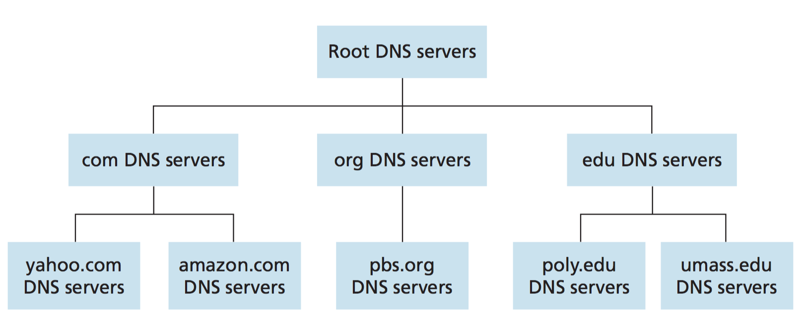

# How DNS work

The DNS protocol runs over UDP and uses port 53.

DNS is commonly employed by other application-layer protocols—including HTTP, SMTP, and FTP—to translate user-supplied hostnames to IP addresses. As an example, consider what happens when a browser (that is, an HTTP client), running on some user’s host, requests the URL www.someschool.edu/ index.html. In order for the user’s host to be able to send an HTTP request mes- sage to the Web server www.someschool.edu, the user’s host must first obtain the IP address of www.someschool.edu. This is done as follows.

1. The same user machine runs the client side of the DNS application.
2. The browser extracts the hostname, www.someschool.edu, from the URL
and passes the hostname to the client side of the DNS application.
3. The DNS client sends a query containing the hostname to a DNS server.
4. The DNS client eventually receives a reply, which includes the IP address for
the hostname.
5. Once the browser receives the IP address from DNS, it can initiate a TCP con-
nection to the HTTP server process located at port 80 at that IP address.

