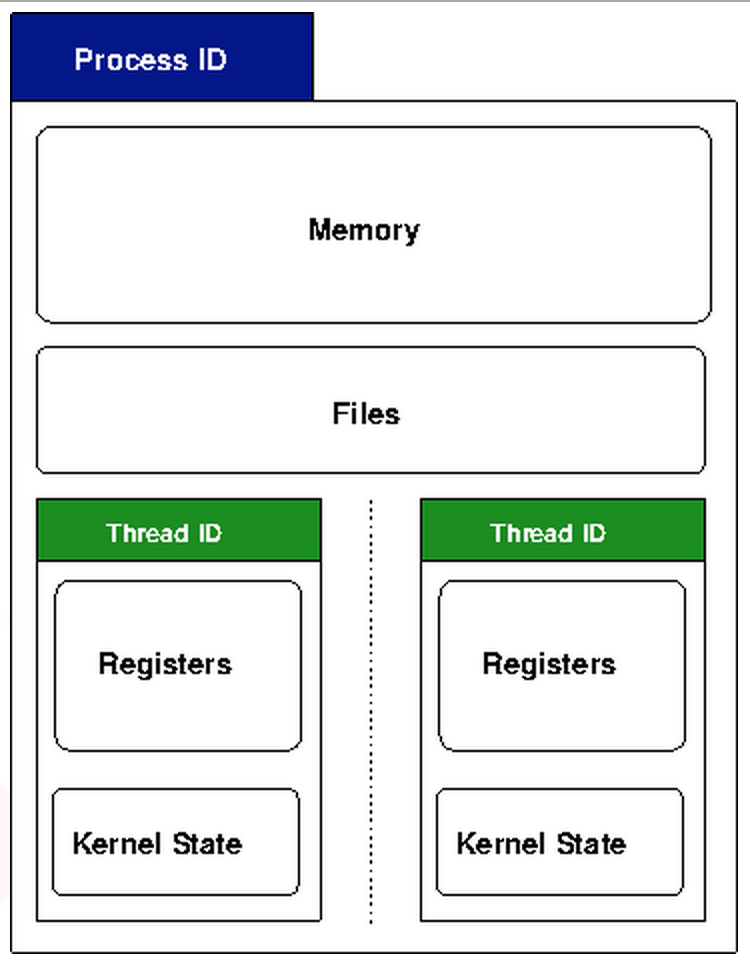

# How Linux actually handles fork and exec

#### clone

In the kernel, fork is actually implemented by a clone system call. This clone interfaces effectively provides a level of abstraction in how the Linux kernel can create processes.

clone allows you to explicitly specify which parts of the new process are copied into the new process, and which parts are shared between the two processes. This may seem a bit strange at first, but allows us to easily implement threads with one very simple interface.

### Threads

While fork copies all of the attributes we mentioned above, imagine if everything was copied for the new process except for the memory. This means the parent and child share the same memory, which includes program code and data.

This hybrid child is called a thread. Threads have a number of advantages over where you might use fork

* Separate processes can not see each others memory. They can only communicate with each other via other system calls.

 Threads however, share the same memory. So you have the advantage of multiple processes, with the expense of having to use system calls to communicate between them. 

 The problem that this raises is that threads can very easily step on each others toes. One thread might increment a variable, and another may decrease it without informing the first thread. These type of problems are called concurrency problems and they are many and varied.

 To help with this, there are userspace libraries that help programmers work with threads properly. The most common one is called POSIX threads or, as it more commonly referred to pthreads

* Switching processes is quite expensive, and one of the major expenses is keeping track of what memory each process is using. By sharing the memory this overhead is avoided and performance can be significantly increased.

There are many different ways to implement threads. On the one hand, a userspace implementation could implement threads within a process without the kernel having any idea about it. The threads all look like they are running in a single process to the kernel.

This is suboptimal mainly because the kernel is being withheld information about what is running in the system. It is the kernels job to make sure that the system resources are utilised in the best way possible, and if what the kernel thinks is a single process is actually running multiple threads it may make suboptimal decisions.

Thus the other method is that the kernel has full knowledge of the thread. Under Linux, this is established by making all processes able to share resources via the clone system call. Each thread still has associated kernel resources, so the kernel can take it into account when doing resource allocations.

Other operating systems have a hybrid method, where some threads can be specified to run in userspace only ("hidden" from the kernel) and others might be a light weight process, a similar indication to the kernel that the processes is part of a thread group.

### Copy on write

As we mentioned, copying the entire memory of one process to another when fork is called is an expensive operation.

One optimisation is called copy on write. This means that similar to threads above, the memory is actually shared, rather than copied, between the two processes when fork is called. If the processes are only going to be reading the memory, then actually copying the data is unnecessary.

However, when a process writes to it's memory, it needs to be a private copy that is not shared. As the name suggests, copy on write optimises this by only doing the actual copy of the memory at the point when it is written to.

Copy on write also has a big advantage for exec. Since exec will simply be overwriting all the memory with the new program, actually copying the memory would waste a lot of time. Copy on write saves us actually doing the copy.

