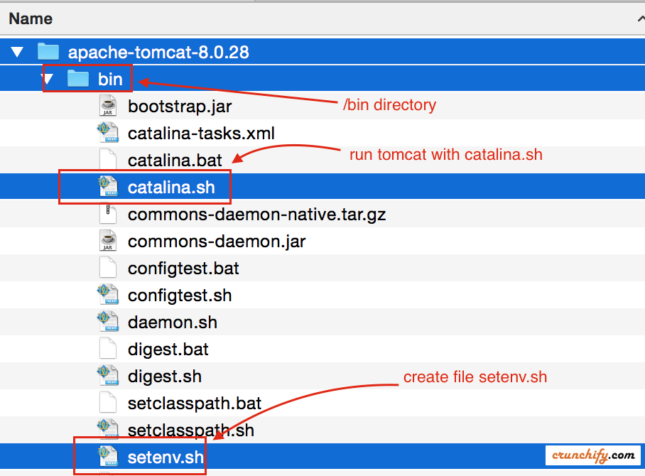
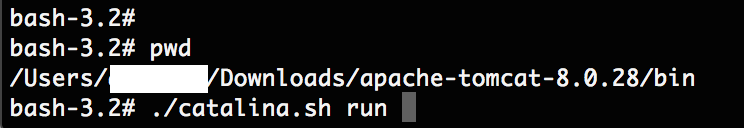

# How to Change JVM Heap Setting (-Xms -Xmx) of Tomcat – Configure setenv.sh file – Run catalina.sh

Apache Tomcat is widely used Web Container in the world. Very big companies run on Apache Tomcat now a days. There are quite a few other alternatives like IBM WebSphere, Geronimo, IIS, etc. but Tomcat is my favorite one too.

It’s very critical for us to configure all correct parameters while running your application in Production environment or even in development env.

In this tutorial we will go over steps on how to configure -Xms, -Xmx and -XX:PermSize value for Tomcat server. Let’s first understand few terms.

###-Xmx

Specifies the maximum size, in bytes, of the memory allocation pool. This value must a multiple of 1024 greater than 2MB. Append the letter k or K to indicate kilobytes, or m or M to indicate megabytes. The default value is 64MB. The upper limit for this value will be approximately 4000m on Solaris 7 and Solaris 8 SPARC platforms and 2000m on Solaris 2.6 and x86 platforms, minus overhead amounts. So, in simple words, you are saying Java to use Maximum of 1024 MB from available memory.

NOTE: there is NO SPACE between -Xmx and 1024m

###-Xmn

It’s a size of the heap for the young generation.

###-XX:PermSize

It’s used to set size for Permanent Generation. It is where class files are kept.

Another must read: Change -Xmx value of Tomcat in Eclipse IDE

Let’s get started:

Below are the simple steps to change -Xmx / -Xms values or other JVM parameters if you are running Tomcat from command prompt.

###Step-1

Download Apache Tomcat.

###Step-2

Go to Apache Tomcat /bin directory.


###Step-3

By default you wont see setenv.sh (for Linux/Mac) or setenv.bat (for windows) file under /bin directory. You have to create one with below parameters.
```
export CATALINA_OPTS="$CATALINA_OPTS -Xms512m"
export CATALINA_OPTS="$CATALINA_OPTS -Xmx8192m"
export CATALINA_OPTS="$CATALINA_OPTS -XX:MaxPermSize=256m"
```

###Step-4

1. Go to command prompt.
2. Go to <Tomcat Directory>/bin directory
3. Execute command: ./catalina.sh run



###Step-5

Monitor logfile and you should see your Tomcat started with all your specified parameters in setenv.sh file.


PS: For Windows environment you need to create setenv.bat file and run Tomcat with catalina.bat

