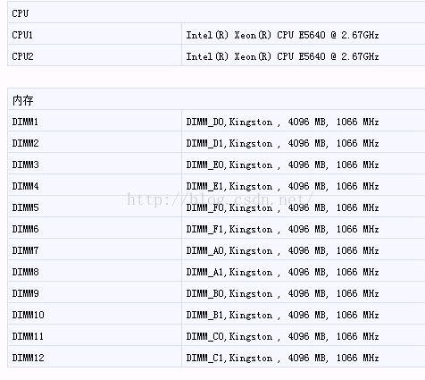
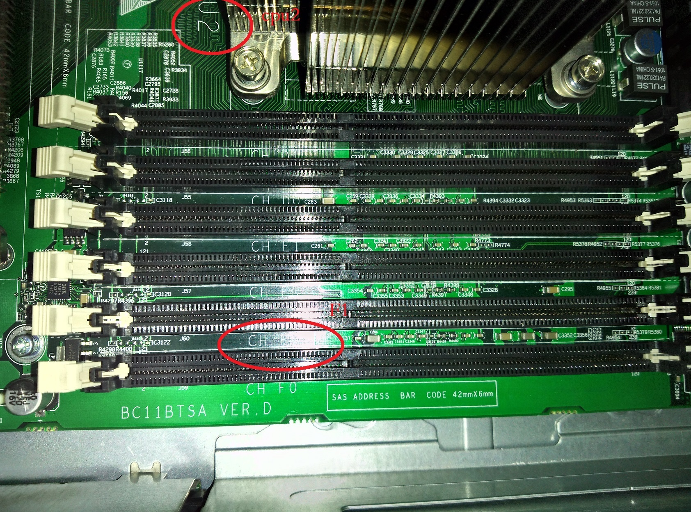

# How to solve EDAC DIMM CE Error

```bash 
$ More /var/log/message
Jul 21 08:54:32 customerkernel: EDAC MC1: 5486 CE error on CPU # 1Channel # 2_DIMM # ​​1 (channel: 2 slot: 1page: 0x0 offset: 0x0 grain: 8 syndrome: 0x0)
Jul 21 08:54:33 customerkernel: EDAC MC1: 11480 CE error on CPU # 1Channel # 2_DIMM # ​​1 (channel: 2 slot: 1page: 0x0 offset: 0x0 grain: 8 syndrome: 0x0)
Jul 21 08:54:34 customerkernel: EDAC MC1: 11330 CE error on CPU # 1Channel # 2_DIMM # ​​1 (channel: 2 slot: 1page: 0x0 offset: 0x0 grain: 8 syndrome: 0x0)
Jul 21 08:54:35 customerkernel: EDAC MC1: 6584 CE error on CPU # 1Channel # 2_DIMM # ​​1 (channel: 2 slot: 1page: 0x0 offset: 0x0 grain: 8 syndrome: 0x0)
Jul 21 08:54:36 customerkernel: EDAC MC1: 27428 CE error on CPU # 1Channel # 2_DIMM # ​​1 (channel: 2 slot: 1page: 0x0 offset: 0x0 grain: 8 syndrome: 0x0)
Jul 21 08:54:37 customerkernel: EDAC MC1: 30113 CE error on CPU # 1Channel # 2_DIMM # ​​1 (channel: 2 slot: 1page: 0x0 offset: 0x0 grain: 8 syndrome: 0x0)
Jul 21 08:54:38 customerkernel: EDAC MC1: 4453 CE error on CPU # 1Channel # 2_DIMM # ​​1 (channel: 2 slot: 1page: 0x0 offset: 0x0 grain: 8 syndrome: 0x0)
Jul 21 08:54:39 ​​customerkernel: EDAC MC1: 6269 CE error on CPU # 1Channel # 2_DIMM # ​​1 (channel: 2 slot: 1page: 0x0 offset: 0x0 grain: 8 syndrome: 0x0)
Jul 21 08:54:40 customer kernel: EDAC MC1: 15720 CE error on CPU # 1Channel # 2_DIMM # ​​1 (channel: 2 slot: 1 page: 0x0offset: 0x0 grain: 8 syndrome: 0x0)
Jul 21 08:54:41 customerkernel: EDAC MC1: 16107 CE error on CPU # 1Channel # 2_DIMM # ​​1 (channel: 2 slot: 1page: 0x0 offset: 0x0 grain: 8 syndrome: 0x0)
```

**Analysis and solution:**
 
This is [EDAC (Error Detection AndCorrection] (https://www.kernel.org/doc/Documentation/edac.txt) logs.
 
CE Error Correctable Error is referred to, in addition to UE (Uncorrectable Error)

According to the above documents, identify errors DIMM:
```bash
[root @ the Customer log] # grep "[0-9]" / SYS / Devices / System / EDAC / MC / MC * / csrow * / * CH _ce_count
/ Sys / devices / system / edac / mc / mc0 / csrow0 / ch0_ce_count: 0
/ Sys / devices / system / edac / mc / mc0 / csrow0 / ch1_ce_count: 0
/ Sys / devices / system / edac / mc / mc0 / csrow0 / ch2_ce_count: 0
/ Sys / devices / system / edac / mc / mc0 / csrow1 / ch0_ce_count: 0
/ Sys / devices / system / edac / mc / mc0 / csrow1 / ch1_ce_count: 0
/ Sys / devices / system / edac / mc / mc0 / csrow1 / ch2_ce_count: 0
/ Sys / devices / system / edac / mc / mc1 / csrow0 / ch0_ce_count: 0
/ Sys / devices / system / edac / mc / mc1 / csrow0 / ch1_ce_count: 0
/ Sys / devices / system / edac / mc / mc1 / csrow0 / ch2_ce_count: 0
/ Sys / devices / system / edac / mc / mc1 / csrow1 / ch0_ce_count: 0
/ Sys / devices / system / edac / mc / mc1 / csrow1 / ch1_ce_count: 0
/ Sys / devices / system / edac / mc / mc1 / csrow1 / ch2_ce_count: 554836518
```

Found errors in /mc1/csrow1/ch2, according to the chart:
```bash
       Channel 0 Channel 1
===================================
csrow0 | DIMM_A0 | DIMM_B0 |
csrow1 | DIMM_A0 | DIMM_B0 |
===================================
===================================
csrow2 | DIMM_A1 | DIMM_B1 |
csrow3 | DIMM_A1 | DIMM_B1 |
===================================
```

From dmidecode info:
```bash
[Root @ customer log] # dmidecode -t memory | grep 'Locator: DIMM'
       Locator: DIMM_D0
       Locator: DIMM_D1
       Locator: DIMM_E0
       Locator: DIMM_E1
       Locator: DIMM_F0
       Locator: DIMM_F1
       Locator: DIMM_A0
       Locator: DIMM_A1
       Locator: DIMM_B0
       Locator: DIMM_B1
       Locator: DIMM_C0
       Locator: DIMM_C1
```

From server console to find the memory info:


Memory slot on the motherboard of distribution:



Combined error log: kernel: EDAC MC1: 16107 CE error on CPU # 1Channel #2_DIMM # ​​1 (channel: 2slot: 1 DIMM_F1 memory slots should be a problem.
 
**Solution:**
Finally, what we need to do is to replace F1 memory slot, after the system reboot the memory issue is no longer happening.