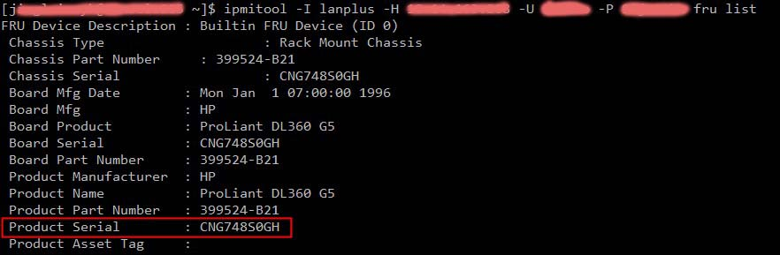

# ipmitool

```
ipmitool - I lanplus - H address  - U account  - P password fru list
```



The Linux ipmitool tool can easily in Linux command line with the operation of the server outside. 
Summarized as follows: 

1. Check the IPMI version

`ipmitool - V`

2. Reset ipmi card

`ipmitool mc reset cold`

3. Log ipmi console

`ipmitool - I lanplus - H IPADDR - U USERNAME - PASSWORD P - e ^ Sol activate`

4. Band reboot

`ipmitool - I lanplus - H IPADDR - U USERNAME - PASSWORD power P RESET`

5. The band is set to boot from the next pxe

`ipmitool - I lanplus - H IPADDR - U USERNAME - PASSWORD chassis bootdev P pxe`

6. Empty IPMI SEL

`ipmitool sel clear`

7. Access to the channel ipmi

`for i in  { 1. . 14 };  do ipmitool LAN Print $ i 2 > / dev / null  | grep - q ^ Set  && echo $ i ;  DONE`

### " IPMI command to collect " 
All IPMI functions are to BMC sending another complete, BMC reception occurs in the system event log
First, make sure system with or without support IPMI 
```
#rpm -aq | grep -I ipmi
```
 
```
# Ipmitool -I  Open <command>
```

The following is the IOL under instruction:
```
# Ipmitool  -I  <lanplus>  -H  <hostname> [-U  <username>] [-P  <password>] <command>
```

Basic reference: http://starbots.org/cgi-bin/man/man2html?ipmitool+1

```
# Ipmitool sel info : see some of the information
# Ipmitool sel List : get a List sel Records
# Ipmitool sel elist : get detial sel
# Ipmitool sel get time : Check BMC Clock
# Ipmitool sel time set : setting BMC Clock
# Ipmitool sel Clear : The information Clear
 
# Ipmitool mc info : BMC H / W related news
# Ipmitool mc RESET Cold : BMC RESET
# Ipmitool mc selftest :
# Ipmitool mc getenables : List all BMC allows options
# Ipmitool mc setenables :

# Ipmitool -I Open Event 1 : send a signal to the high temperature of System Event Log in
1 Temperature : Upper Critical going High
2 Voltage threshold : Lower Crirical going low
3 Memory : Correctable ECC error detected
# Ipmitool -I Open Event : test configurations IPMI the snmp function is successful
```

###Change ipmi addr
```
# Ipmitool LAN set 1 ipaddr 192.168.1.200 : the lan1 ip set to 192.168.1.200 , execute this command when the Internet line is to remember to pull together
# Ipmitool LAN set 1 ipsrc dhcp : DHCP
# Ipmitool LAN Print : You can check ip has already been changed
# Ipmitool -I open lan set 1 snmp public setting channel 1 on snmp the community as a public 
# i pmitool -I Open Access on LAN set 1 Set channel 1 to allow access
 
# Ipmitool sel get time : Check BMC Time
# Ipmitool sel time set "mm / dd / yyyy hh: mm: ss"
 
# Ipmitool power status View the current power status
# Ipmitool power on boot
# Ipmitool power off shutdown, power off violence, so OS does not end normally
# Ipmitool power reset as press reset
# Ipmitool power cycle the system seems to be the first shutdown after passing second and then power on , so you do not always run the engine room
# Ipmitool power soft through ACPI let OS shutdown or restart or log off
 
# Ipmitool chassis status : system status information includes power, system status
# Ipmitool chassis identify : the host can be found in the engine room rack, LED will flash for 15 seconds
# Ipmitool chassis restart_cause : Check the reason the last system reboot
# Ipmitool -I open chassis policy list view power-related policies
# Ipmitool chassis poh :
# Ipmitool chassis selftest :
```