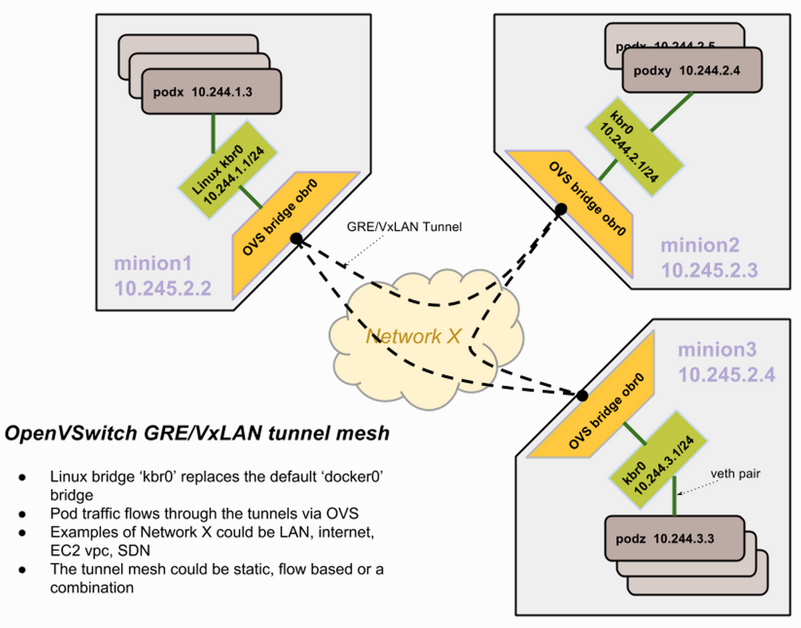

# K8S-Network

1. Highly-coupled container-to-container communications.
2. Pop-to-Pod communications.
3. Pod-to-Service communications.
4. External-to-Service communications.

Kubernetes model
Kubernetes imposes some fundamental requirements on any networking implementation:

* All containers can communicate with all other containers without NAT.

* All nodes can communicate with all containers without NAT.

* The IP that a container sees itself as is the same IP that others see it as.

How to achieve this:
1. Google Compute Engine (GCE)
2. L2 networks and linux bridging
Four ways to connect a docker container to a local network
3. Flannel
Flannel is a very simple overlay network that satisfies the Kubernetes requirements.
4. OpenVSwitch
OpenVSwitch is a somewhat more mature but also complicated way to build an overlay network. Kubernetes OpenVSwitch GRE/VxLAN networking
5. Weave
Weave is yet another way to build an overlay network, primarily aiming at Docker integration.
6. Calico
Calico uses BGP to enable real container IPs.

### Kubernetes OpenVSwitch GRE/VxLAN networking
This document describes how OpenVSwitch is used to setup networking between pods across nodes. The tunnel type could be GRE or VxLAN. VxLAN is preferable when large scale isolation needs to be performed within the network.

The vagrant setup in Kubernetes does the following:

The docker bridge is replaced with a brctl generated linux bridge(kbr0) with a 256 address space subnet. Basically, a node gets 10.244.x.0/24 subnet and docker is configured to use that bridge instead of the default docker0 bridge.

Also, an OVS bridge is created(obr0) and added as a port to the kbr0 bridge. All OVS bridges across all nodes are linked with GRE tunnels. So, each node has an outgoing GRE tunnel to all other nodes. It does not need to be a complete mesh really, just meshier the better. STP(spanning tree) mode is enabled in the bridges to prevent loops.

Routing rules enable any 10.244.0.0/16 target to become reachable via the OVS bridge connected with the tunnels.