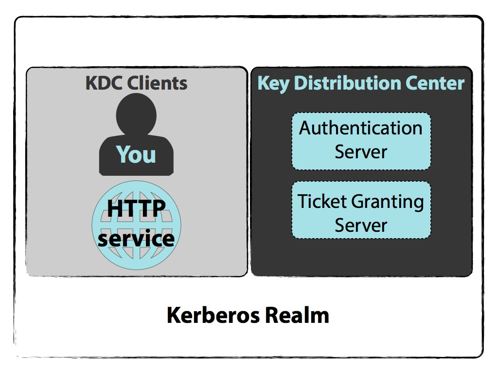
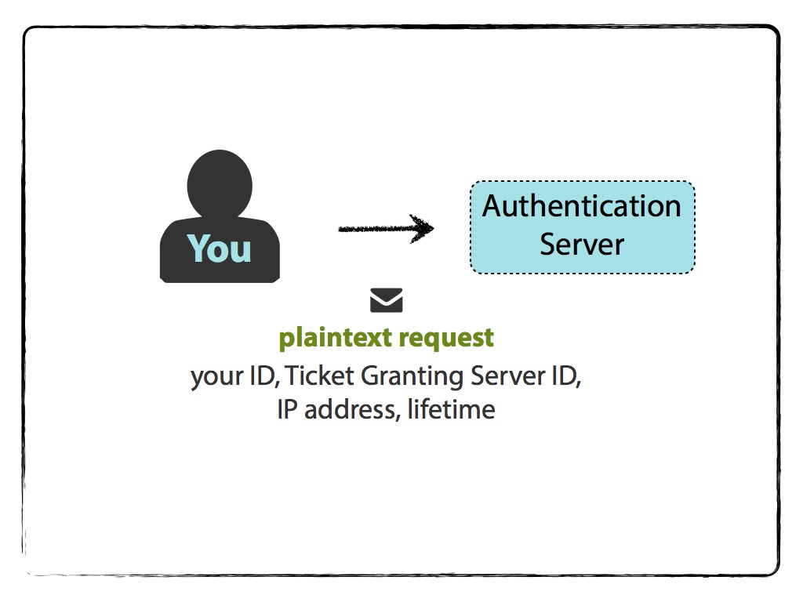
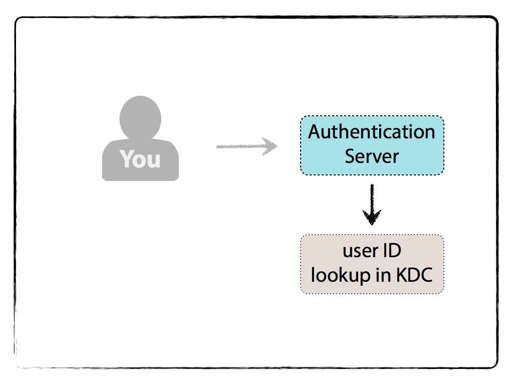
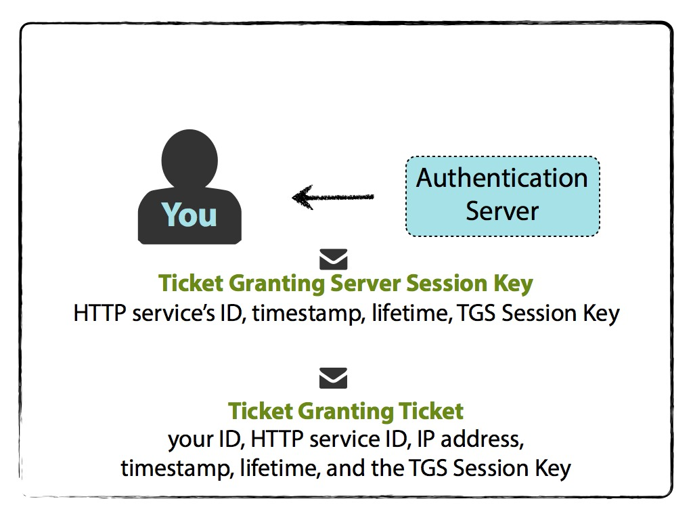
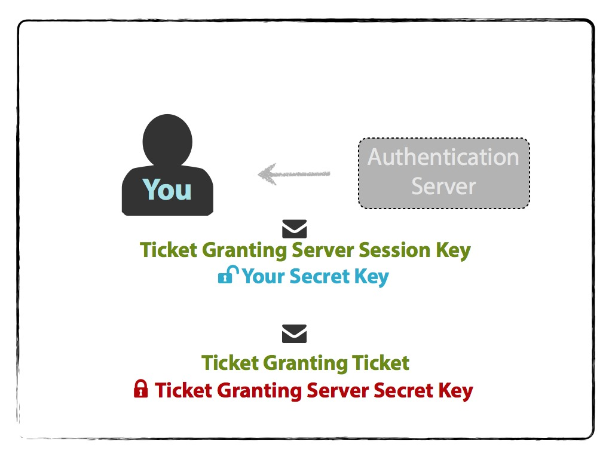

# Kerberos

###In a nutshell
Basically, Kerberos comes down to just this:

* a protocol for authentication
* uses tickets to authenticate
*avoids storing passwords locally or sending them over the internet
* involves a trusted 3rd-party
* built on symmetric-key cryptography

You have a ticket – your proof of identity encrypted with a secret key for the particular service requested – on your local machine (creation of a ticket is described below); so long as it’s valid, you can access the requested service that is within a Kerberos realm.

Typically, this is used within corporate/internal environments. Perhaps you want to access your internal payroll site to review what little bonus your boss has given you. Rather than re-entering your user/password credentials, your ticket (cached on your system) is used to authenticate allowing for single sign-on.

Your ticket is refreshed when you sign on to your computer, or when you kinit USER within your terminal.

For the trivia-loving folks, Kerberos’ name comes from Greek mythology, the three-headed guard dog of Hades. It’s pretty fitting since it takes a third-party (a Key Distribution Center) to authenticate between a client and a service or host machine.

###Kerberos Realm
Admins create realms – Kerberos realms – that will encompass all that is available to access. Granted, you may not have access to certain services or host machines that is defined within the policy management – developers should not access anything finance related, stuff like that. But a realm defines what Kerberos manages in terms of who can access what.

Your machine, the Client, lives within this realm, as well as the service or host you want to request and the Key Distribution Center, KDC (no, not the KGB, although I always think of that, too). In the following example, I separate out the Authentication Server and the Ticket Granting Server, but both are within the KDC.

###To keep in the back of your mind
You may want to come back up here after you read through the gritty details on how the example works.

When requesting access to a service or host, three interactions take place between you and:

* the Authentication Server
* the Ticket Granting Server
* the Service or host machine that you’re wanting access to.

Other important points:

* With each interaction, you’ll receive two messages. Each message is one that you can decrypt, and one that you can not.
* The service or machine you are requesting access to never communicates directly with the KDC.
* The KDC stores all of the secret keys for user machines and services in its database.
* Secret keys are passwords plus a salt that are hashed – the hash algorithm is chosen during implementation of the * Kerberos setup. For services or host machines, there are no passwords (who would enter it). A key is actually generated by an admin during initial setup and memorized on the service/host machine.
* Again, these secret keys are all stored in the KDC database; recall the Kerberos’ reliance on symmetric-key cryptography.
* The KDC itself is encrypted with a master key to add a layer of difficulty from stealing keys from the database.
* There are Kerberos configurations and implementations that use public-key cryptography instead of symmetrical key encryption.

An aside: the order of the messages and their contents discussed here does not reflect the order in which they are sent over TCP or UDP.

The example below describes what happens when you request something from an internal HTTP Service – like information regarding payroll within your corporate intranet.

###You and the Authentication Server

You want to access an HTTP Service, but first you must introduce yourself to the Authentication Server. Logging into your computer, or kinit USERNAME, initiates that introduction via a plaintext request for a Ticket Granting Ticket (TGT). The plaintext message contains:

* your name/ID
* the name/ID of the requested service (in this case, service is the Ticket Granting Server),
* your network address (may be a list of IP addresses for multiple machines, or may be null if wanting to use on any machine), and
* requested lifetime for the validity of the TGT,
and is sent to the Authentication Server.

The Authentication Server will check if you are in the KDC database. This check is only to see if you exist; no credentials are checked.

If there are no errors (e.g. user is not found), it will randomly generate a key called a session key for use between you and the Ticket Granting Server (TGS).

The Authentication Server will then send two messages back to you. One message is the TGT that contains:

* your name/ID,
* the TGS name/ID,
* timestamp,
* your network address (may be a list of IP addresses for multiple machines, or may be null if wanting to use on any machine)
* lifetime of the TGT (could be what you initially requested, lower if you or the TGS’s secret keys are about to expire, or another limit that was implemented during the Kerberos setup), and
* TGS Session Key,

and is encrypted with the TGS Secret Key . The other message contains:

* the TGS name/ID,
* timestamp,
* lifetime (same as above), and
* TGS Session Key

and is encrypted with your Client Secret Key. Note that the TGS Session Key is the shared key between you and the TGS.

Your Client Secret Key is determined by prompting you for your password, appending a salt (made up of user@REALMNAME.COM) and hashing the whole thing. Now you can use it for decrypting the second message in order to obtain the TGS Session Key. If the password is incorrect, then you will not be able to decrypt the message. Please note that this is the step in which the password you enter is implicitly validated.

You can not, however, decrypt the TGT since you do not know the TGS Secret Key. The encrypted TGT is stored within your credential cache.

###You and the Ticket Granting Server
At this point, you have the TGT that you can not read because you do not have the TGS Secret Key to decrypt it. You do, however, have the TGS Session Key.

It’s now your turn to send two messages. You first prepare the Authenticator, encrypted with the TGS Session Key, containing:

* your name/ID, and
* timestamp.

You send an unencrypted message that contains:

* the requested HTTP Service name/ID you want access to, and
* lifetime of the Ticket for the HTTP Service,

along with the encrypted Authenticator and TGT to the Ticket Granting Server.

