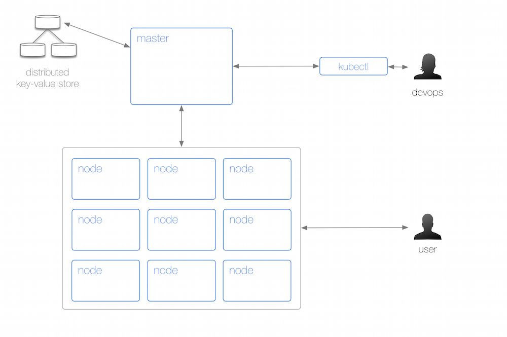
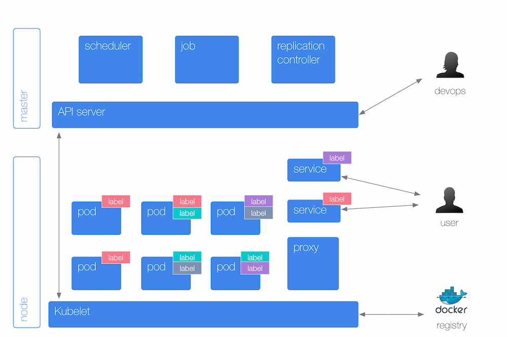

# Kubernetes Cheat Sheet

###Physical Layout

Query the server/client version used:
`kubectl version`

Get cluster info:
`kubectl cluster-info`

Get configuration info:
`kubectl config view`

Watch nodes continuously:
`kubectl get nodes -w`

Get info about 'node123':
`kubectl describe node123`

From a physical perspective, a Kubernetes cluster consists of:

1. A master (with several independent sub-components, details below) that coordinates the work.
2. A distributed key-value store, currently etcd, for maintaining the resource state in a persistent and reliable manner, throughout the cluster.
3. A number of nodes that carry out the work.
4. A command line tool called `kubectl` allowing to query and manipulate the cluster state; this is a fancy way of saying: running containers, creating services and administrating the cluster (logging, monitoring, debugging).

List pods:
`kubectl get pods`

Get info about pod 'nginx-hl2nb':
`kubectl describe pod nginx-hl2nb`

List replication controllers:
`kubectl get rc`

Get info about replication controller 'nginx':
`kubectl describe rc nginx`

Expose replication controller 'nginx' as a service on port 80:
`kubectl expose rc nginx --port=80 --target-port=8000`

List services:
`kubectl get svc`

Get info about service 'nginx':
`kubectl describe svc nginx`

Destroy/remove a resource :
`kubectl delete pod nginx-hl2nb` &&
`kubectl delete rc nginx` &&
`kubectl delete svc nginx`

###Organize your resources

The primary organization mechanism in Kubernetes are so called labels: these key/value pairs allow you to tag any sort of resource such as a pod or a RC. Both the key and the value are transparent to Kubernetes, which is an elaborate way to say: Kubernetes doesn't know and doesn't care about it; labels only have a meaning to you. Kubernetes, however, will use the labels to, for example, select pods that belong to a service, select pods that a certain RC is supposed to look after, for rolling upgrades and to debug containers online.