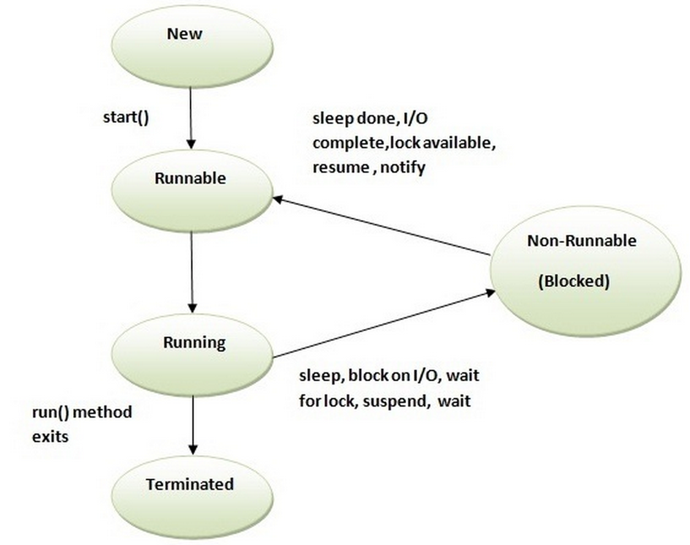

# Life cycle of a Thread (Thread States)

A thread can be in one of the five states. According to sun, there is only 4 states in thread life cycle in java new, runnable, non-runnable and terminated. There is no running state.

But for better understanding the threads, we are explaining it in the 5 states.

The life cycle of the thread in java is controlled by JVM. The java thread states are as follows:

1. New
2. Runnable
3. Running
4. Non-Runnable (Blocked)
5. Terminated

### 1) New

The thread is in new state if you create an instance of Thread class but before the invocation of start() method.

### 2) Runnable

The thread is in runnable state after invocation of start() method, but the thread scheduler has not selected it to be the running thread.

### 3) Running

The thread is in running state if the thread scheduler has selected it.

### 4) Non-Runnable (Blocked)

This is the state when the thread is still alive, but is currently not eligible to run.

### 5) Terminated

A thread is in terminated or dead state when its run() method exits.