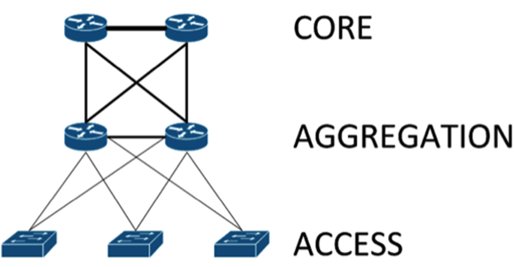

#Data center network design moves from tree to leaf

###Explained: Leaf-spine data center network architecture

The old data center network design should make like a tree and leaf.

For many years, data center networks have been built in layers that, when diagrammed, suggest a hierarchical tree. As this hierarchy runs up against limitations, a new model is taking its place.

In the hierarchical tree data center, the bottom of the tree is the access layer, where hosts connect to the network.

The middle layer is the aggregation, or distribution, layer, to which the access layer is redundantly connected. The aggregation layer provides connectivity to adjacent access layer switches and data center rows, and in turn to the top of the tree, known as the core.

The core layer provides routing services to other parts of the data center, as well as to services outside of the data center such as the Internet, geographically separated data centers and other remote locations.

This model scales somewhat well, but it is subject to bottlenecks if uplinks between layers are oversubscribed. This can come from latency incurred as traffic flows through each layer and from blocking of redundant links (assuming the use of the spanning tree protocol, STP).

