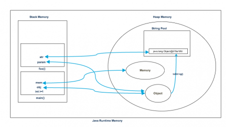

# Java

### Java Heap Memory vs Stack Memory Difference

#### #Java Heap Memory

Heap memory is used by java runtime to allocate memory to Objects and JRE classes. Whenever we create any object, it’s always created in the Heap space. Garbage Collection runs on the heap memory to free the memory used by objects that doesn’t have any reference. Any object created in the heap space has global access and can be referenced from anywhere of the application.

#### Java Stack Memory

Java Stack memory is used for execution of a thread. They contain method specific values that are short-lived and references to other objects in the heap that are getting referred from the method. Stack memory is always referenced in LIFO (Last-In-First-Out) order. Whenever a method is invoked, a new block is created in the stack memory for the method to hold local primitive values and reference to other objects in the method. As soon as method ends, the block becomes unused and become available for next method.
Stack memory size is very less compared to Heap memory.

Let’s understand the Heap and Stack memory usage with a simple program.

Memory.java
```
package com.journaldev.test;
 
public class Memory {
 
    public static void main(String[] args) { // Line 1
        int i=1; // Line 2
        Object obj = new Object(); // Line 3
        Memory mem = new Memory(); // Line 4
        mem.foo(obj); // Line 5
    } // Line 9
 
    private void foo(Object param) { // Line 6
        String str = param.toString(); //// Line 7
        System.out.println(str);
    } // Line 8
 
}
```
Below image shows the Stack and Heap memory with reference to above program and how they are being used to store primitive, Objects and reference variables.




Let’s go through the steps of execution of the program.

As soon as we run the program, it loads all the Runtime classes into the Heap space. When main() method is found at line 1, Java Runtime creates stack memory to be used by main() method thread.
We are creating primitive local variable at line 2, so it’s created and stored in the stack memory of main() method.
Since we are creating an Object in line 3, it’s created in Heap memory and stack memory contains the reference for it. Similar process occurs when we create Memory object in line 4.
Now when we call foo() method in line 5, a block in the top of the stack is created to be used by foo() method. Since Java is pass by value, a new reference to Object is created in the foo() stack block in line 6.
A string is created in line 7, it goes in the String Pool in the heap space and a reference is created in the foo() stack space for it.
foo() method is terminated in line 8, at this time memory block allocated for foo() in stack becomes free.
In line 9, main() method terminates and the stack memory created for main() method is destroyed. Also the program ends at this line, hence Java Runtime frees all the memory and end the execution of the program.
Difference between Heap and Stack Memory

Based on the above explanations, we can easily conclude following differences between Heap and Stack memory.

Heap memory is used by all the parts of the application whereas stack memory is used only by one thread of execution.
Whenever an object is created, it’s always stored in the Heap space and stack memory contains the reference to it. Stack memory only contains local primitive variables and reference variables to objects in heap space.
Objects stored in the heap are globally accessible whereas stack memory can’t be accessed by other threads.
Memory management in stack is done in LIFO manner whereas it’s more complex in Heap memory because it’s used globally. Heap memory is divided into Young-Generation, Old-Generation etc, more details at Java Garbage Collection.
Stack memory is short-lived whereas heap memory lives from the start till the end of application execution.
We can use -Xms and -Xmx JVM option to define the startup size and maximum size of heap memory. We can use -Xss to define the stack memory size.
When stack memory is full, Java runtime throws java.lang.StackOverFlowError whereas if heap memory is full, it throws java.lang.OutOfMemoryError: Java Heap Space error.
Stack memory size is very less when compared to Heap memory. Because of simplicity in memory allocation (LIFO), stack memory is very fast when compared to heap memory.
That’s all for Stack vs Heap Memory in terms of java application, I hope it will clear your doubts regarding memory allocation when any java program is executed.