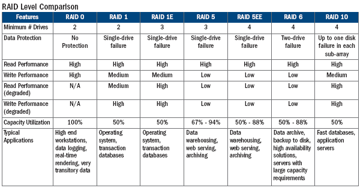
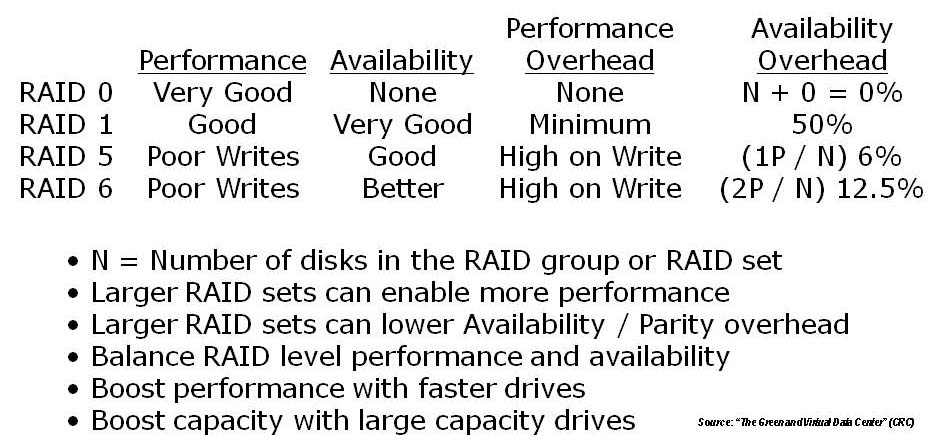

# RAID

Standard levels

Main article: Standard RAID levels

Storage servers with 24 hard disk drives and built-in hardware RAID controllers supporting various RAID levels.
A number of standard schemes have evolved. These are called levels. Originally, there were five RAID levels, but many variations have evolved, notably several nested levels and many non-standard levels (mostly proprietary). RAID levels and their associated data formats are standardized by the Storage Networking Industry Association (SNIA) in the Common RAID Disk Drive Format (DDF) standard

###RAID 0
RAID 0 consists of striping, without mirroring or parity. The capacity of a RAID 0 volume is the sum of the capacities of the disks in the set, the same as with a spanned volume. There is no added redundancy for handling disk failures, just as with a spanned volume. Thus, failure of one disk causes the loss of the entire RAID 0 volume, with reduced possibilities of data recovery when compared to a broken spanned volume. Striping distributes the contents of files roughly equally among all disks in the set, which makes concurrent read or write operations on the multiple disks almost inevitable and results in performance improvements. The concurrent operations make the throughput of most read and write operations equal to the throughput of one disk multiplied by the number of disks. Increased throughput is the big benefit of RAID 0 versus spanned volume.[11]

###RAID 1
RAID 1 consists of data mirroring, without parity or striping. Data is written identically to two (or more) drives, thereby producing a "mirrored set" of drives. Thus, any read request can be serviced by any drive in the set. If a request is broadcast to every drive in the set, it can be serviced by the drive that accesses the data first (depending on its seek time and rotational latency), improving performance. Sustained read throughput, if the controller or software is optimized for it, approaches the sum of throughputs of every drive in the set, just as for RAID 0. Actual read throughput of most RAID 1 implementations is slower than the fastest drive. Write throughput is always slower because every drive must be updated, and the slowest drive limits the write performance. The array continues to operate as long as at least one drive is functioning.[11]

###RAID 2
RAID 2 consists of bit-level striping with dedicated Hamming-code parity. All disk spindle rotation is synchronized and data is striped such that each sequential bit is on a different drive. Hamming-code parity is calculated across corresponding bits and stored on at least one parity drive.[11] This level is of historical significance only; although it was used on some early machines (for example, the Thinking Machines CM-2),[18] as of 2014 it is not used by any of the commercially available systems.[19]

###RAID 3
RAID 3 consists of byte-level striping with dedicated parity. All disk spindle rotation is synchronized and data is striped such that each sequential byte is on a different drive. Parity is calculated across corresponding bytes and stored on a dedicated parity drive.[11] Although implementations exist,[20] RAID 3 is not commonly used in practice.

###RAID 4
RAID 4 consists of block-level striping with dedicated parity. This level was previously used by NetApp, but has now been largely replaced by a proprietary implementation of RAID 4 with two parity disks, called RAID-DP.[21]

###RAID 5
RAID 5 consists of block-level striping with distributed parity. Unlike in RAID 4, parity information is distributed among the drives. It requires that all drives but one be present to operate. Upon failure of a single drive, subsequent reads can be calculated from the distributed parity such that no data is lost. RAID 5 requires at least three disks.[11] RAID 5 is seriously affected by the general trends regarding array rebuild time and the chance of drive failure during rebuild.[22] Rebuilding an array requires reading all data from all disks, opening a chance for a second drive failure and the loss of entire array. In August 2012, Dell posted an advisory against the use of RAID 5 in any configuration on Dell EqualLogic arrays and RAID 50 with "Class 2 7200 RPM drives of 1 TB and higher capacity" for business-critical data.[23]

###RAID 6
RAID 6 consists of block-level striping with double distributed parity. Double parity provides fault tolerance up to two failed drives. This makes larger RAID groups more practical, especially for high-availability systems, as large-capacity drives take longer to restore. RAID 6 requires a minimum of four disks. As with RAID 5, a single drive failure results in reduced performance of the entire array until the failed drive has been replaced.[11] With a RAID 6 array, using drives from multiple sources and manufacturers, it is possible to mitigate most of the problems associated with RAID 5. The larger the drive capacities and the larger the array size, the more important it becomes to choose RAID 6 instead of RAID 5.[24] RAID 10 also minimizes these problems.[25]