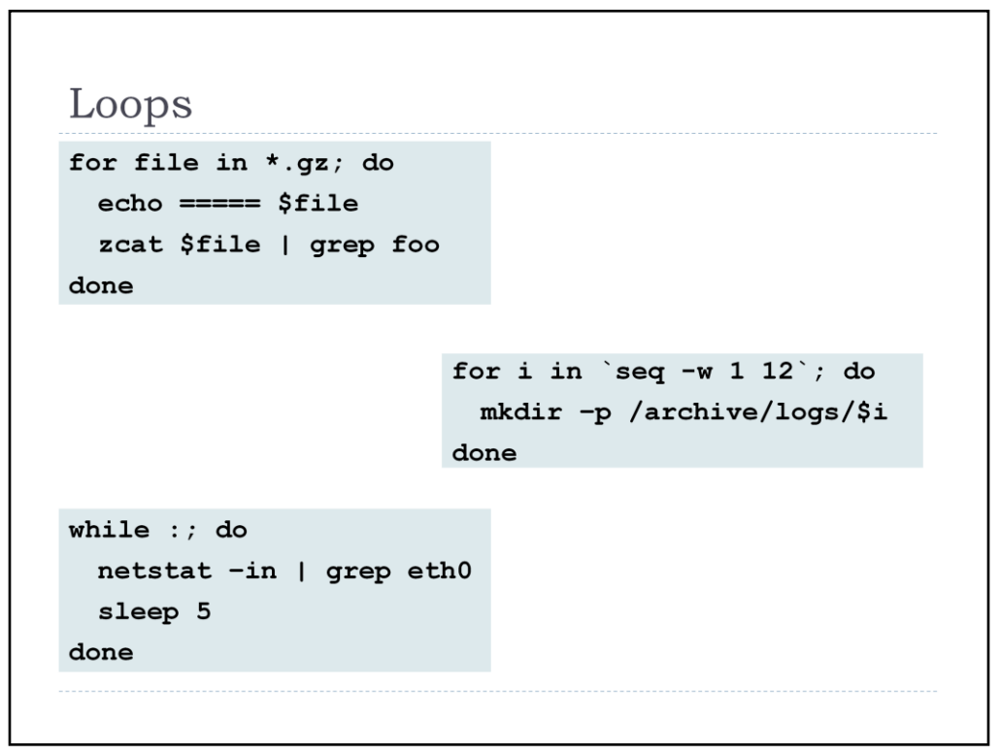
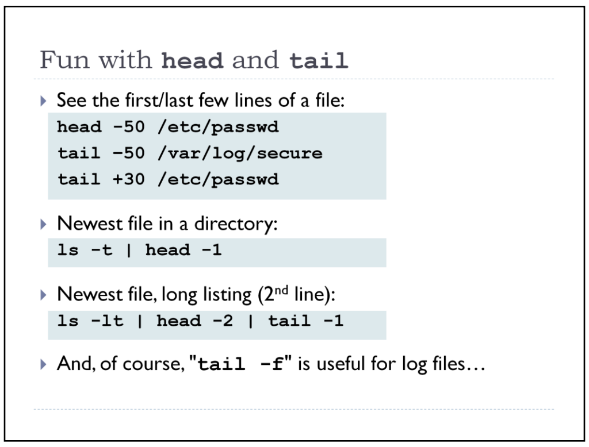
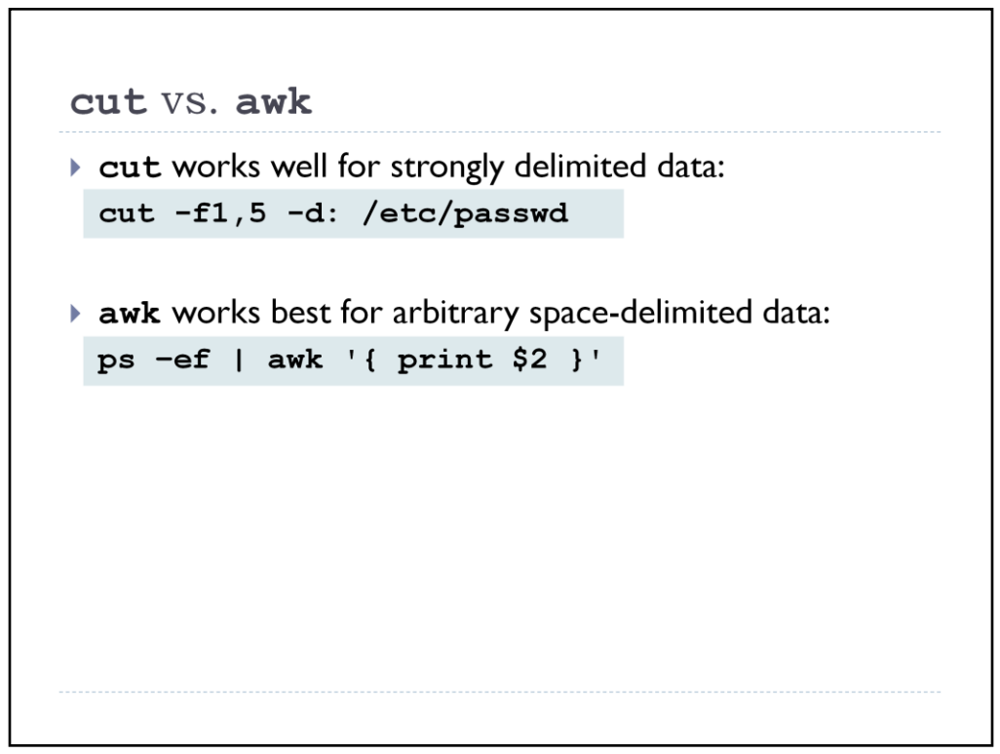
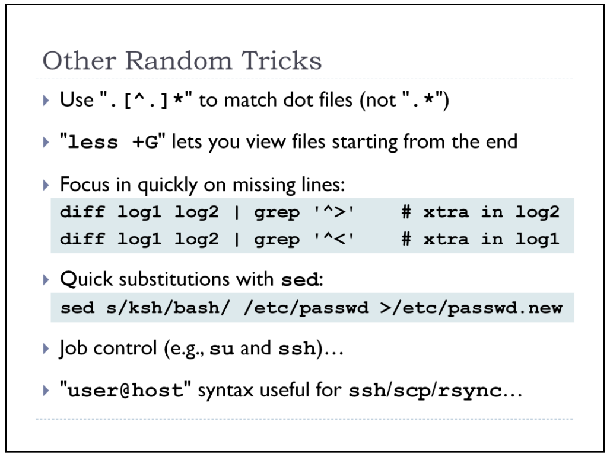

# Scripts

```
for i in $(ls); do echo "$i $(ls $i | wc -l)"; done
```








#### List of commands you use most often:
```
history | awk '{a[$2]++}END{for(i in a){print a[i] " " i}}' | sort -rn | head
```

#### How to archive all the files that are not modified in the last x number of days?

The following command finds all the files not modified in the last 60 days under /home/jsmith directory and creates an archive files under /tmp in the format of ddmmyyyy_archive.tar.
```
# find /home/jsmith -type f -mtime +60 | xargs tar -cvf
/tmp/`date '+%d%m%Y'_archive.tar`
```