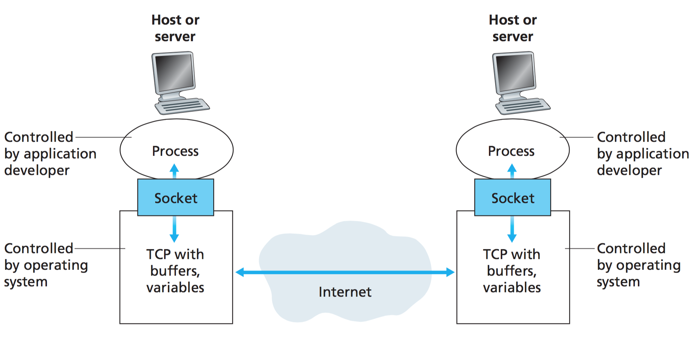

# Sockets

A process sends messages into, and receives messages from, the network through a software interface called a socket. Let’s consider an analogy to help us understand processes and sockets. A process is analogous to a house and its socket is analogous to its door. When a process wants to send a message to another process on another host, it shoves the message out its door (socket). This sending process assumes that there is a transportation infrastructure on the other side of its door that will transport the message to the door of the destination process. Once the message arrives at the des- tination host, the message passes through the receiving process’s door (socket), and the receiving process then acts on the message.

Sockets were developed in the BSD lineage of Unix as a way to encapsulate access to data networks. Two programs communicating over a socket typically see a bidirectional byte stream (there are other socket modes and transmission methods, but they are of only minor importance). The byte stream is both sequenced (that is, even single bytes will be received in the same order sent) and reliable **(socket users are guaranteed that the underlying network will do error detection and retry to ensure delivery).** Socket descriptors, once obtained, behave essentially like file descriptors.

At the time a socket is created, you specify a protocol family which tells the network layer how the name of the socket is interpreted. Sockets are usually thought of in connection with the Internet, as a way of passing data between programs running on different hosts; this is the AF_INET socket family, in which addresses are interpreted as host-address and service- number pairs. However, the AF_UNIX (aka AF_LOCAL) protocol family supports the same socket abstraction for communication between two processes on the same machine (names are interpreted as the locations of special files analogous to bidirectional named pipes). As an example, client programs and servers using the X windowing system typically use AF_LOCAL sockets to communicate.

All modern Unixes support BSD-style sockets, and as a matter of design they are usually the right thing to use for bidirectional IPC no matter where your cooperating processes are located. Performance pressure may push you to use shared memory or tempfiles or other techniques that make stronger locality assumptions, but under modern conditions it is best to assume that your code will need to be scaled up to distributed operation. More importantly, those locality assumptions may mean that portions of your system get chummier with each others’ internals than ought to be the case in a good design. The separation of address spaces that sockets enforce is a feature, not a bug.

To use sockets gracefully, in the Unix tradition, start by designing an application protocol for use between them — a set of requests and responses which expresses the semantics of what your programswillbecommunicatingaboutinasuccinctway. We’vealreadydiscussedthesomemajor issues in the design of application protocols in Chapter 5.

Sockets are supported in all recent Unixes, under Windows, and under classic MacOS as well.
