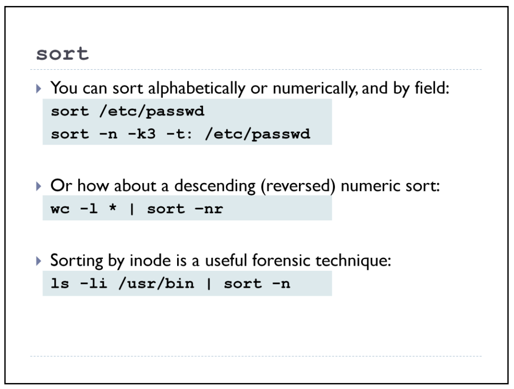

# SORT



Sort a file in ascending order

```
$ sort names.txt
```

Sort a file in descending order

```
$ sort -r names.txt
```

Sort passwd file by 3rd field.

```
$ sort -t: -k 3n /etc/passwd | more
```