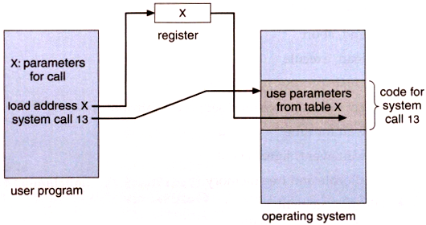

# System Calls

#### What is System Call

As we know that for performing any Operation as user must have to specify the Operation which he wants to Operate on the Computer. We can say that For Performing any Operation a user must have to Request for a Service from the System. For Making any Request a user will prepare a Special call which is also known as the System Call.

---

The System Call is the Request for Running any Program and for Performing any Operation on the System. When a user First Time Starts the System then the System is in the user Mode and When he request For a Service then the User Mode will be Converted into the Kernel Mode Which just Listen the Request of the user and Process the Request and Display the Results those are Produced after the Processing. When a user Request for Opening any Folder or When a Moves his Mouse his Mouse on the Screen, then this is called as the System call which he is using for performing any Operation.

In computing, a system call is how a program requests a service from an operating system's kernel. This may include hardware-related services (for example, accessing a hard disk drive), creation and execution of new processes, and communication with integral kernel services such as process scheduling. System calls provide an essential interface between a process and the operating system.
In most systems, system calls are possible to be made only from userspace processes, while in some systems, OS/360 and successors for example, privileged system code also issues system calls.[1]

The architecture of most modern processors, with the exception of some embedded systems, involves a security model. For example, the rings model specifies multiple privilege levels under which software may be executed: a program is usually limited to its own address space so that it cannot access or modify other running programs or the operating system itself, and is usually prevented from directly manipulating hardware devices (e.g. the frame buffer or network devices).

However, many normal applications obviously need access to these components, so system calls are made available by the operating system to provide well defined, safe implementations for such operations. The operating system executes at the highest level of privilege, and allows applications to request services via system calls, which are often initiated via interrupts. An interrupt automatically puts the CPU into some elevated privilege level, and then passes control to the kernel, which determines whether the calling program should be granted the requested service. If the service is granted, the kernel executes a specific set of instructions over which the calling program has no direct control, returns the privilege level to that of the calling program, and then returns control to the calling program.

**On Unix, Unix-like and other POSIX-compliant operating systems, popular system calls are open, read, write, close, wait, exec, fork, exit, and kill. Many modern operating systems have hundreds of system calls. For example, Linux and OpenBSD each have over 300 different calls,[2][3] NetBSD has close to 500,[4] FreeBSD has over 500,[5] while Plan 9 has 51.[6]
Tools such as strace and truss allow a process to execute from start and report all system calls the process invokes, or can attach to an already running process and intercept any system call made by said process if the operation does not violate the permissions of the user. This special ability of the program is usually also implemented with a system call, e.g. strace is implemented with ptrace or system calls on files in procfs.**

---

####System calls can be roughly grouped into five major categories:

1. Process Control
```
load
execute
end, abort
create process (for example, fork on Unix-like systems, or NtCreateProcess in the Windows NT Native API)
terminate process
get/set process attributes
wait for time, wait event, signal event
allocate, free memory
```
2. File management
```
create file, delete file
open, close
read, write, reposition
get/set file attributes
```
3. Device Management
```
request device, release device
read, write, reposition
get/set device attributes
logically attach or detach devices
```
4. Information Maintenance
```
get/set time or date
get/set system data
get/set process, file, or device attributes
```
5. Communication
```
create, delete communication connection
send, receive messages
transfer status information
attach or detach remote devices
```

---


The system call provides an interface to the operating system services.

Application developers often do not have direct access to the system calls, but can access them through an application programming interface (API). The functions that are included in the API invoke the actual system calls. By using the API, certain benefits can be gained:

Portability: as long a system supports an API, any program using that API can compile and run.
Ease of Use: using the API can be significantly easier then using the actual system call.

1. System Call Paramaters
Three general methods exist for passing parameters to the OS:
Parameters can be passed in registers.
When there are more parameters than registers, parameters can be stored in a block and the block address can be passed as a parameter to a register.
Parameters can also be pushed on or popped off the stack by the operating system.


2. Types of System Calls
There are 5 different categories of system calls:
process control, file manipulation, device manipulation, information maintenance and communication.
1.12.2.1. Process Control
A running program needs to be able to stop execution either normally or abnormally. When execution is stopped abnormally, often a dump of memory is taken and can be examined with a debugger.

3. File Management
Some common system calls are create, delete, read, write, reposition, or close. Also, there is a need to determine the file attributes – get and set file attribute. Many times the OS provides an API to make these system calls.

4. Device Management
Process usually require several resources to execute, if these resources are available, they will be granted and control returned to the user process. These resources are also thought of as devices. Some are physical, such as a video card, and others are abstract, such as a file.
User programs request the device, and when finished they release the device. Similar to files, we can read, write, and reposition the device.

5. Information Management
Some system calls exist purely for transferring information between the user program and the operating system. An example of this is time, or date.
The OS also keeps information about all its processes and provides system calls to report this information.

6. Communication
There are two models of interprocess communication, the message-passing model and the shared memory model.
Message-passing uses a common mailbox to pass messages between processes.
Shared memory use certain system calls to create and gain access to create and gain access to regions of memory owned by other processes. The two processes exchange information by reading and writing in the shared data.