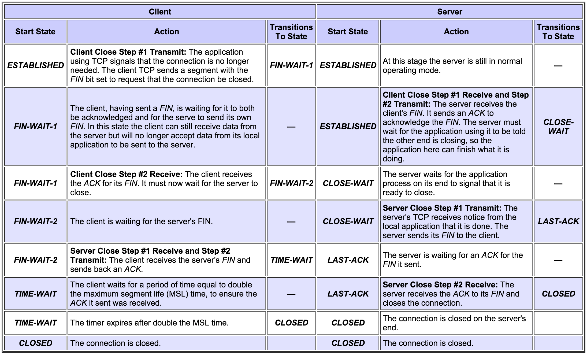
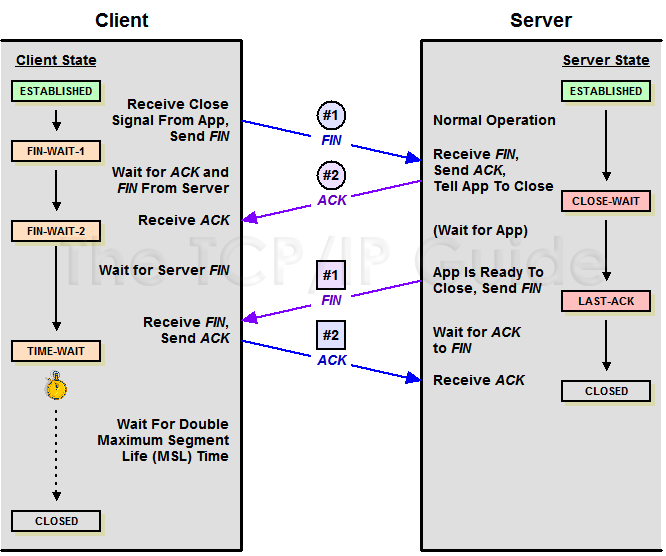

# TCP Connection Termination

Normal Connection Termination

In the normal case, each side terminates its end of the connection by sending a special message with the FIN (finish) bit set. This message, sometimes called a FIN, serves as a connection termination request to the other device, while also possibly carrying data like a regular segment. The device receiving the FIN responds with an acknowledgment to the FIN to indicate that it was received. The connection as a whole is not considered terminated until both sides have finished the shut down procedure by sending a FIN and receiving an ACK.

Thus, termination isn't a three-way handshake like establishment: it is a pair of two-way handshakes. The states that the two devices in the connection move through during a normal connection shutdown are different because the device initiating the shutdown must behave differently than the one that receives the termination request. In particular, the TCP on the device receiving the initial termination request must inform its application process and wait for a signal that the process is ready to proceed. The initiating device doesn't need to do this, since the application is what started the ball rolling in the first place.

> Key Concept: A TCP connection is normally terminating using a special procedure where each side independently closes its end of the link. It normally begins with one of the application processes signalling to its TCP layer that the session is no longer needed. That device sends a FIN message to tell the other device that it wants to end the connection, which is acknowledged. When the responding device is ready, it too sends a FIN that is acknowledged; after waiting a period of time for the ACK to be received, the session is closed.

Table 154 describes in detail how the connection termination process works; the progression of states and messages exchanged can also be seen in Figure 214. The table is adapted from Table 151, describing the TCP finite state machine, but shows what happens for both the server and the client over time during connection shutdown. Either device can initiate connection termination; in this example I am assuming the client does it. Each row shows the state each device begins in, what action it takes in that state and what state to which it transitions. I have also shown the send and receive stages of both of the steps for each of the client and server’s close operations.

Figure 214: TCP Connection Termination Procedure

This diagram shows the conventional termination procedure for a TCP session, with one device initiating termination and the other responding. In this case the client initiates; it sends a FIN which is acknowledged by the server. The server waits for the server process to be ready to close and then sends its FIN, which is acknowledged by the client. The client waits for a period of time to ensure that its ACK is received, before proceeding to the CLOSED state.