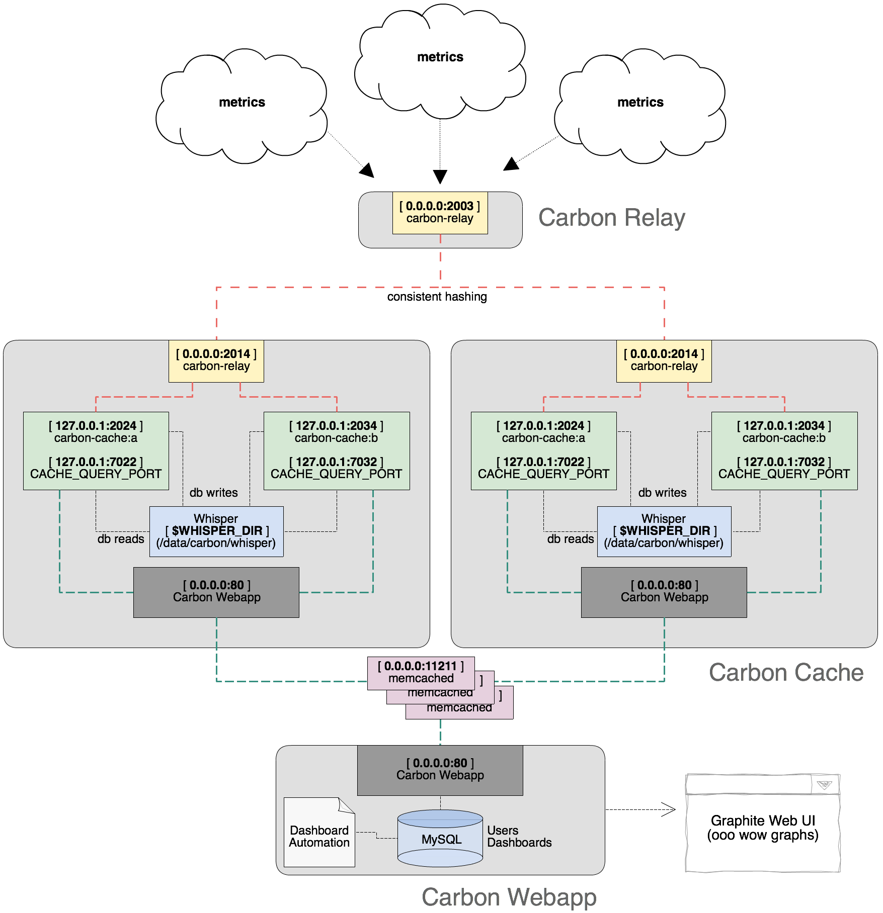
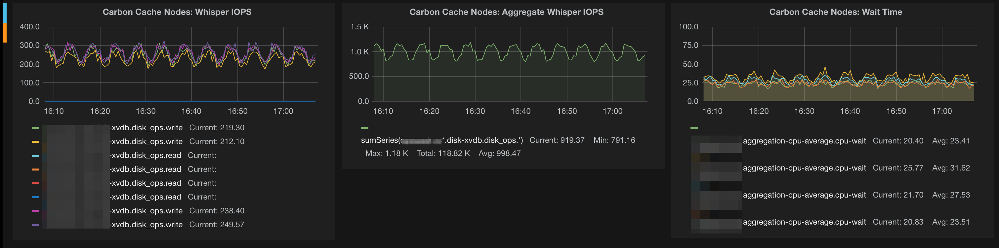

# The architecture of clustering Graphite

###Clarifying the Components

Graphite isn't directly comparable to say, Zenoss. It's not a monolithic, boxed-up, poll-based SNMP system. It scales and bottlenecks a bit differently than what you might be used to. It's the fundamental operations that need to be understood in order to break out the components properly, and I think this is where the 'installation guides' I've mentioned skimp out.

So while you can find plenty of those (in case you are looking for basic installation), I'll go over what the components are and how they interact.

###Graphite

In whole is basically a collection of a few components that allow for the aggregation, storage and querying of metrics from many hosts. Graphite itself does not provide agents for collecting data on monitored hosts, default dashboards or alerting functionality. Consider it a "metrics core" on which a full monitoring / alerting system can be built by adding additional layers.

The core components:

* Carbon
    * An event-driven, Python-based daemon that listens on a TCP port, expecting a stream of time-series data.
    * Time-series data in concept: someMetric:someValue:timeStamp
    * Carbon expects time-series data in a particular format (of two primary types - details later). Third party tools that support * Graphite are used to feed properly formatted data, such as Collectd or StatsD.
    * Metrics can be anything from OS memory usage to event counts fired off from an application (e.g. number of times a function was called).
    * After Carbon receives metrics, it periodically flushes them to a storage database.

* Whisper
    * A lightweight, flat-file database format for storing time-series data.
    * It does not run as a stand-alone service or bind to a port. * Carbon natively supports writing to disk in "Whisper format".
    * Each unique metric type is stored in a fixed-size file. If you fed in the metrics memory free and memory used for both Host A and Host B, the following database files would be created:
```
$WHISPER_DIR/carbon/whisper/HostA/memory-free.wsp 
$WHISPER_DIR/carbon/whisper/HostA/memory-used.wsp 
$WHISPER_DIR/carbon/whisper/HostB/memory-free.wsp 
$WHISPER_DIR/carbon/whisper/HostB/memory-used.wsp
```
    * The size of database files is determined by the number of data points stored - this is configurable (details later).

* Graphite Web
    * A Django web UI that can query Carbon daemons and read Whisper data to return complete metrics data, such as all memory used values logged for Host A over the last 6 hours.
    * Graphite Web can be used directly for composing basic graphs.
    * Graphite Web provides the REST API that can be queried by third-party tools (such as Grafana) to create complete dashboards.
    * The API can return either raw text data or a rendered graph (.png format).

###A Standalone Graphite Setup

So, I think the best favor you can do for yourself is starting with the most basic, necessary components and configuration. The 'install guides' (I've snarkily continued placing in quotes) do the typical thing: include long lists of software packages to install without descriptions of why (Which are actual requirements? Are some just optional and you think they're cool?), followed by arbitrary configurations without explanation (Are these your personal optimizations? Are these configurations necessary to function? Are they unnecessarily elaborate?).

In any case, I will make the following installation recommendations / notes:

* Use PIP to install Carbon / Whisper / Graphite Web if you want it to go down easily.
* Manually install Twisted version 13.1, first: `pip install twisted==13.1`. For some reason I didn't care to sort out, newer versions prevented Graphite daemons from starting properly.

Function first, optimization later.

I'm going to strip out all of the configuration lines that can be left as defaults so that we can focus on the mechanics of the Graphite components.

###Carbon config

Carbon actually has multiple daemons that can be used for different scenarios, and each has their own section in the Carbon config. Carbon-Cache specifically is the core daemon that represents what the Carbon component of Graphite does, so it's the only section that really matters right now:
```
[cache]
LINE_RECEIVER_INTERFACE = 0.0.0.0
LINE_RECEIVER_PORT = 2003
PICKLE_RECEIVER_INTERFACE = 0.0.0.0
PICKLE_RECEIVER_PORT = 2004
CACHE_QUERY_INTERFACE = 0.0.0.0
CACHE_QUERY_PORT = 7002
```

If you recall the mention that Carbon accepts metrics in two different formats, that's what's going on here:

* Metrics in `line` format should be received on `port 2003`
* Metrics in `pickle` format should be received on `port 2004`

The difference is that line format is a plaintext protocol with one metric name, value and timestamp per datum. The pickle format allows for metrics to be sent in batches and is used where heavy amounts of metrics are being transferred.

**This is an important area** of confusion that seems overlooked and inadequately described. If you're using a tool like Collectd to feed metrics from theoretical Host A, it's sending in line format and should be transmitting to your Graphite box on port 2003. The pickle format is used when a Carbon-Relay daemon is load-balancing / proxying metrics data to multiple Carbon-Cache daemons in a Graphite cluster. Understanding these functional boundaries should help clarify why all these listening directives with fuzzy names exist.

Pretty much everyone reading this is probably starting out with a single Graphite box and intends to feed data like CPU and memory usage via Collectd. Basically, you want a Carbon-Cache daemon listening on port 2003 on an interface that all your monitored hosts can point their Collectd daemons at to fire off line data. This config simply needs to exist in `carbon.conf`. And when you start the `carbon-cache` daemon: done deal.

You can ignore all the other config files and directives for now.

###Whisper config

(I'm going to touch on Whisper a bit. So while I'm skipping out on basic setup again, it's worth understanding some of the core functionality that ultimately relates to storage and I/O considerations that become major thinking points down the line scaling Graphite.)

When Carbon-Cache writes data to disk, it stores it in the Whisper database format. As previously mentioned, a `.wsp` file is created per unique metric. Each file is created at the time a given metric type is first received. Every file is a fixed-size (for performance) determined by the resolution and retention configured in Whisper's config, `storage-schemas.conf`.

Using the example of memory free / used for Host A and Host B, we would have the following Whisper DB files: 
```
$WHISPER_DIR/carbon/whisper/HostA/memory-free.wsp 
$WHISPER_DIR/carbon/whisper/HostA/memory-used.wsp 
$WHISPER_DIR/carbon/whisper/HostB/memory-free.wsp 
$WHISPER_DIR/carbon/whisper/HostB/memory-used.wsp
```

Let's say Host A was a really important box and we wanted more historical data on it - 90 days versus only needing 7 days for Host B. We would define a retention rule that's matched to the metric name with a regular expression:

```
[carbon]
pattern = ^carbon\.
retentions = 60s:7d

[shortretention]
pattern = ^HostB\.
retentions = 60s:7d

[longretention]
pattern = ^HostA\.
retentions = 60s:90d
```

Note: you'll notice the `[carbon]` entry, which is used for default metrics (such as number of metrics received) fed in by the Carbon-Cache daemon itself.

Something you'll discover through further configuration efforts is that retention resolution can be tiered. For instance, you could store high resolution metrics @ every 10 seconds for 7 days and lower resolution metrics @ every 60 seconds for 90 days with the following retention line:

```
...
retentions = 10s:7d,60s:90d
...
```

This grants you the ability to do precise anomaly inspection on a recent event, while being able to graph long-term trends. `This is a major advantage of Graphite` that is a pain-point in other monitoring solutions. I'll detail this later in the scaling architecture notes.

The key takeaway is that storage consumption can (and should) be predicted. For the meantime, the defaults aren't bad and it's not worth over-thinking it until you discover a need.

###Graphite Web config

Carbon-Cache and Whisper are on the side of writing data. Graphite Web is how data is queried. Basically, it's a Django app that can read metric data from one of three sources:

* Directly from Whisper database files on-disk
* From Carbon-Cache daemons on their `CACHE_QUERY_PORT` (remember this directive in the carbon config?)
* From other instances of Graphite Web through the REST API

Once data is fetched by Graphite Web, it delivers it in two fashions:

* Makes it directly accessible in your web browser by simply visiting the Graphite Web app address, and allows you to construct your own graphs or dashboards
* As raw data or rendered png graphs emitted through a REST API

The reason one Graphite Web instance can demand data through the API of another instance is fundamental to how Graphite clustering works, in respect to querying data from many nodes. Secondly, the API from the Web app is consumed by third-party dashboards; even if you're not going to use Graphites provided graphing capabilities, consider Graphite Web the API endpoint.

Lastly, the reason Graphite web can query data from either a Carbon-Cache instance through the CACHE_QUERY_PORT or directly from on-disk Whisper database files is another great piece of functionality: metrics don't have to be flushed to disk before they're available for querying. As soon as a metric is received by a Carbon-Cache daemon, it's immediately accessible. Graphite Web both read on-disk data and query the in-memory data in all listed Carbon-Cache daemons, combine and deliver. If you've ever tried high-resolution, real-time anomaly detection in SNMP, you'll love this characteristic of Graphite.

At the minimum, your Graphite Web configuration will have two things: a basic storage back-end for saving users and dashboards created directly in the app, and a Carbon-Cache instance `(CARBONLINK_HOSTS)` that it will query for data. And it's all defined in the `local_settings.py` config file:

```
CARBONLINK_HOSTS = ['127.0.0.1:7002']
DATABASES = {
    'default': {
        'NAME': '/opt/graphite/storage/graphite.db',
        'ENGINE': 'django.db.backends.sqlite3',
        'USER': '',
        'PASSWORD': '',
        'HOST': '',
        'PORT': ''
    }
}
```

Keep in mind that Graphite Web also reads data directly from Whisper, so you must specify any non-standard paths with the `WHISPER_DIR` directive. For instance, if you intend to store your databases on a second hard drive mounted at /data:

```
CARBONLINK_HOSTS = ['127.0.0.1:7002']
WHISPER_DIR = "/data/carbon/whisper"
DATABASES = {
    'default': {
        'NAME': '/opt/graphite/storage/graphite.db',
        'ENGINE': 'django.db.backends.sqlite3',
        'USER': '',
        'PASSWORD': '',
        'HOST': '',
        'PORT': ''
    }
}
```

###Components Summary

You feed metrics into a Carbon-Cache daemon which persists the data on-disk in fixed-size Whisper database files, according your configured resolution and retention periods. Graphite Web queries this data, both already on-disk or still in-memory and presents it for final consumption.

Metrics consumption can be visualized directly using the basic Graphite Web graphing tools, or through a third-party dashboarding solution–such as Grafana–that interacts with the Graphite Web API.

###Breaking Out Components

###Multiple Carbon-Cache daemons

So what about when we want to break out components? Graphite allows you to run multiple Carbon-Cache daemons on a single box to make better use of resources (many people will do something like one Carbon-Cache daemon per CPU cores). The configuration file changes a bit to accommodate additional daemons, like so:

```
[cache]
LINE_RECEIVER_INTERFACE = 127.0.0.1
PICKLE_RECEIVER_INTERFACE = 127.0.0.1
CACHE_QUERY_INTERFACE = 127.0.0.1

[cache:1]
LINE_RECEIVER_PORT = 2013
PICKLE_RECEIVER_PORT = 2014
CACHE_QUERY_PORT = 7012

[cache:2]
LINE_RECEIVER_PORT = 2023
PICKLE_RECEIVER_PORT = 2024
CACHE_QUERY_PORT = 7022
```

And instead of running: 
```
bin/carbon-cache.py start
```

You would run: 
```
bin/carbon-cache.py --instance=1 start 
bin/carbon-cache.py --instance=2 start
```

...In order to start each respective instance.

Now, notice that the Carbon-Cache daemons are no longer bound to `0.0.0.0`, but rather, localhost. That's because we're not going to write directly to Carbon-Cache anymore. This is where a new Graphite daemon steps in: Carbon-Relay.

Carbon-Relay provides the listening capabilities of Carbon-Cache and ingests Line and Pickle formatted metrics, only it expects to forward them to Carbon-Cache daemons for storage. Consider it a metrics proxy. This is what will bind to your network-accessible interface on ports 2003 and 2004 and accept inputs from Collectd and friends.

Carbon-Relay is also configured in the same `carbon.conf` file, in its own section:

```
[relay]
LINE_RECEIVER_INTERFACE = 0.0.0.0
LINE_RECEIVER_PORT = 2003
PICKLE_RECEIVER_INTERFACE = 0.0.0.0
PICKLE_RECEIVER_PORT = 2004
RELAY_METHOD = consistent-hashing 
DESTINATIONS = 127.0.0.1:2014:1, 127.0.0.1:2024:2 
```

You'll see that the two local Carbon-Cache instances (:1 and :2) are the destinations where received metrics will be sent to. Take note that the destinations are on the Carbon-Cache `PICKLE_RECEIVER_PORT` addresses. This is a scenario where the Pickle format is used; Carbon-to-Carbon daemon communication. It's supported and is simply more efficient.

Lastly, take note of the `RELAY_METHOD` directive. Carbon-Relay can choose which Carbon-Cache daemon to send metrics to by either user-defined regex rules matching the metric name, or through consistent-hashing. I highly recommend understanding consistent-hashing, as the choice of what relay method to use at various levels will play a crucial role down the line when clustering Graphite. For now, consistent-hashing will allow a hands-off and mostly even distribution between Cache daemons.

Once it's wired up, you can start the Carbon-Relay daemon: 
`bin/carbon-relay.py` start

###Accessing multiple Carbon-Cache daemons

Next, Graphite Web needs to know where to read data. Additional Carbon-Cache daemons simply need to be listed as an array in `local_settings.py`:

```
CARBONLINK_HOSTS = ['127.0.0.1:7012', '127.0.0.1:7022']
DATABASES = {
    'default': {
        'NAME': '/opt/graphite/storage/graphite.db',
        'ENGINE': 'django.db.backends.sqlite3',
        'USER': '',
        'PASSWORD': '',
        'HOST': '',
        'PORT': ''
    }
}
```

Now, data will be queried from the Whisper database files and two separate Carbon-Cache daemons. The results are combined and emitted through the various delivery methods of the web app.

You can run many Carbon-Cache daemons per-host. As I mentioned, many people tend to run a daemon per CPU core. Although, unless you have extremely fast storage, it's probably the CPU will not become your first bottleneck. It's not uncommon to find Graphite boxes packed with SSDs or large RAID10 arrays.

Fortunately for me, nothing scales up indefinitely. I'm a fan of breaking things out into clusters or federated pools of services. Eventually, you're going to max out your hardware or hit a point of disproportionately expensive performance density.

And I love this point–

###Clustering Architecture

###How clustering works

The importance of how selective I was on the descriptions of Graphite's components all leads up to the architecture of clustering Graphite, since this is what this write-up is all about. We know how all the core daemons operate, interact and scale out. We understand the flow of metrics inbound and data outbound.

Clustering Graphite operates on these same principles, but multiplies under itself as a pyramid structure. Let's say for instance we completely saturate our resources on our Graphite box. This box has a Carbon-Relay daemon accepting metrics from 1,000 machines, which are forwarded to eight Carbon-Cache daemons. The CPUs are chugging along 24/7 and 80% the disks are sustaining a high queue length. We can't introduce more monitored hosts and pulling up a 10 day period of graph data for 200 machines is painfully slow.

The setup should be pretty straight forward to understand at this point:

* Double your Graphite boxes.
* Put a third box in front of these two Graphite boxes. This will be a dedicated Graphite-Relay.
    * All metrics are sent to this dedicated Carbon-Relay box. It then proxies all the data to each of the Graphite machines using the Pickle protocol and according to its own configured RELAY_METHOD.
* Put a fourth box behind the two Graphite boxes. This will be a dedicated Graphite Web.
    * This will now be the "master" Web app to use. It will be configured to query the Graphite Web instance API running local to each Graphite box.

The dedicated Carbon-Relay will be configured like this:
```
[relay]
LINE_RECEIVER_INTERFACE = 0.0.0.0
LINE_RECEIVER_PORT = 2003
PICKLE_RECEIVER_INTERFACE = 0.0.0.0
PICKLE_RECEIVER_PORT = 2004
RELAY_METHOD = consistent-hashing 
DESTINATIONS = 10.0.1.10:2004, 10.0.1.11:2004
```

Where `10.0.1.10` and `10.0.1.11` are the two Graphite boxes. We're again relaying data through the Pickle protocol on port 2004.

The master Graphite Web `local_settings.py` will look like this:

```
CLUSTER_SERVERS = ["10.0.1.10:80", "10.0.1.11:80"]

DATABASES = {
    'default': {
        'NAME': '/opt/graphite/storage/graphite.db',
        'ENGINE': 'django.db.backends.sqlite3',
        'USER': '',
        'PASSWORD': '',
        'HOST': '',
        'PORT': ''
    }
}
```

Rather than specifying local Carbon-Cache daemons with the `CARBONLINK_HOSTS` directive, we specify upstream Graphite Web addresses with the `CLUSTER_SERVERS` directive.

If you create any graphs or dashboards using the Carbon Web app, they will be stored on the master server. The upstream Graphite Web instances running local to Whisper data are now merely API endpoints.

###How data is routed in and out a cluster

So this probably introduces a few questions. Where does a single given metric ultimately end up? How does the "master" Graphite Web instance know where to locate a given metric?

Assuming you're using consistent-hashing on every relay in the cluster, every metric inbound is hashed by name and delivered to the same host and then to the same Carbon-Cache daemon and written to the same Whisper db, every time. All Carbon-Cache daemons in the cluster receive an even distribution (practically) of all the inbound metrics, in whole.

The master Graphite Web will query APIs of all the secondary Graphite Web instances. Each instance will read from the local Whisper data and Carbon-Cache instances and return the data if it has it. The master Graphite Web instance will ultimately combine and present the data through the same ole' methods as a stand-alone Graphite setup. You can compose a single graph for a single hosts made from metrics data stored on 100 Graphite boxes. Likewise, the aggregated data could be fed through the master Graphite Web REST API into a third-party dashboarding utility.

###A basic cluster, diagrammed

This is a diagram I made for internal documentation purposes, so it references different port configurations (and other things like memcached and backing the Web app with MySQL rather than sqlite - other details you'll discover in general configuration efforts). Functionally, it visualizes everything mentioned: with one dedicated relay, two storage nodes each with two Carbon-Cache daemons, and a master Web app:



###Scaling the Architecture

The purpose of breaking out all of these components is simple: you want to collect hundreds of millions / billions of metrics for high resolution, you want nearly instant graphs and the ability to sustain failure without losing data.

We can accomplish all of that.

###Defeating CPU & I/O limitations

As you add more nodes dedicated to running Carbon-Cache daemons, you're adding more total block devices (be it EBS volumes, SSDs, spindles, etc.) for metric storage. You're also gaining more total memory that Carbon-Cache daemons are occupying where temporal data / not-yet-flushed-to-disk can be fetched.

A large article could be written just on the topic of how many relays to run per storage node, the implications of context switch costs for running too many daemons per box (are those "real" cores? etc.). Hell. A whole article could (and has been many times) written on what "IOPS" even means.

The summary of scaling out to defeat CPU and I/O bottlenecks is actually quite interesting: monitor your Graphite cluster with itself. See what your utilization looks like.

I have a specific view in my Grafana dashboard that shows the per-host write IOPS, the cluster total write IOPS and the average CPU-wait times for all my storage nodes:

