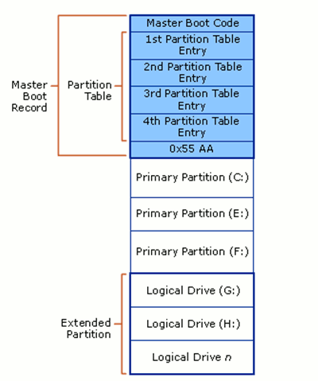
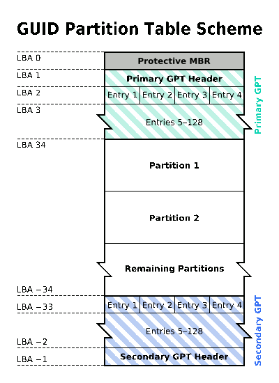

# The Differences Between MBR and GPT

If you have dabbled with your hard disk and is always doing formatting and partitioning, you will surely come across the term “MBR” and “GPT”. This is especially evident when you are dual-booting your Mac and faced with the problem of having to switch from GPT to MBR. You probably are wondering, what are the differences between MBR and GPT and is there any benefit using one over the other? We wil clear your doubt in this article.

### Hard Disk Partitions

You probably know that you can split your hard disk into several partitions. The question is, how does the OS know the partition structure of the hard disk? That information has to come from some where. This is where MBR (Master Boot Record) and GPT (Guid Partition Table) come into play. While both are architecturally different, both play the same role in governing and provide information for the partitions in the hard disk.

### Master Boot Record (MBR)
[mte_content_ads]MBR is the old standard for managing the partition in the hard disk, and it is still being used extensively by many people. The MBR resides at the very beginning of the hard disk and it holds the information on how the logical partitions are organized in the storage device. In addition, the MBR also contains executable code that can scan the partitions for the active OS and load up the boot up code/procedure for the OS.

For a MBR disk, you can only have four primary partitions. To create more partitions, you can set the fourth partition as the extended partition and you will be able to create more sub-partitions (or logical drives) within it. As MBR uses 32-bit to record the partition, each partition can only go up to a maximum of 2TB in size. This is how a typical MBR disk layout looks like:

There are several pitfalls with MBR. First of all, you can only have 4 partitions in the hard disk and each partition is limited to only 2TB in size. This is not going to work well with hard disk of big storage space, say 100TB. Secondly, the MBR is the only place that holds the partition information. If it ever get corrupted (and yes, it can get corrupted very easily), the entire hard disk is unreadable.

### GUID Partition Table (GPT)

GPT is the latest standard for laying out the partitions of a hard disk. It makes use of globally unique identifiers (GUID) to define the partition and it is part of the UEFI standard. This means that on a UEFI-based system (which is required for Windows 8 Secure Boot feature), it is a must to use GPT. With GPT, you can create theoretically unlimited partitions on the hard disk, even though it is generally restricted to 128 partitions by most OSes. Unlike MBR that limits each partition to only 2TB in size, each partition in GPT can hold up to 2^64 blocks in length (as it is using 64-bit), which is equivalent to 9.44ZB for a 512-byte block (1 ZB is 1 billion terabytes). In Microsoft Windows, that size is limited to 256TB.

From the GPT Table Scheme diagram above, you can see that there is a primary GPT at the beginning of the hard disk and a secondary GPT at the end. This is what makes GPT more useful than MBR. GPT stores a backup header and partition table at the end of the disk so it can be recovered if the primary tables are corrupted. It also carry out CRC32 checksums to detect errors and corruption of the header and partition table.

You can also see that there is a protective MBR at the first sector of the hard disk. Such hybrid setup is to allow a BIOS-based system to boot from a GPT disk using a boot loader stored in the protective MBR’s code area. In addition, it protects the GPT disk from damage by GPT-unaware disk utilties.

### OS Support

Intel Macs are using GPT by default and you won’t be able to install Mac OS X (without tweaks and hacks) on a MBR system. Mac OS X will run on MBR disk though, it is just that you won’t be able to install on it.

Most Linux kernels come with support for GPT. Unless you are compiling your own kernel and you didn’t add this feature in, you should have no problem getting your favorite distro to work in GPT disk. One thing to note, you wil have to use Grub 2 as the bootloader.

For Windows, only the 64-bit version of Windows from XP onward support booting from GPT disk. If you are getting a laptop pre-installed with 64-bit Windows 8, most probably it is using GPT. For Windows 7 and earlier version, the default configuration will be MBR instead of GPT.

