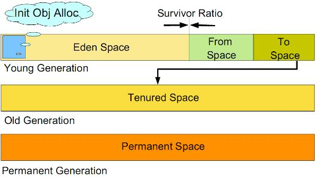

# Understand JVM GC

For us to understand the JVM GC control Java applications are of great help. Let me from the operation and maintenance point of view, the JVM online relevant information are summarized as follows, in order to deepen the understanding of the JVM GC. 
If the wrong place, please correct me Tell me.

###JVM memory usage classification

JVM's memory partition relationship:

* [JVM whole heap memory] = the young generation + old generation
* [JVM] = entire memory (heap memory) + non-heap memory = (the young generation + old generation) + permanent generation

###About the young generation, the old generation, lasting generations

For the JVM, the memory is divided into three areas: the young generation, the old generation and permanent generation. The young generation and the old generation used to store Java process variables, lasting generations to put Java class information. 
We generally focus on the young generation and the old generation. JVM generational can use the following figure shows this:



The young generation is divided into three areas: a Eden area (referred to as E area), two Survivor area (which we define as S0, S1). 
Variables Java program new applications will be placed in E zone; when the E area is full, all surviving objects are moved to the S0 area. When S0 area is full, S0 surviving objects are moved to the S1 zone (S0 on the air this time, when the E area full-lived objects will move to S1 area). When S1 area is full, the experienced S0 object is moved to the old generation (O area). S0 and S1 zone area is like, such an object to enter the permanent generation will experience E area, S0 area, S1 zone, and then proceeds to O area.

Promoted from the young generation up objects (-> S0 area -> S1 Zone - E Zone> O area) for storing the old generation, in general, when we set the boss is relatively large.

###Case jstat view the current Java process JVM districts

Instructions

`jstat - gcutil process pid   refresh sec s`

Examples

```
[ hadoop @ localhost ~] $ jstat - gcutil 6572  1S
  S0 S1 EOP YGC YGCT FGC FGCT GCT
  0.00    0.13   10.61   60.38   63.44     249   117.204      2     1.468   118.673 
  0.00    0.13   10.61   60.38   63.44     249   117.204      2     1.468   118.673 
  0.00    0.13   10.61   60.38   63.44     249   117.204      2     1.468   118.673 
  0.00    0.13   10.61   60.38   63.44     249   117.204      2     1.468   118.673 
  0.00    0.13   10.61   60.38   63.44     249   117.204      2     1.468   118.673 
  0.00    0.13   10.61   60.38   63.44     249   117.204      2     1.468   118.673 
  0.00    0.13   10.61   60.38   63.44     249   117.204      2     1.468   118.673 
  0.00    0.13   10.61   60.38   63.44     249   117.204      2     1.468   118.673 
  0.00    0.13   10.61   60.38   63.44     249   117.204      2     1.468   118.673 
  0.00    0.13   10.61   60.38   63.44     249   117.204      2     1.468   118.673
```