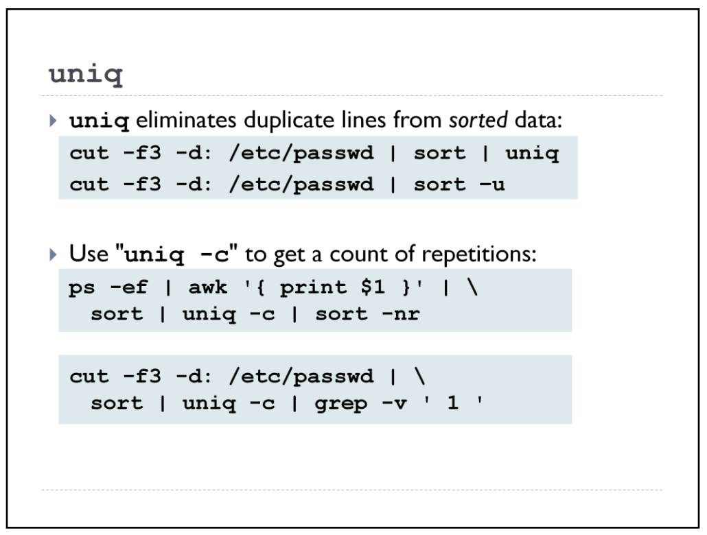

# Uniq



```
$ ps -ef | awk '{ print $1 }' | sort | uniq -c | sort -nr
 34 root
 8 apache
 7 hal
 1 UID
 1 rpc
 1 ntp
 1 mysql
 1 dbus
```

The "1 UID" line is a result of the initial header line from ps. If we wanted to get rid of
that we could do something like "ps -ef | tail +2 | awk …", but the above is
good enough for most purposes.