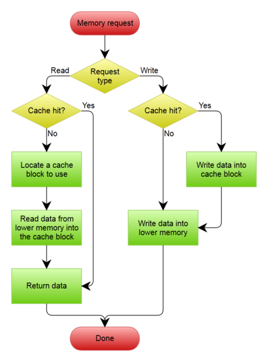
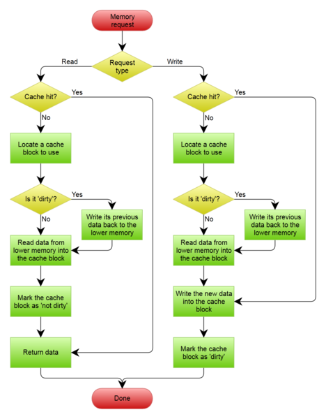

# Write-through, write-around, write-back: Cache explained

Cache is vital for application deployment, but which one to choose: Write-through, write-around or write-back cache? We examine the options:

Cache, the technique of storing a copy of data temporarily in rapidly-accessible storage media (also known as memory) local to the CPU and separate from bulk storage, has been around for as long as computing itself.

The existence of cache is based on a mismatch between the performance characteristics of core components of computing architectures, namely that bulk storage cannot keep up with the performance requirements of the CPU and application processing.

Today there is a wide range of caching options available – write-through, write-around and write-back cache, plus a number of products built around these – and the array of options makes it daunting to know which to plump for to achieve the best benefit.

This article will explain caching, its benefits, the variants available, the suppliers that provide them and how to implement them, and pitfalls to look out for in doing so.

###Cache benefits

Gaining better application performance is all about reducing latency in accessing data. Improving the time storage I/O takes to complete usually results in faster application performance, as almost all application workload is dependent on I/O operations.

Of course, nowadays you could deploy flash for all data, with its low latency and high performance. But, this isn’t a practical or cost-effective method as most IT environments only have a portion of data active at any one time, otherwise known as the working set. This is where caching comes in.

Caching provides several benefits:

* Latency is reduced for active data, which results in higher performance levels for the application.
* I/O operations to external storage are reduced as much of the I/O is diverted to cache, resulting in lower levels of SAN traffic and contention for the SAN.
* Data can sit permanently on external storage arrays or traditional storage, which maintains the consistency and integrity of the data using features provided by the array, such as snapshots or replication.
* Flash is targeted at just the part of the workload that benefits from lower latency, resulting in a more cost-effective use of high $/TB storage.

###Write-through, write-around and write-back cache

There are three main caching techniques that can be deployed, each with their own pros and cons.

**Write-through** cache directs write I/O onto cache and through to underlying permanent storage before confirming I/O completion to the host. This ensures data updates are safely stored on, for example, a shared storage array, but has the disadvantage that I/O still experiences latency based on writing to that storage. Write-through cache is good for applications that write and then re-read data frequently as data is stored in cache and results in low read latency.

**Write-around** cache is a similar technique to write-through cache, but write I/O is written directly to permanent storage, bypassing the cache. This can reduce the cache being flooded with write I/O that will not subsequently be re-read, but has the disadvantage is that a read request for recently written data will create a “cache miss” and have to be read from slower bulk storage and experience higher latency.

**Write-back** cache is where write I/O is directed to cache and completion is immediately confirmed to the host. This results in low latency and high throughput for write-intensive applications, but there is data availability exposure risk because the only copy of the written data is in cache. As we will discuss later, suppliers have added resiliency with products that duplicate writes. Users need to consider whether write-back cache solutions offer enough protection as data is exposed until it is staged to external storage. Write-back cache is the best performing solution for mixed workloads as both read and write I/O have similar response time levels.

###Where to cache

There are a number of locations in which caching solutions can be deployed.

In the server – Some caching solutions are deployed directly in the server, either on RAID cards or Fibre Channel host bus adapter (HBA) cards. Products in the market today include LSI’s range of Nytro MegaRAID PCIe cards and Qlogic’s FabricCache.

Both these products aim to accelerate I/O by caching data on the card itself or in the case of FabricCache on a connected PCIe SSD device that uses the PCIe bus for power.

Placing the intelligence into an adaptor card provides some degree of abstraction from the application or operating system (OS), making it less host-dependent. However, this also means the adaptor card has no concept or understanding of the data is it caching and has to rely on optimisation algorithms based around frequency of use rather than application-based information.

Qlogic FabricCache has the benefit that cached data can be shared between hosts. The Fibre Channel fabric is used to transfer cached data, which potentially provides a larger cache capacity than could be provided with a single device alone, as data doesn’t need to be cached if it is already available elsewhere on the fabric.

Working with the hypervisor – In this case the hypervisor is involved in the caching process, typically through one of two methods.

Some solutions, such as FVP from PernixData, are embedded as a kernel extension to the hypervisor and so work in close co-operation with the hypervisor. FVP acts as either a write-through or write-back cache and protects the integrity of write-back data by synchronously replicating it between vSphere cluster guests.

VMware has integrated caching into the hypervisor with vSphere Flash Read Cache. This provides the benefit of full hypervisor integration, which means new features should be supported more quickly than third-party offerings. Microsoft offers a similar feature known as Write-Back Cache for Hyper-V in Windows Server 2012 R2.

Other solutions, such as Infinio Systems’ Accelerator or Atlantis Computing’s ILIO USX, deploy a virtual machine on the hypervisor that provides storage resources to other hypervisor guests. Both of these solutions use system DRAM rather than flash to store cached data.

Accelerator exposes an NFS datastore to the host that acts as a proxy to the primary datastore on permanent storage. Data in the cache is deduplicated and can be shared across a cluster of VMware vSphere hosts.

ILIO USX is capable of caching SAN and NAS storage and has the additional benefit of supporting the emerging NVDIMM technology. It also makes significant storage capacity savings through deduplication of data in the cache.

In the operating system – Microsoft provides write-back cache within Windows Server 2012 R2 that can be used with Hyper-V. There are other caching software solutions that deploy into the operating system, providing acceleration for Windows and Linux environments, such as FlashSoft from SanDisk.

Having caching software integrated with the OS provides the ability to be more targeted with caching software, for example, by applying it only to certain disk volumes or folders, although these solutions may be less flexible with clustered environments.

Deciding exactly where to cache data is dependent on the design and requirements of the infrastructure being deployed and that means taking into consideration some of the issues associated with caching solutions.

###Caching issues

Caching can encounter challenges that include, for example, the problem of cache warm-up, where cache needs to be loaded with enough active data to reduce cache misses and allow it to start improving I/O response times.

There are also problems associated with caching software, most notably issues of data integrity and cache coherence in clustered deployments.

In response, some suppliers have chosen to implement only write-through cache, whereas others have resolved the coherence issue by replicating data between cluster nodes.

There will always be a trade-off between latency and resiliency and so it becomes dependent on the user to look at whether write-cache is an essential requirement of the deployment.

One other consideration is the algorithms or logic used to determine what to cache. Some solutions use simple “least recently used” policies to discard data; others are more complex and look at the data for clues as to which should be retained in cache.

Users should look at the cache occupancy criteria and ensure the rules fit the types of data they expect the cache to manage.

###New caching technologies
DRAM has become much cheaper over recent years and many motherboards support large numbers of DIMM slots. DRAM itself is extremely fast and offers low latency and so as a read cache, DRAM can be an attractive solution in larger servers.

NVDIMM technology, which uses the DRAM slots and delivers NAND flash storage offers a middle ground by providing performance that comes close to DRAM speeds but provides a permanent storage medium.

NVDIMM performance is already delivering latency as low as five microseconds, with the promise of further improvements to come. Combining NVDIMM with flash promised to offer some very interesting future caching solutions.